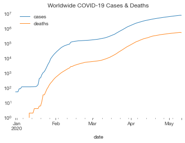
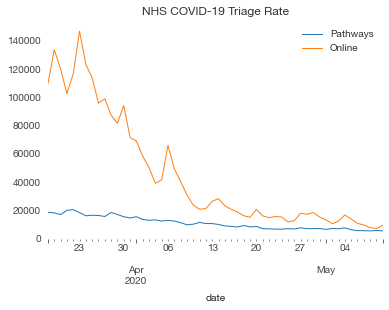

# COVIDdata

Yet another python package for accessing COVID-19 data. Sorry. I have opinions and I don't like all the others.

This package provides methods for fetching various COVID-19 related data sources. Results are provided as [xarray](http://xarray.pydata.org/) datasets, with consistent variable naming and attribution data included.

## Installation

I'm not going to clutter PyPI up with yet another COVID package. Just do `pip install git+https://github.com/russs/coviddata#egg=coviddata`.


## Worldwide Data

My preferred wordwide data source is [Our World in Data](https://ourworldindata.org/coronavirus-source-data) which sources their data from the ECDC. The `cases_owid` function downloads this data and returns a Dataset.


```python
import coviddata.world
world_cases = coviddata.world.cases_owid()
world_cases
```


<div><svg style="position: absolute; width: 0; height: 0; overflow: hidden">
<defs>
<symbol id="icon-database" viewBox="0 0 32 32">
<title>Show/Hide data repr</title>
<path d="M16 0c-8.837 0-16 2.239-16 5v4c0 2.761 7.163 5 16 5s16-2.239 16-5v-4c0-2.761-7.163-5-16-5z"></path>
<path d="M16 17c-8.837 0-16-2.239-16-5v6c0 2.761 7.163 5 16 5s16-2.239 16-5v-6c0 2.761-7.163 5-16 5z"></path>
<path d="M16 26c-8.837 0-16-2.239-16-5v6c0 2.761 7.163 5 16 5s16-2.239 16-5v-6c0 2.761-7.163 5-16 5z"></path>
</symbol>
<symbol id="icon-file-text2" viewBox="0 0 32 32">
<title>Show/Hide attributes</title>
<path d="M28.681 7.159c-0.694-0.947-1.662-2.053-2.724-3.116s-2.169-2.030-3.116-2.724c-1.612-1.182-2.393-1.319-2.841-1.319h-15.5c-1.378 0-2.5 1.121-2.5 2.5v27c0 1.378 1.122 2.5 2.5 2.5h23c1.378 0 2.5-1.122 2.5-2.5v-19.5c0-0.448-0.137-1.23-1.319-2.841zM24.543 5.457c0.959 0.959 1.712 1.825 2.268 2.543h-4.811v-4.811c0.718 0.556 1.584 1.309 2.543 2.268zM28 29.5c0 0.271-0.229 0.5-0.5 0.5h-23c-0.271 0-0.5-0.229-0.5-0.5v-27c0-0.271 0.229-0.5 0.5-0.5 0 0 15.499-0 15.5 0v7c0 0.552 0.448 1 1 1h7v19.5z"></path>
<path d="M23 26h-14c-0.552 0-1-0.448-1-1s0.448-1 1-1h14c0.552 0 1 0.448 1 1s-0.448 1-1 1z"></path>
<path d="M23 22h-14c-0.552 0-1-0.448-1-1s0.448-1 1-1h14c0.552 0 1 0.448 1 1s-0.448 1-1 1z"></path>
<path d="M23 18h-14c-0.552 0-1-0.448-1-1s0.448-1 1-1h14c0.552 0 1 0.448 1 1s-0.448 1-1 1z"></path>
</symbol>
</defs>
</svg>
<style>/* CSS stylesheet for displaying xarray objects in jupyterlab.
 *
 */

:root {
  --xr-font-color0: var(--jp-content-font-color0, rgba(0, 0, 0, 1));
  --xr-font-color2: var(--jp-content-font-color2, rgba(0, 0, 0, 0.54));
  --xr-font-color3: var(--jp-content-font-color3, rgba(0, 0, 0, 0.38));
  --xr-border-color: var(--jp-border-color2, #e0e0e0);
  --xr-disabled-color: var(--jp-layout-color3, #bdbdbd);
  --xr-background-color: var(--jp-layout-color0, white);
  --xr-background-color-row-even: var(--jp-layout-color1, white);
  --xr-background-color-row-odd: var(--jp-layout-color2, #eeeeee);
}

.xr-wrap {
  min-width: 300px;
  max-width: 700px;
}

.xr-header {
  padding-top: 6px;
  padding-bottom: 6px;
  margin-bottom: 4px;
  border-bottom: solid 1px var(--xr-border-color);
}

.xr-header > div,
.xr-header > ul {
  display: inline;
  margin-top: 0;
  margin-bottom: 0;
}

.xr-obj-type,
.xr-array-name {
  margin-left: 2px;
  margin-right: 10px;
}

.xr-obj-type {
  color: var(--xr-font-color2);
}

.xr-sections {
  padding-left: 0 !important;
  display: grid;
  grid-template-columns: 150px auto auto 1fr 20px 20px;
}

.xr-section-item {
  display: contents;
}

.xr-section-item input {
  display: none;
}

.xr-section-item input + label {
  color: var(--xr-disabled-color);
}

.xr-section-item input:enabled + label {
  cursor: pointer;
  color: var(--xr-font-color2);
}

.xr-section-item input:enabled + label:hover {
  color: var(--xr-font-color0);
}

.xr-section-summary {
  grid-column: 1;
  color: var(--xr-font-color2);
  font-weight: 500;
}

.xr-section-summary > span {
  display: inline-block;
  padding-left: 0.5em;
}

.xr-section-summary-in:disabled + label {
  color: var(--xr-font-color2);
}

.xr-section-summary-in + label:before {
  display: inline-block;
  content: '►';
  font-size: 11px;
  width: 15px;
  text-align: center;
}

.xr-section-summary-in:disabled + label:before {
  color: var(--xr-disabled-color);
}

.xr-section-summary-in:checked + label:before {
  content: '▼';
}

.xr-section-summary-in:checked + label > span {
  display: none;
}

.xr-section-summary,
.xr-section-inline-details {
  padding-top: 4px;
  padding-bottom: 4px;
}

.xr-section-inline-details {
  grid-column: 2 / -1;
}

.xr-section-details {
  display: none;
  grid-column: 1 / -1;
  margin-bottom: 5px;
}

.xr-section-summary-in:checked ~ .xr-section-details {
  display: contents;
}

.xr-array-wrap {
  grid-column: 1 / -1;
  display: grid;
  grid-template-columns: 20px auto;
}

.xr-array-wrap > label {
  grid-column: 1;
  vertical-align: top;
}

.xr-preview {
  color: var(--xr-font-color3);
}

.xr-array-preview,
.xr-array-data {
  padding: 0 5px !important;
  grid-column: 2;
}

.xr-array-data,
.xr-array-in:checked ~ .xr-array-preview {
  display: none;
}

.xr-array-in:checked ~ .xr-array-data,
.xr-array-preview {
  display: inline-block;
}

.xr-dim-list {
  display: inline-block !important;
  list-style: none;
  padding: 0 !important;
  margin: 0;
}

.xr-dim-list li {
  display: inline-block;
  padding: 0;
  margin: 0;
}

.xr-dim-list:before {
  content: '(';
}

.xr-dim-list:after {
  content: ')';
}

.xr-dim-list li:not(:last-child):after {
  content: ',';
  padding-right: 5px;
}

.xr-has-index {
  font-weight: bold;
}

.xr-var-list,
.xr-var-item {
  display: contents;
}

.xr-var-item > div,
.xr-var-item label,
.xr-var-item > .xr-var-name span {
  background-color: var(--xr-background-color-row-even);
  margin-bottom: 0;
}

.xr-var-item > .xr-var-name:hover span {
  padding-right: 5px;
}

.xr-var-list > li:nth-child(odd) > div,
.xr-var-list > li:nth-child(odd) > label,
.xr-var-list > li:nth-child(odd) > .xr-var-name span {
  background-color: var(--xr-background-color-row-odd);
}

.xr-var-name {
  grid-column: 1;
}

.xr-var-dims {
  grid-column: 2;
}

.xr-var-dtype {
  grid-column: 3;
  text-align: right;
  color: var(--xr-font-color2);
}

.xr-var-preview {
  grid-column: 4;
}

.xr-var-name,
.xr-var-dims,
.xr-var-dtype,
.xr-preview,
.xr-attrs dt {
  white-space: nowrap;
  overflow: hidden;
  text-overflow: ellipsis;
  padding-right: 10px;
}

.xr-var-name:hover,
.xr-var-dims:hover,
.xr-var-dtype:hover,
.xr-attrs dt:hover {
  overflow: visible;
  width: auto;
  z-index: 1;
}

.xr-var-attrs,
.xr-var-data {
  display: none;
  background-color: var(--xr-background-color) !important;
  padding-bottom: 5px !important;
}

.xr-var-attrs-in:checked ~ .xr-var-attrs,
.xr-var-data-in:checked ~ .xr-var-data {
  display: block;
}

.xr-var-data > table {
  float: right;
}

.xr-var-name span,
.xr-var-data,
.xr-attrs {
  padding-left: 25px !important;
}

.xr-attrs,
.xr-var-attrs,
.xr-var-data {
  grid-column: 1 / -1;
}

dl.xr-attrs {
  padding: 0;
  margin: 0;
  display: grid;
  grid-template-columns: 125px auto;
}

.xr-attrs dt, dd {
  padding: 0;
  margin: 0;
  float: left;
  padding-right: 10px;
  width: auto;
}

.xr-attrs dt {
  font-weight: normal;
  grid-column: 1;
}

.xr-attrs dt:hover span {
  display: inline-block;
  background: var(--xr-background-color);
  padding-right: 10px;
}

.xr-attrs dd {
  grid-column: 2;
  white-space: pre-wrap;
  word-break: break-all;
}

.xr-icon-database,
.xr-icon-file-text2 {
  display: inline-block;
  vertical-align: middle;
  width: 1em;
  height: 1.5em !important;
  stroke-width: 0;
  stroke: currentColor;
  fill: currentColor;
}
</style><div class='xr-wrap'><div class='xr-header'><div class='xr-obj-type'>xarray.Dataset</div></div><ul class='xr-sections'><li class='xr-section-item'><input id='section-d0e7d4c3-104c-4b7b-9416-42ca87c0e243' class='xr-section-summary-in' type='checkbox' disabled ><label for='section-d0e7d4c3-104c-4b7b-9416-42ca87c0e243' class='xr-section-summary'  title='Expand/collapse section'>Dimensions:</label><div class='xr-section-inline-details'><ul class='xr-dim-list'><li><span class='xr-has-index'>date</span>: 133</li><li><span class='xr-has-index'>location</span>: 210</li></ul></div><div class='xr-section-details'></div></li><li class='xr-section-item'><input id='section-3968de26-38a2-4ed1-8c6f-ba32d5e2d9d4' class='xr-section-summary-in' type='checkbox'  checked><label for='section-3968de26-38a2-4ed1-8c6f-ba32d5e2d9d4' class='xr-section-summary' >Coordinates: <span>(2)</span></label><div class='xr-section-inline-details'></div><div class='xr-section-details'><ul class='xr-var-list'><li class='xr-var-item'><div class='xr-var-name'><span class='xr-has-index'>location</span></div><div class='xr-var-dims'>(location)</div><div class='xr-var-dtype'>object</div><div class='xr-var-preview xr-preview'>&#x27;Afghanistan&#x27; ... &#x27;Zimbabwe&#x27;</div><input id='attrs-9d2303ba-13e7-4299-8513-f556e9eb7b5f' class='xr-var-attrs-in' type='checkbox' disabled><label for='attrs-9d2303ba-13e7-4299-8513-f556e9eb7b5f' title='Show/Hide attributes'><svg class='icon xr-icon-file-text2'><use xlink:href='#icon-file-text2'></use></svg></label><input id='data-98bf1bd5-23eb-44bc-ad0e-44c642a44479' class='xr-var-data-in' type='checkbox'><label for='data-98bf1bd5-23eb-44bc-ad0e-44c642a44479' title='Show/Hide data repr'><svg class='icon xr-icon-database'><use xlink:href='#icon-database'></use></svg></label><div class='xr-var-attrs'><dl class='xr-attrs'></dl></div><pre class='xr-var-data'>array([&#x27;Afghanistan&#x27;, &#x27;Albania&#x27;, &#x27;Algeria&#x27;, ..., &#x27;Yemen&#x27;, &#x27;Zambia&#x27;, &#x27;Zimbabwe&#x27;],
      dtype=object)</pre></li><li class='xr-var-item'><div class='xr-var-name'><span class='xr-has-index'>date</span></div><div class='xr-var-dims'>(date)</div><div class='xr-var-dtype'>datetime64[ns]</div><div class='xr-var-preview xr-preview'>2019-12-31 ... 2020-05-11</div><input id='attrs-15c08464-5630-44bf-bb93-e3e508d52819' class='xr-var-attrs-in' type='checkbox' disabled><label for='attrs-15c08464-5630-44bf-bb93-e3e508d52819' title='Show/Hide attributes'><svg class='icon xr-icon-file-text2'><use xlink:href='#icon-file-text2'></use></svg></label><input id='data-6425c089-c22b-407e-9cf2-28a8ebab6080' class='xr-var-data-in' type='checkbox'><label for='data-6425c089-c22b-407e-9cf2-28a8ebab6080' title='Show/Hide data repr'><svg class='icon xr-icon-database'><use xlink:href='#icon-database'></use></svg></label><div class='xr-var-attrs'><dl class='xr-attrs'></dl></div><pre class='xr-var-data'>array([&#x27;2019-12-31T00:00:00.000000000&#x27;, &#x27;2020-01-01T00:00:00.000000000&#x27;,
       &#x27;2020-01-02T00:00:00.000000000&#x27;, &#x27;2020-01-03T00:00:00.000000000&#x27;,
       &#x27;2020-01-04T00:00:00.000000000&#x27;, &#x27;2020-01-05T00:00:00.000000000&#x27;,
       &#x27;2020-01-06T00:00:00.000000000&#x27;, &#x27;2020-01-07T00:00:00.000000000&#x27;,
       &#x27;2020-01-08T00:00:00.000000000&#x27;, &#x27;2020-01-09T00:00:00.000000000&#x27;,
       &#x27;2020-01-10T00:00:00.000000000&#x27;, &#x27;2020-01-11T00:00:00.000000000&#x27;,
       &#x27;2020-01-12T00:00:00.000000000&#x27;, &#x27;2020-01-13T00:00:00.000000000&#x27;,
       &#x27;2020-01-14T00:00:00.000000000&#x27;, &#x27;2020-01-15T00:00:00.000000000&#x27;,
       &#x27;2020-01-16T00:00:00.000000000&#x27;, &#x27;2020-01-17T00:00:00.000000000&#x27;,
       &#x27;2020-01-18T00:00:00.000000000&#x27;, &#x27;2020-01-19T00:00:00.000000000&#x27;,
       &#x27;2020-01-20T00:00:00.000000000&#x27;, &#x27;2020-01-21T00:00:00.000000000&#x27;,
       &#x27;2020-01-22T00:00:00.000000000&#x27;, &#x27;2020-01-23T00:00:00.000000000&#x27;,
       &#x27;2020-01-24T00:00:00.000000000&#x27;, &#x27;2020-01-25T00:00:00.000000000&#x27;,
       &#x27;2020-01-26T00:00:00.000000000&#x27;, &#x27;2020-01-27T00:00:00.000000000&#x27;,
       &#x27;2020-01-28T00:00:00.000000000&#x27;, &#x27;2020-01-29T00:00:00.000000000&#x27;,
       &#x27;2020-01-30T00:00:00.000000000&#x27;, &#x27;2020-01-31T00:00:00.000000000&#x27;,
       &#x27;2020-02-01T00:00:00.000000000&#x27;, &#x27;2020-02-02T00:00:00.000000000&#x27;,
       &#x27;2020-02-03T00:00:00.000000000&#x27;, &#x27;2020-02-04T00:00:00.000000000&#x27;,
       &#x27;2020-02-05T00:00:00.000000000&#x27;, &#x27;2020-02-06T00:00:00.000000000&#x27;,
       &#x27;2020-02-07T00:00:00.000000000&#x27;, &#x27;2020-02-08T00:00:00.000000000&#x27;,
       &#x27;2020-02-09T00:00:00.000000000&#x27;, &#x27;2020-02-10T00:00:00.000000000&#x27;,
       &#x27;2020-02-11T00:00:00.000000000&#x27;, &#x27;2020-02-12T00:00:00.000000000&#x27;,
       &#x27;2020-02-13T00:00:00.000000000&#x27;, &#x27;2020-02-14T00:00:00.000000000&#x27;,
       &#x27;2020-02-15T00:00:00.000000000&#x27;, &#x27;2020-02-16T00:00:00.000000000&#x27;,
       &#x27;2020-02-17T00:00:00.000000000&#x27;, &#x27;2020-02-18T00:00:00.000000000&#x27;,
       &#x27;2020-02-19T00:00:00.000000000&#x27;, &#x27;2020-02-20T00:00:00.000000000&#x27;,
       &#x27;2020-02-21T00:00:00.000000000&#x27;, &#x27;2020-02-22T00:00:00.000000000&#x27;,
       &#x27;2020-02-23T00:00:00.000000000&#x27;, &#x27;2020-02-24T00:00:00.000000000&#x27;,
       &#x27;2020-02-25T00:00:00.000000000&#x27;, &#x27;2020-02-26T00:00:00.000000000&#x27;,
       &#x27;2020-02-27T00:00:00.000000000&#x27;, &#x27;2020-02-28T00:00:00.000000000&#x27;,
       &#x27;2020-02-29T00:00:00.000000000&#x27;, &#x27;2020-03-01T00:00:00.000000000&#x27;,
       &#x27;2020-03-02T00:00:00.000000000&#x27;, &#x27;2020-03-03T00:00:00.000000000&#x27;,
       &#x27;2020-03-04T00:00:00.000000000&#x27;, &#x27;2020-03-05T00:00:00.000000000&#x27;,
       &#x27;2020-03-06T00:00:00.000000000&#x27;, &#x27;2020-03-07T00:00:00.000000000&#x27;,
       &#x27;2020-03-08T00:00:00.000000000&#x27;, &#x27;2020-03-09T00:00:00.000000000&#x27;,
       &#x27;2020-03-10T00:00:00.000000000&#x27;, &#x27;2020-03-11T00:00:00.000000000&#x27;,
       &#x27;2020-03-12T00:00:00.000000000&#x27;, &#x27;2020-03-13T00:00:00.000000000&#x27;,
       &#x27;2020-03-14T00:00:00.000000000&#x27;, &#x27;2020-03-15T00:00:00.000000000&#x27;,
       &#x27;2020-03-16T00:00:00.000000000&#x27;, &#x27;2020-03-17T00:00:00.000000000&#x27;,
       &#x27;2020-03-18T00:00:00.000000000&#x27;, &#x27;2020-03-19T00:00:00.000000000&#x27;,
       &#x27;2020-03-20T00:00:00.000000000&#x27;, &#x27;2020-03-21T00:00:00.000000000&#x27;,
       &#x27;2020-03-22T00:00:00.000000000&#x27;, &#x27;2020-03-23T00:00:00.000000000&#x27;,
       &#x27;2020-03-24T00:00:00.000000000&#x27;, &#x27;2020-03-25T00:00:00.000000000&#x27;,
       &#x27;2020-03-26T00:00:00.000000000&#x27;, &#x27;2020-03-27T00:00:00.000000000&#x27;,
       &#x27;2020-03-28T00:00:00.000000000&#x27;, &#x27;2020-03-29T00:00:00.000000000&#x27;,
       &#x27;2020-03-30T00:00:00.000000000&#x27;, &#x27;2020-03-31T00:00:00.000000000&#x27;,
       &#x27;2020-04-01T00:00:00.000000000&#x27;, &#x27;2020-04-02T00:00:00.000000000&#x27;,
       &#x27;2020-04-03T00:00:00.000000000&#x27;, &#x27;2020-04-04T00:00:00.000000000&#x27;,
       &#x27;2020-04-05T00:00:00.000000000&#x27;, &#x27;2020-04-06T00:00:00.000000000&#x27;,
       &#x27;2020-04-07T00:00:00.000000000&#x27;, &#x27;2020-04-08T00:00:00.000000000&#x27;,
       &#x27;2020-04-09T00:00:00.000000000&#x27;, &#x27;2020-04-10T00:00:00.000000000&#x27;,
       &#x27;2020-04-11T00:00:00.000000000&#x27;, &#x27;2020-04-12T00:00:00.000000000&#x27;,
       &#x27;2020-04-13T00:00:00.000000000&#x27;, &#x27;2020-04-14T00:00:00.000000000&#x27;,
       &#x27;2020-04-15T00:00:00.000000000&#x27;, &#x27;2020-04-16T00:00:00.000000000&#x27;,
       &#x27;2020-04-17T00:00:00.000000000&#x27;, &#x27;2020-04-18T00:00:00.000000000&#x27;,
       &#x27;2020-04-19T00:00:00.000000000&#x27;, &#x27;2020-04-20T00:00:00.000000000&#x27;,
       &#x27;2020-04-21T00:00:00.000000000&#x27;, &#x27;2020-04-22T00:00:00.000000000&#x27;,
       &#x27;2020-04-23T00:00:00.000000000&#x27;, &#x27;2020-04-24T00:00:00.000000000&#x27;,
       &#x27;2020-04-25T00:00:00.000000000&#x27;, &#x27;2020-04-26T00:00:00.000000000&#x27;,
       &#x27;2020-04-27T00:00:00.000000000&#x27;, &#x27;2020-04-28T00:00:00.000000000&#x27;,
       &#x27;2020-04-29T00:00:00.000000000&#x27;, &#x27;2020-04-30T00:00:00.000000000&#x27;,
       &#x27;2020-05-01T00:00:00.000000000&#x27;, &#x27;2020-05-02T00:00:00.000000000&#x27;,
       &#x27;2020-05-03T00:00:00.000000000&#x27;, &#x27;2020-05-04T00:00:00.000000000&#x27;,
       &#x27;2020-05-05T00:00:00.000000000&#x27;, &#x27;2020-05-06T00:00:00.000000000&#x27;,
       &#x27;2020-05-07T00:00:00.000000000&#x27;, &#x27;2020-05-08T00:00:00.000000000&#x27;,
       &#x27;2020-05-09T00:00:00.000000000&#x27;, &#x27;2020-05-10T00:00:00.000000000&#x27;,
       &#x27;2020-05-11T00:00:00.000000000&#x27;], dtype=&#x27;datetime64[ns]&#x27;)</pre></li></ul></div></li><li class='xr-section-item'><input id='section-21cfe5f8-6d33-43d0-adf9-8cde4c9b63bd' class='xr-section-summary-in' type='checkbox'  checked><label for='section-21cfe5f8-6d33-43d0-adf9-8cde4c9b63bd' class='xr-section-summary' >Data variables: <span>(2)</span></label><div class='xr-section-inline-details'></div><div class='xr-section-details'><ul class='xr-var-list'><li class='xr-var-item'><div class='xr-var-name'><span>cases</span></div><div class='xr-var-dims'>(location, date)</div><div class='xr-var-dtype'>float64</div><div class='xr-var-preview xr-preview'>0.0 0.0 0.0 0.0 ... 35.0 36.0 36.0</div><input id='attrs-f03b2443-0aea-4129-9366-8635f11170a8' class='xr-var-attrs-in' type='checkbox' disabled><label for='attrs-f03b2443-0aea-4129-9366-8635f11170a8' title='Show/Hide attributes'><svg class='icon xr-icon-file-text2'><use xlink:href='#icon-file-text2'></use></svg></label><input id='data-b6bf38fc-4ef6-4260-ad91-f5e1342d98fa' class='xr-var-data-in' type='checkbox'><label for='data-b6bf38fc-4ef6-4260-ad91-f5e1342d98fa' title='Show/Hide data repr'><svg class='icon xr-icon-database'><use xlink:href='#icon-database'></use></svg></label><div class='xr-var-attrs'><dl class='xr-attrs'></dl></div><pre class='xr-var-data'>array([[   0.,    0.,    0., ..., 3778., 4033., 4402.],
       [  nan,   nan,   nan, ...,  850.,  856.,  868.],
       [   0.,    0.,    0., ..., 5369., 5558., 5723.],
       ...,
       [  nan,   nan,   nan, ...,   34.,   34.,   51.],
       [  nan,   nan,   nan, ...,  167.,  252.,  267.],
       [  nan,   nan,   nan, ...,   35.,   36.,   36.]])</pre></li><li class='xr-var-item'><div class='xr-var-name'><span>deaths</span></div><div class='xr-var-dims'>(location, date)</div><div class='xr-var-dtype'>float64</div><div class='xr-var-preview xr-preview'>0.0 0.0 0.0 0.0 ... 4.0 4.0 4.0 4.0</div><input id='attrs-8915d565-f1d3-4fa5-bf3c-3ab7ed0f7f61' class='xr-var-attrs-in' type='checkbox' disabled><label for='attrs-8915d565-f1d3-4fa5-bf3c-3ab7ed0f7f61' title='Show/Hide attributes'><svg class='icon xr-icon-file-text2'><use xlink:href='#icon-file-text2'></use></svg></label><input id='data-14524018-6a3d-4d30-9348-8ea2eef0de99' class='xr-var-data-in' type='checkbox'><label for='data-14524018-6a3d-4d30-9348-8ea2eef0de99' title='Show/Hide data repr'><svg class='icon xr-icon-database'><use xlink:href='#icon-database'></use></svg></label><div class='xr-var-attrs'><dl class='xr-attrs'></dl></div><pre class='xr-var-data'>array([[  0.,   0.,   0., ..., 109., 115., 120.],
       [ nan,  nan,  nan, ...,  31.,  31.,  31.],
       [  0.,   0.,   0., ..., 488., 494., 502.],
       ...,
       [ nan,  nan,  nan, ...,   7.,   7.,   8.],
       [ nan,  nan,  nan, ...,   4.,   7.,   7.],
       [ nan,  nan,  nan, ...,   4.,   4.,   4.]])</pre></li></ul></div></li><li class='xr-section-item'><input id='section-f9e6223c-2927-44ba-8364-8c07b4988c04' class='xr-section-summary-in' type='checkbox'  checked><label for='section-f9e6223c-2927-44ba-8364-8c07b4988c04' class='xr-section-summary' >Attributes: <span>(3)</span></label><div class='xr-section-inline-details'></div><div class='xr-section-details'><dl class='xr-attrs'><dt><span>date :</span></dt><dd>2020-05-11</dd><dt><span>source_url :</span></dt><dd>https://cowid.netlify.com/data/ecdc/full_data.csv</dd><dt><span>source :</span></dt><dd>ECDC (Our World in Data)</dd></dl></div></li></ul></div></div>


We can filter this data by country, and convert it to a [pandas](https://pandas.pydata.org/) dataframe, giving us easy access to pandas' plotting functions.


```python
import matplotlib
matplotlib.rcParams['figure.figsize'] = [14, 6]

(world_cases.sel(location="United States")
     .to_dataframe()
     .plot(logy=True, title="US COVID-19 Cases & Deaths"));
```


## Country-specific Data

Some country-specific data sources are more reliable or complete.

### UK Cases Data

UK data can be fetched from [Public Health England](https://www.gov.uk/government/publications/covid-19-track-coronavirus-cases). Note that:

* This data is broken down by constituent UK country whereas global data is usually combined.
* The cases data is a subset of total UK cases - [more info](https://coronavirus.data.gov.uk/about)


```python
import coviddata.uk
uk_cases = coviddata.uk.cases_phe()
uk_cases
```


<div><svg style="position: absolute; width: 0; height: 0; overflow: hidden">
<defs>
<symbol id="icon-database" viewBox="0 0 32 32">
<title>Show/Hide data repr</title>
<path d="M16 0c-8.837 0-16 2.239-16 5v4c0 2.761 7.163 5 16 5s16-2.239 16-5v-4c0-2.761-7.163-5-16-5z"></path>
<path d="M16 17c-8.837 0-16-2.239-16-5v6c0 2.761 7.163 5 16 5s16-2.239 16-5v-6c0 2.761-7.163 5-16 5z"></path>
<path d="M16 26c-8.837 0-16-2.239-16-5v6c0 2.761 7.163 5 16 5s16-2.239 16-5v-6c0 2.761-7.163 5-16 5z"></path>
</symbol>
<symbol id="icon-file-text2" viewBox="0 0 32 32">
<title>Show/Hide attributes</title>
<path d="M28.681 7.159c-0.694-0.947-1.662-2.053-2.724-3.116s-2.169-2.030-3.116-2.724c-1.612-1.182-2.393-1.319-2.841-1.319h-15.5c-1.378 0-2.5 1.121-2.5 2.5v27c0 1.378 1.122 2.5 2.5 2.5h23c1.378 0 2.5-1.122 2.5-2.5v-19.5c0-0.448-0.137-1.23-1.319-2.841zM24.543 5.457c0.959 0.959 1.712 1.825 2.268 2.543h-4.811v-4.811c0.718 0.556 1.584 1.309 2.543 2.268zM28 29.5c0 0.271-0.229 0.5-0.5 0.5h-23c-0.271 0-0.5-0.229-0.5-0.5v-27c0-0.271 0.229-0.5 0.5-0.5 0 0 15.499-0 15.5 0v7c0 0.552 0.448 1 1 1h7v19.5z"></path>
<path d="M23 26h-14c-0.552 0-1-0.448-1-1s0.448-1 1-1h14c0.552 0 1 0.448 1 1s-0.448 1-1 1z"></path>
<path d="M23 22h-14c-0.552 0-1-0.448-1-1s0.448-1 1-1h14c0.552 0 1 0.448 1 1s-0.448 1-1 1z"></path>
<path d="M23 18h-14c-0.552 0-1-0.448-1-1s0.448-1 1-1h14c0.552 0 1 0.448 1 1s-0.448 1-1 1z"></path>
</symbol>
</defs>
</svg>
<style>/* CSS stylesheet for displaying xarray objects in jupyterlab.
 *
 */

:root {
  --xr-font-color0: var(--jp-content-font-color0, rgba(0, 0, 0, 1));
  --xr-font-color2: var(--jp-content-font-color2, rgba(0, 0, 0, 0.54));
  --xr-font-color3: var(--jp-content-font-color3, rgba(0, 0, 0, 0.38));
  --xr-border-color: var(--jp-border-color2, #e0e0e0);
  --xr-disabled-color: var(--jp-layout-color3, #bdbdbd);
  --xr-background-color: var(--jp-layout-color0, white);
  --xr-background-color-row-even: var(--jp-layout-color1, white);
  --xr-background-color-row-odd: var(--jp-layout-color2, #eeeeee);
}

.xr-wrap {
  min-width: 300px;
  max-width: 700px;
}

.xr-header {
  padding-top: 6px;
  padding-bottom: 6px;
  margin-bottom: 4px;
  border-bottom: solid 1px var(--xr-border-color);
}

.xr-header > div,
.xr-header > ul {
  display: inline;
  margin-top: 0;
  margin-bottom: 0;
}

.xr-obj-type,
.xr-array-name {
  margin-left: 2px;
  margin-right: 10px;
}

.xr-obj-type {
  color: var(--xr-font-color2);
}

.xr-sections {
  padding-left: 0 !important;
  display: grid;
  grid-template-columns: 150px auto auto 1fr 20px 20px;
}

.xr-section-item {
  display: contents;
}

.xr-section-item input {
  display: none;
}

.xr-section-item input + label {
  color: var(--xr-disabled-color);
}

.xr-section-item input:enabled + label {
  cursor: pointer;
  color: var(--xr-font-color2);
}

.xr-section-item input:enabled + label:hover {
  color: var(--xr-font-color0);
}

.xr-section-summary {
  grid-column: 1;
  color: var(--xr-font-color2);
  font-weight: 500;
}

.xr-section-summary > span {
  display: inline-block;
  padding-left: 0.5em;
}

.xr-section-summary-in:disabled + label {
  color: var(--xr-font-color2);
}

.xr-section-summary-in + label:before {
  display: inline-block;
  content: '►';
  font-size: 11px;
  width: 15px;
  text-align: center;
}

.xr-section-summary-in:disabled + label:before {
  color: var(--xr-disabled-color);
}

.xr-section-summary-in:checked + label:before {
  content: '▼';
}

.xr-section-summary-in:checked + label > span {
  display: none;
}

.xr-section-summary,
.xr-section-inline-details {
  padding-top: 4px;
  padding-bottom: 4px;
}

.xr-section-inline-details {
  grid-column: 2 / -1;
}

.xr-section-details {
  display: none;
  grid-column: 1 / -1;
  margin-bottom: 5px;
}

.xr-section-summary-in:checked ~ .xr-section-details {
  display: contents;
}

.xr-array-wrap {
  grid-column: 1 / -1;
  display: grid;
  grid-template-columns: 20px auto;
}

.xr-array-wrap > label {
  grid-column: 1;
  vertical-align: top;
}

.xr-preview {
  color: var(--xr-font-color3);
}

.xr-array-preview,
.xr-array-data {
  padding: 0 5px !important;
  grid-column: 2;
}

.xr-array-data,
.xr-array-in:checked ~ .xr-array-preview {
  display: none;
}

.xr-array-in:checked ~ .xr-array-data,
.xr-array-preview {
  display: inline-block;
}

.xr-dim-list {
  display: inline-block !important;
  list-style: none;
  padding: 0 !important;
  margin: 0;
}

.xr-dim-list li {
  display: inline-block;
  padding: 0;
  margin: 0;
}

.xr-dim-list:before {
  content: '(';
}

.xr-dim-list:after {
  content: ')';
}

.xr-dim-list li:not(:last-child):after {
  content: ',';
  padding-right: 5px;
}

.xr-has-index {
  font-weight: bold;
}

.xr-var-list,
.xr-var-item {
  display: contents;
}

.xr-var-item > div,
.xr-var-item label,
.xr-var-item > .xr-var-name span {
  background-color: var(--xr-background-color-row-even);
  margin-bottom: 0;
}

.xr-var-item > .xr-var-name:hover span {
  padding-right: 5px;
}

.xr-var-list > li:nth-child(odd) > div,
.xr-var-list > li:nth-child(odd) > label,
.xr-var-list > li:nth-child(odd) > .xr-var-name span {
  background-color: var(--xr-background-color-row-odd);
}

.xr-var-name {
  grid-column: 1;
}

.xr-var-dims {
  grid-column: 2;
}

.xr-var-dtype {
  grid-column: 3;
  text-align: right;
  color: var(--xr-font-color2);
}

.xr-var-preview {
  grid-column: 4;
}

.xr-var-name,
.xr-var-dims,
.xr-var-dtype,
.xr-preview,
.xr-attrs dt {
  white-space: nowrap;
  overflow: hidden;
  text-overflow: ellipsis;
  padding-right: 10px;
}

.xr-var-name:hover,
.xr-var-dims:hover,
.xr-var-dtype:hover,
.xr-attrs dt:hover {
  overflow: visible;
  width: auto;
  z-index: 1;
}

.xr-var-attrs,
.xr-var-data {
  display: none;
  background-color: var(--xr-background-color) !important;
  padding-bottom: 5px !important;
}

.xr-var-attrs-in:checked ~ .xr-var-attrs,
.xr-var-data-in:checked ~ .xr-var-data {
  display: block;
}

.xr-var-data > table {
  float: right;
}

.xr-var-name span,
.xr-var-data,
.xr-attrs {
  padding-left: 25px !important;
}

.xr-attrs,
.xr-var-attrs,
.xr-var-data {
  grid-column: 1 / -1;
}

dl.xr-attrs {
  padding: 0;
  margin: 0;
  display: grid;
  grid-template-columns: 125px auto;
}

.xr-attrs dt, dd {
  padding: 0;
  margin: 0;
  float: left;
  padding-right: 10px;
  width: auto;
}

.xr-attrs dt {
  font-weight: normal;
  grid-column: 1;
}

.xr-attrs dt:hover span {
  display: inline-block;
  background: var(--xr-background-color);
  padding-right: 10px;
}

.xr-attrs dd {
  grid-column: 2;
  white-space: pre-wrap;
  word-break: break-all;
}

.xr-icon-database,
.xr-icon-file-text2 {
  display: inline-block;
  vertical-align: middle;
  width: 1em;
  height: 1.5em !important;
  stroke-width: 0;
  stroke: currentColor;
  fill: currentColor;
}
</style><div class='xr-wrap'><div class='xr-header'><div class='xr-obj-type'>xarray.Dataset</div></div><ul class='xr-sections'><li class='xr-section-item'><input id='section-f46e43e5-4a18-47f0-9109-1de312391e95' class='xr-section-summary-in' type='checkbox' disabled ><label for='section-f46e43e5-4a18-47f0-9109-1de312391e95' class='xr-section-summary'  title='Expand/collapse section'>Dimensions:</label><div class='xr-section-inline-details'><ul class='xr-dim-list'><li><span class='xr-has-index'>date</span>: 92</li><li><span class='xr-has-index'>location</span>: 4</li></ul></div><div class='xr-section-details'></div></li><li class='xr-section-item'><input id='section-4bb5ab77-ed92-4d8e-bdbf-09d65fe15a12' class='xr-section-summary-in' type='checkbox'  checked><label for='section-4bb5ab77-ed92-4d8e-bdbf-09d65fe15a12' class='xr-section-summary' >Coordinates: <span>(3)</span></label><div class='xr-section-inline-details'></div><div class='xr-section-details'><ul class='xr-var-list'><li class='xr-var-item'><div class='xr-var-name'><span class='xr-has-index'>location</span></div><div class='xr-var-dims'>(location)</div><div class='xr-var-dtype'>object</div><div class='xr-var-preview xr-preview'>&#x27;England&#x27; ... &#x27;Wales&#x27;</div><input id='attrs-4a0eda75-b060-4846-b4fb-cf75405ba6fb' class='xr-var-attrs-in' type='checkbox' disabled><label for='attrs-4a0eda75-b060-4846-b4fb-cf75405ba6fb' title='Show/Hide attributes'><svg class='icon xr-icon-file-text2'><use xlink:href='#icon-file-text2'></use></svg></label><input id='data-fd84c488-c764-4c13-922a-85c0c606ff68' class='xr-var-data-in' type='checkbox'><label for='data-fd84c488-c764-4c13-922a-85c0c606ff68' title='Show/Hide data repr'><svg class='icon xr-icon-database'><use xlink:href='#icon-database'></use></svg></label><div class='xr-var-attrs'><dl class='xr-attrs'></dl></div><pre class='xr-var-data'>array([&#x27;England&#x27;, &#x27;Northern Ireland&#x27;, &#x27;Scotland&#x27;, &#x27;Wales&#x27;], dtype=object)</pre></li><li class='xr-var-item'><div class='xr-var-name'><span class='xr-has-index'>date</span></div><div class='xr-var-dims'>(date)</div><div class='xr-var-dtype'>datetime64[ns]</div><div class='xr-var-preview xr-preview'>2020-01-30 ... 2020-05-10</div><input id='attrs-4c89a87d-5182-41f5-91d2-76f14bfeb7ce' class='xr-var-attrs-in' type='checkbox' disabled><label for='attrs-4c89a87d-5182-41f5-91d2-76f14bfeb7ce' title='Show/Hide attributes'><svg class='icon xr-icon-file-text2'><use xlink:href='#icon-file-text2'></use></svg></label><input id='data-a4616de8-03f8-4938-ac6b-4e8038b6fa3f' class='xr-var-data-in' type='checkbox'><label for='data-a4616de8-03f8-4938-ac6b-4e8038b6fa3f' title='Show/Hide data repr'><svg class='icon xr-icon-database'><use xlink:href='#icon-database'></use></svg></label><div class='xr-var-attrs'><dl class='xr-attrs'></dl></div><pre class='xr-var-data'>array([&#x27;2020-01-30T00:00:00.000000000&#x27;, &#x27;2020-01-31T00:00:00.000000000&#x27;,
       &#x27;2020-02-03T00:00:00.000000000&#x27;, &#x27;2020-02-05T00:00:00.000000000&#x27;,
       &#x27;2020-02-08T00:00:00.000000000&#x27;, &#x27;2020-02-09T00:00:00.000000000&#x27;,
       &#x27;2020-02-11T00:00:00.000000000&#x27;, &#x27;2020-02-12T00:00:00.000000000&#x27;,
       &#x27;2020-02-13T00:00:00.000000000&#x27;, &#x27;2020-02-14T00:00:00.000000000&#x27;,
       &#x27;2020-02-16T00:00:00.000000000&#x27;, &#x27;2020-02-17T00:00:00.000000000&#x27;,
       &#x27;2020-02-19T00:00:00.000000000&#x27;, &#x27;2020-02-21T00:00:00.000000000&#x27;,
       &#x27;2020-02-23T00:00:00.000000000&#x27;, &#x27;2020-02-24T00:00:00.000000000&#x27;,
       &#x27;2020-02-25T00:00:00.000000000&#x27;, &#x27;2020-02-26T00:00:00.000000000&#x27;,
       &#x27;2020-02-27T00:00:00.000000000&#x27;, &#x27;2020-02-28T00:00:00.000000000&#x27;,
       &#x27;2020-02-29T00:00:00.000000000&#x27;, &#x27;2020-03-01T00:00:00.000000000&#x27;,
       &#x27;2020-03-02T00:00:00.000000000&#x27;, &#x27;2020-03-03T00:00:00.000000000&#x27;,
       &#x27;2020-03-04T00:00:00.000000000&#x27;, &#x27;2020-03-05T00:00:00.000000000&#x27;,
       &#x27;2020-03-06T00:00:00.000000000&#x27;, &#x27;2020-03-07T00:00:00.000000000&#x27;,
       &#x27;2020-03-08T00:00:00.000000000&#x27;, &#x27;2020-03-09T00:00:00.000000000&#x27;,
       &#x27;2020-03-10T00:00:00.000000000&#x27;, &#x27;2020-03-11T00:00:00.000000000&#x27;,
       &#x27;2020-03-12T00:00:00.000000000&#x27;, &#x27;2020-03-13T00:00:00.000000000&#x27;,
       &#x27;2020-03-14T00:00:00.000000000&#x27;, &#x27;2020-03-15T00:00:00.000000000&#x27;,
       &#x27;2020-03-16T00:00:00.000000000&#x27;, &#x27;2020-03-17T00:00:00.000000000&#x27;,
       &#x27;2020-03-18T00:00:00.000000000&#x27;, &#x27;2020-03-19T00:00:00.000000000&#x27;,
       &#x27;2020-03-20T00:00:00.000000000&#x27;, &#x27;2020-03-21T00:00:00.000000000&#x27;,
       &#x27;2020-03-22T00:00:00.000000000&#x27;, &#x27;2020-03-23T00:00:00.000000000&#x27;,
       &#x27;2020-03-24T00:00:00.000000000&#x27;, &#x27;2020-03-25T00:00:00.000000000&#x27;,
       &#x27;2020-03-26T00:00:00.000000000&#x27;, &#x27;2020-03-27T00:00:00.000000000&#x27;,
       &#x27;2020-03-28T00:00:00.000000000&#x27;, &#x27;2020-03-29T00:00:00.000000000&#x27;,
       &#x27;2020-03-30T00:00:00.000000000&#x27;, &#x27;2020-03-31T00:00:00.000000000&#x27;,
       &#x27;2020-04-01T00:00:00.000000000&#x27;, &#x27;2020-04-02T00:00:00.000000000&#x27;,
       &#x27;2020-04-03T00:00:00.000000000&#x27;, &#x27;2020-04-04T00:00:00.000000000&#x27;,
       &#x27;2020-04-05T00:00:00.000000000&#x27;, &#x27;2020-04-06T00:00:00.000000000&#x27;,
       &#x27;2020-04-07T00:00:00.000000000&#x27;, &#x27;2020-04-08T00:00:00.000000000&#x27;,
       &#x27;2020-04-09T00:00:00.000000000&#x27;, &#x27;2020-04-10T00:00:00.000000000&#x27;,
       &#x27;2020-04-11T00:00:00.000000000&#x27;, &#x27;2020-04-12T00:00:00.000000000&#x27;,
       &#x27;2020-04-13T00:00:00.000000000&#x27;, &#x27;2020-04-14T00:00:00.000000000&#x27;,
       &#x27;2020-04-15T00:00:00.000000000&#x27;, &#x27;2020-04-16T00:00:00.000000000&#x27;,
       &#x27;2020-04-17T00:00:00.000000000&#x27;, &#x27;2020-04-18T00:00:00.000000000&#x27;,
       &#x27;2020-04-19T00:00:00.000000000&#x27;, &#x27;2020-04-20T00:00:00.000000000&#x27;,
       &#x27;2020-04-21T00:00:00.000000000&#x27;, &#x27;2020-04-22T00:00:00.000000000&#x27;,
       &#x27;2020-04-23T00:00:00.000000000&#x27;, &#x27;2020-04-24T00:00:00.000000000&#x27;,
       &#x27;2020-04-25T00:00:00.000000000&#x27;, &#x27;2020-04-26T00:00:00.000000000&#x27;,
       &#x27;2020-04-27T00:00:00.000000000&#x27;, &#x27;2020-04-28T00:00:00.000000000&#x27;,
       &#x27;2020-04-29T00:00:00.000000000&#x27;, &#x27;2020-04-30T00:00:00.000000000&#x27;,
       &#x27;2020-05-01T00:00:00.000000000&#x27;, &#x27;2020-05-02T00:00:00.000000000&#x27;,
       &#x27;2020-05-03T00:00:00.000000000&#x27;, &#x27;2020-05-04T00:00:00.000000000&#x27;,
       &#x27;2020-05-05T00:00:00.000000000&#x27;, &#x27;2020-05-06T00:00:00.000000000&#x27;,
       &#x27;2020-05-07T00:00:00.000000000&#x27;, &#x27;2020-05-08T00:00:00.000000000&#x27;,
       &#x27;2020-05-09T00:00:00.000000000&#x27;, &#x27;2020-05-10T00:00:00.000000000&#x27;],
      dtype=&#x27;datetime64[ns]&#x27;)</pre></li><li class='xr-var-item'><div class='xr-var-name'><span>gss_code</span></div><div class='xr-var-dims'>(location, date)</div><div class='xr-var-dtype'>object</div><div class='xr-var-preview xr-preview'>&#x27;E92000001&#x27; ... &#x27;W92000004&#x27;</div><input id='attrs-5b4821ed-f6b6-4ae3-81d4-8d7117afbb79' class='xr-var-attrs-in' type='checkbox' disabled><label for='attrs-5b4821ed-f6b6-4ae3-81d4-8d7117afbb79' title='Show/Hide attributes'><svg class='icon xr-icon-file-text2'><use xlink:href='#icon-file-text2'></use></svg></label><input id='data-76b0108a-d3fb-4e2a-a868-a20c9b52ea3a' class='xr-var-data-in' type='checkbox'><label for='data-76b0108a-d3fb-4e2a-a868-a20c9b52ea3a' title='Show/Hide data repr'><svg class='icon xr-icon-database'><use xlink:href='#icon-database'></use></svg></label><div class='xr-var-attrs'><dl class='xr-attrs'></dl></div><pre class='xr-var-data'>array([[&#x27;E92000001&#x27;, &#x27;E92000001&#x27;, &#x27;E92000001&#x27;, &#x27;E92000001&#x27;, &#x27;E92000001&#x27;,
        &#x27;E92000001&#x27;, &#x27;E92000001&#x27;, &#x27;E92000001&#x27;, &#x27;E92000001&#x27;, &#x27;E92000001&#x27;,
        &#x27;E92000001&#x27;, &#x27;E92000001&#x27;, &#x27;E92000001&#x27;, &#x27;E92000001&#x27;, &#x27;E92000001&#x27;,
        &#x27;E92000001&#x27;, &#x27;E92000001&#x27;, &#x27;E92000001&#x27;, &#x27;E92000001&#x27;, &#x27;E92000001&#x27;,
        &#x27;E92000001&#x27;, &#x27;E92000001&#x27;, &#x27;E92000001&#x27;, &#x27;E92000001&#x27;, &#x27;E92000001&#x27;,
        &#x27;E92000001&#x27;, &#x27;E92000001&#x27;, &#x27;E92000001&#x27;, &#x27;E92000001&#x27;, &#x27;E92000001&#x27;,
        &#x27;E92000001&#x27;, &#x27;E92000001&#x27;, &#x27;E92000001&#x27;, &#x27;E92000001&#x27;, &#x27;E92000001&#x27;,
        &#x27;E92000001&#x27;, &#x27;E92000001&#x27;, &#x27;E92000001&#x27;, &#x27;E92000001&#x27;, &#x27;E92000001&#x27;,
        &#x27;E92000001&#x27;, &#x27;E92000001&#x27;, &#x27;E92000001&#x27;, &#x27;E92000001&#x27;, &#x27;E92000001&#x27;,
        &#x27;E92000001&#x27;, &#x27;E92000001&#x27;, &#x27;E92000001&#x27;, &#x27;E92000001&#x27;, &#x27;E92000001&#x27;,
        &#x27;E92000001&#x27;, &#x27;E92000001&#x27;, &#x27;E92000001&#x27;, &#x27;E92000001&#x27;, &#x27;E92000001&#x27;,
        &#x27;E92000001&#x27;, &#x27;E92000001&#x27;, &#x27;E92000001&#x27;, &#x27;E92000001&#x27;, &#x27;E92000001&#x27;,
        &#x27;E92000001&#x27;, &#x27;E92000001&#x27;, &#x27;E92000001&#x27;, &#x27;E92000001&#x27;, &#x27;E92000001&#x27;,
        &#x27;E92000001&#x27;, &#x27;E92000001&#x27;, &#x27;E92000001&#x27;, &#x27;E92000001&#x27;, &#x27;E92000001&#x27;,
        &#x27;E92000001&#x27;, &#x27;E92000001&#x27;, &#x27;E92000001&#x27;, &#x27;E92000001&#x27;, &#x27;E92000001&#x27;,
        &#x27;E92000001&#x27;, &#x27;E92000001&#x27;, &#x27;E92000001&#x27;, &#x27;E92000001&#x27;, &#x27;E92000001&#x27;,
        &#x27;E92000001&#x27;, &#x27;E92000001&#x27;, &#x27;E92000001&#x27;, &#x27;E92000001&#x27;, &#x27;E92000001&#x27;,
        &#x27;E92000001&#x27;, &#x27;E92000001&#x27;, &#x27;E92000001&#x27;, &#x27;E92000001&#x27;, &#x27;E92000001&#x27;,
        &#x27;E92000001&#x27;, &#x27;E92000001&#x27;],
       [nan, nan, nan, nan, nan, nan, nan, nan, nan, nan, nan, nan, nan,
        nan, nan, nan, nan, nan, nan, nan, nan, nan, nan, nan, nan, nan,
        nan, nan, nan, nan, nan, nan, nan, nan, nan, nan, nan, nan, nan,
        nan, &#x27;N92000002&#x27;, &#x27;N92000002&#x27;, &#x27;N92000002&#x27;, &#x27;N92000002&#x27;,
        &#x27;N92000002&#x27;, &#x27;N92000002&#x27;, &#x27;N92000002&#x27;, &#x27;N92000002&#x27;, &#x27;N92000002&#x27;,
        &#x27;N92000002&#x27;, &#x27;N92000002&#x27;, &#x27;N92000002&#x27;, &#x27;N92000002&#x27;, &#x27;N92000002&#x27;,
        &#x27;N92000002&#x27;, &#x27;N92000002&#x27;, &#x27;N92000002&#x27;, &#x27;N92000002&#x27;, &#x27;N92000002&#x27;,
        &#x27;N92000002&#x27;, &#x27;N92000002&#x27;, &#x27;N92000002&#x27;, &#x27;N92000002&#x27;, &#x27;N92000002&#x27;,
        &#x27;N92000002&#x27;, &#x27;N92000002&#x27;, &#x27;N92000002&#x27;, &#x27;N92000002&#x27;, &#x27;N92000002&#x27;,
        &#x27;N92000002&#x27;, &#x27;N92000002&#x27;, &#x27;N92000002&#x27;, &#x27;N92000002&#x27;, &#x27;N92000002&#x27;,
        &#x27;N92000002&#x27;, &#x27;N92000002&#x27;, &#x27;N92000002&#x27;, &#x27;N92000002&#x27;, &#x27;N92000002&#x27;,
        &#x27;N92000002&#x27;, &#x27;N92000002&#x27;, &#x27;N92000002&#x27;, &#x27;N92000002&#x27;, &#x27;N92000002&#x27;,
        &#x27;N92000002&#x27;, &#x27;N92000002&#x27;, &#x27;N92000002&#x27;, &#x27;N92000002&#x27;, &#x27;N92000002&#x27;,
        &#x27;N92000002&#x27;, &#x27;N92000002&#x27;, &#x27;N92000002&#x27;],
       [nan, nan, nan, nan, nan, nan, nan, nan, nan, nan, nan, nan, nan,
        nan, nan, nan, nan, nan, nan, nan, nan, nan, nan, nan, nan, nan,
        nan, nan, nan, nan, nan, nan, nan, nan, nan, &#x27;S92000003&#x27;,
        &#x27;S92000003&#x27;, &#x27;S92000003&#x27;, &#x27;S92000003&#x27;, &#x27;S92000003&#x27;, &#x27;S92000003&#x27;,
        &#x27;S92000003&#x27;, &#x27;S92000003&#x27;, &#x27;S92000003&#x27;, &#x27;S92000003&#x27;, &#x27;S92000003&#x27;,
        &#x27;S92000003&#x27;, &#x27;S92000003&#x27;, &#x27;S92000003&#x27;, &#x27;S92000003&#x27;, &#x27;S92000003&#x27;,
        &#x27;S92000003&#x27;, &#x27;S92000003&#x27;, &#x27;S92000003&#x27;, &#x27;S92000003&#x27;, &#x27;S92000003&#x27;,
        &#x27;S92000003&#x27;, &#x27;S92000003&#x27;, &#x27;S92000003&#x27;, &#x27;S92000003&#x27;, &#x27;S92000003&#x27;,
        &#x27;S92000003&#x27;, &#x27;S92000003&#x27;, &#x27;S92000003&#x27;, &#x27;S92000003&#x27;, &#x27;S92000003&#x27;,
        &#x27;S92000003&#x27;, &#x27;S92000003&#x27;, &#x27;S92000003&#x27;, &#x27;S92000003&#x27;, &#x27;S92000003&#x27;,
        &#x27;S92000003&#x27;, &#x27;S92000003&#x27;, &#x27;S92000003&#x27;, &#x27;S92000003&#x27;, &#x27;S92000003&#x27;,
        &#x27;S92000003&#x27;, &#x27;S92000003&#x27;, &#x27;S92000003&#x27;, &#x27;S92000003&#x27;, &#x27;S92000003&#x27;,
        &#x27;S92000003&#x27;, &#x27;S92000003&#x27;, &#x27;S92000003&#x27;, &#x27;S92000003&#x27;, &#x27;S92000003&#x27;,
        &#x27;S92000003&#x27;, &#x27;S92000003&#x27;, &#x27;S92000003&#x27;, &#x27;S92000003&#x27;, &#x27;S92000003&#x27;,
        &#x27;S92000003&#x27;],
       [nan, nan, nan, nan, nan, nan, nan, nan, nan, nan, nan, nan, nan,
        nan, nan, nan, nan, nan, nan, nan, nan, nan, nan, nan, nan, nan,
        nan, nan, nan, nan, nan, nan, nan, nan, nan, nan, nan,
        &#x27;W92000004&#x27;, &#x27;W92000004&#x27;, &#x27;W92000004&#x27;, &#x27;W92000004&#x27;, &#x27;W92000004&#x27;,
        &#x27;W92000004&#x27;, &#x27;W92000004&#x27;, &#x27;W92000004&#x27;, &#x27;W92000004&#x27;, &#x27;W92000004&#x27;,
        &#x27;W92000004&#x27;, &#x27;W92000004&#x27;, &#x27;W92000004&#x27;, &#x27;W92000004&#x27;, &#x27;W92000004&#x27;,
        &#x27;W92000004&#x27;, &#x27;W92000004&#x27;, &#x27;W92000004&#x27;, &#x27;W92000004&#x27;, &#x27;W92000004&#x27;,
        &#x27;W92000004&#x27;, &#x27;W92000004&#x27;, &#x27;W92000004&#x27;, &#x27;W92000004&#x27;, &#x27;W92000004&#x27;,
        &#x27;W92000004&#x27;, &#x27;W92000004&#x27;, &#x27;W92000004&#x27;, &#x27;W92000004&#x27;, &#x27;W92000004&#x27;,
        &#x27;W92000004&#x27;, &#x27;W92000004&#x27;, &#x27;W92000004&#x27;, &#x27;W92000004&#x27;, &#x27;W92000004&#x27;,
        &#x27;W92000004&#x27;, &#x27;W92000004&#x27;, &#x27;W92000004&#x27;, &#x27;W92000004&#x27;, &#x27;W92000004&#x27;,
        &#x27;W92000004&#x27;, &#x27;W92000004&#x27;, &#x27;W92000004&#x27;, &#x27;W92000004&#x27;, &#x27;W92000004&#x27;,
        &#x27;W92000004&#x27;, &#x27;W92000004&#x27;, &#x27;W92000004&#x27;, &#x27;W92000004&#x27;, &#x27;W92000004&#x27;,
        &#x27;W92000004&#x27;, &#x27;W92000004&#x27;, &#x27;W92000004&#x27;, &#x27;W92000004&#x27;, &#x27;W92000004&#x27;]],
      dtype=object)</pre></li></ul></div></li><li class='xr-section-item'><input id='section-ec654081-767f-4301-bc6b-46abfbb7b160' class='xr-section-summary-in' type='checkbox'  checked><label for='section-ec654081-767f-4301-bc6b-46abfbb7b160' class='xr-section-summary' >Data variables: <span>(3)</span></label><div class='xr-section-inline-details'></div><div class='xr-section-details'><ul class='xr-var-list'><li class='xr-var-item'><div class='xr-var-name'><span>cases</span></div><div class='xr-var-dims'>(location, date)</div><div class='xr-var-dtype'>float64</div><div class='xr-var-preview xr-preview'>1.0 2.0 8.0 9.0 ... nan nan nan nan</div><input id='attrs-3afcef6b-5d5e-4748-97bc-2d4b6e0325d8' class='xr-var-attrs-in' type='checkbox' disabled><label for='attrs-3afcef6b-5d5e-4748-97bc-2d4b6e0325d8' title='Show/Hide attributes'><svg class='icon xr-icon-file-text2'><use xlink:href='#icon-file-text2'></use></svg></label><input id='data-a701ad21-5088-4ce8-94a3-b15bcd075082' class='xr-var-data-in' type='checkbox'><label for='data-a701ad21-5088-4ce8-94a3-b15bcd075082' title='Show/Hide data repr'><svg class='icon xr-icon-database'><use xlink:href='#icon-database'></use></svg></label><div class='xr-var-attrs'><dl class='xr-attrs'></dl></div><pre class='xr-var-data'>array([[1.00000e+00, 2.00000e+00, 8.00000e+00, 9.00000e+00, 1.20000e+01,
        1.30000e+01, 1.40000e+01, 1.50000e+01, 1.60000e+01, 1.70000e+01,
        1.80000e+01, 1.90000e+01, 2.00000e+01, 2.10000e+01, 2.50000e+01,
        2.60000e+01, 3.00000e+01, 3.30000e+01, 3.90000e+01, 5.10000e+01,
        5.50000e+01, 8.60000e+01, 1.25000e+02, 1.76000e+02, 2.25000e+02,
        2.72000e+02, 3.45000e+02, 3.92000e+02, 4.42000e+02, 5.67000e+02,
        7.92000e+02, 1.15700e+03, 1.57900e+03, 1.96900e+03, 2.28400e+03,
        2.68100e+03, 3.22600e+03, 3.90500e+03, 4.81500e+03, 5.74600e+03,
        6.82700e+03, 7.86100e+03, 9.06700e+03, 1.10790e+04, 1.30980e+04,
        1.53600e+04, 1.79700e+04, 2.06230e+04, 2.30000e+04, 2.54360e+04,
        2.89160e+04, 3.26570e+04, 3.67420e+04, 4.07500e+04, 4.47860e+04,
        4.81030e+04, 5.11320e+04, 5.54660e+04, 5.99580e+04, 6.42160e+04,
        6.82450e+04, 7.17740e+04, 7.47760e+04, 7.74650e+04, 8.07990e+04,
        8.42400e+04, 8.78770e+04, 9.13220e+04, 9.47610e+04, 9.73380e+04,
        9.94260e+04, 1.02509e+05, 1.05497e+05, 1.08273e+05, 1.11034e+05,
        1.13815e+05, 1.15634e+05, 1.17032e+05, 1.19256e+05, 1.21554e+05,
        1.23922e+05, 1.26044e+05, 1.27998e+05, 1.29260e+05, 1.30245e+05,
        1.31871e+05, 1.33420e+05, 1.34620e+05, 1.35599e+05, 1.35936e+05,
        1.35982e+05,         nan],
       [        nan,         nan,         nan,         nan,         nan,
                nan,         nan,         nan,         nan,         nan,
                nan,         nan,         nan,         nan,         nan,
                nan,         nan,         nan,         nan,         nan,
                nan,         nan,         nan,         nan,         nan,
                nan,         nan,         nan,         nan,         nan,
                nan,         nan,         nan,         nan,         nan,
                nan,         nan,         nan,         nan,         nan,
                nan,         nan,         nan,         nan,         nan,
                nan,         nan,         nan,         nan,         nan,
                nan,         nan,         nan,         nan,         nan,
                nan,         nan,         nan,         nan,         nan,
                nan,         nan,         nan,         nan,         nan,
                nan,         nan,         nan,         nan,         nan,
                nan,         nan,         nan,         nan,         nan,
                nan,         nan,         nan,         nan,         nan,
                nan,         nan,         nan,         nan,         nan,
                nan,         nan,         nan,         nan,         nan,
                nan,         nan],
       [        nan,         nan,         nan,         nan,         nan,
                nan,         nan,         nan,         nan,         nan,
                nan,         nan,         nan,         nan,         nan,
                nan,         nan,         nan,         nan,         nan,
                nan,         nan,         nan,         nan,         nan,
                nan,         nan,         nan,         nan,         nan,
                nan,         nan,         nan,         nan,         nan,
                nan,         nan,         nan,         nan,         nan,
                nan,         nan,         nan,         nan,         nan,
                nan,         nan,         nan,         nan,         nan,
                nan,         nan,         nan,         nan,         nan,
                nan,         nan,         nan,         nan,         nan,
                nan,         nan,         nan,         nan,         nan,
                nan,         nan,         nan,         nan,         nan,
                nan,         nan,         nan,         nan,         nan,
                nan,         nan,         nan,         nan,         nan,
                nan,         nan,         nan,         nan,         nan,
                nan,         nan,         nan,         nan,         nan,
                nan,         nan],
       [        nan,         nan,         nan,         nan,         nan,
                nan,         nan,         nan,         nan,         nan,
                nan,         nan,         nan,         nan,         nan,
                nan,         nan,         nan,         nan,         nan,
                nan,         nan,         nan,         nan,         nan,
                nan,         nan,         nan,         nan,         nan,
                nan,         nan,         nan,         nan,         nan,
                nan,         nan,         nan,         nan,         nan,
                nan,         nan,         nan,         nan,         nan,
                nan,         nan,         nan,         nan,         nan,
                nan,         nan,         nan,         nan,         nan,
                nan,         nan,         nan,         nan,         nan,
                nan,         nan,         nan,         nan,         nan,
                nan,         nan,         nan,         nan,         nan,
                nan,         nan,         nan,         nan,         nan,
                nan,         nan,         nan,         nan,         nan,
                nan,         nan,         nan,         nan,         nan,
                nan,         nan,         nan,         nan,         nan,
                nan,         nan]])</pre></li><li class='xr-var-item'><div class='xr-var-name'><span>new_cases</span></div><div class='xr-var-dims'>(location, date)</div><div class='xr-var-dtype'>float64</div><div class='xr-var-preview xr-preview'>0.0 0.0 0.0 0.0 ... nan nan nan nan</div><input id='attrs-571b88da-a7d0-4d42-9f3f-7433d046adc5' class='xr-var-attrs-in' type='checkbox' disabled><label for='attrs-571b88da-a7d0-4d42-9f3f-7433d046adc5' title='Show/Hide attributes'><svg class='icon xr-icon-file-text2'><use xlink:href='#icon-file-text2'></use></svg></label><input id='data-0cbd9ce8-a682-49ad-9d55-25e980315f9b' class='xr-var-data-in' type='checkbox'><label for='data-0cbd9ce8-a682-49ad-9d55-25e980315f9b' title='Show/Hide data repr'><svg class='icon xr-icon-database'><use xlink:href='#icon-database'></use></svg></label><div class='xr-var-attrs'><dl class='xr-attrs'></dl></div><pre class='xr-var-data'>array([[  0.,   0.,   0.,   0.,   0.,   0.,   0.,   0.,   0.,   0.,   0.,
          0.,   0.,   0.,   0.,   0.,   0.,   0.,   0.,   0.,   0.,   0.,
          0.,   0.,   0.,   0.,   0.,   0.,   0.,   0.,   0.,   0.,   0.,
          0.,   0.,   2.,   0.,   2.,   0.,   0.,   1.,   0.,   2.,   0.,
          0.,   1.,   7.,   0.,   5.,   2.,   8.,   0.,   9.,   1.,   6.,
          0.,   0.,   0.,   0.,   6.,   5.,   4.,   4.,   0.,   0.,   1.,
         13.,   4.,   4.,  15.,  11.,  12.,   4.,   0.,   5.,  12.,   4.,
          4.,   9.,  13.,   9.,  12.,  18.,   0.,   0.,   0.,  13.,  63.,
        452., 274.,  46.,  nan],
       [ nan,  nan,  nan,  nan,  nan,  nan,  nan,  nan,  nan,  nan,  nan,
         nan,  nan,  nan,  nan,  nan,  nan,  nan,  nan,  nan,  nan,  nan,
         nan,  nan,  nan,  nan,  nan,  nan,  nan,  nan,  nan,  nan,  nan,
         nan,  nan,  nan,  nan,  nan,  nan,  nan,  nan,  nan,  nan,  nan,
         nan,  nan,  nan,  nan,  nan,  nan,  nan,  nan,  nan,  nan,  nan,
         nan,  nan,  nan,  nan,  nan,  nan,  nan,  nan,  nan,  nan,  nan,
         nan,  nan,  nan,  nan,  nan,  nan,  nan,  nan,  nan,  nan,  nan,
         nan,  nan,  nan,  nan,  nan,  nan,  nan,  nan,  nan,  nan,  nan,
         nan,  nan,  nan,  nan],
       [ nan,  nan,  nan,  nan,  nan,  nan,  nan,  nan,  nan,  nan,  nan,
         nan,  nan,  nan,  nan,  nan,  nan,  nan,  nan,  nan,  nan,  nan,
         nan,  nan,  nan,  nan,  nan,  nan,  nan,  nan,  nan,  nan,  nan,
         nan,  nan,  nan,  nan,  nan,  nan,  nan,  nan,  nan,  nan,  nan,
         nan,  nan,  nan,  nan,  nan,  nan,  nan,  nan,  nan,  nan,  nan,
         nan,  nan,  nan,  nan,  nan,  nan,  nan,  nan,  nan,  nan,  nan,
         nan,  nan,  nan,  nan,  nan,  nan,  nan,  nan,  nan,  nan,  nan,
         nan,  nan,  nan,  nan,  nan,  nan,  nan,  nan,  nan,  nan,  nan,
         nan,  nan,  nan,  nan],
       [ nan,  nan,  nan,  nan,  nan,  nan,  nan,  nan,  nan,  nan,  nan,
         nan,  nan,  nan,  nan,  nan,  nan,  nan,  nan,  nan,  nan,  nan,
         nan,  nan,  nan,  nan,  nan,  nan,  nan,  nan,  nan,  nan,  nan,
         nan,  nan,  nan,  nan,  nan,  nan,  nan,  nan,  nan,  nan,  nan,
         nan,  nan,  nan,  nan,  nan,  nan,  nan,  nan,  nan,  nan,  nan,
         nan,  nan,  nan,  nan,  nan,  nan,  nan,  nan,  nan,  nan,  nan,
         nan,  nan,  nan,  nan,  nan,  nan,  nan,  nan,  nan,  nan,  nan,
         nan,  nan,  nan,  nan,  nan,  nan,  nan,  nan,  nan,  nan,  nan,
         nan,  nan,  nan,  nan]])</pre></li><li class='xr-var-item'><div class='xr-var-name'><span>deaths</span></div><div class='xr-var-dims'>(location, date)</div><div class='xr-var-dtype'>float64</div><div class='xr-var-preview xr-preview'>nan nan nan ... 1.099e+03 1.111e+03</div><input id='attrs-e1ac8821-ca3f-4a4a-b7f3-adbdffa5ec12' class='xr-var-attrs-in' type='checkbox' disabled><label for='attrs-e1ac8821-ca3f-4a4a-b7f3-adbdffa5ec12' title='Show/Hide attributes'><svg class='icon xr-icon-file-text2'><use xlink:href='#icon-file-text2'></use></svg></label><input id='data-8d61c6d3-8d0a-4b69-851d-f9c04125aa2d' class='xr-var-data-in' type='checkbox'><label for='data-8d61c6d3-8d0a-4b69-851d-f9c04125aa2d' title='Show/Hide data repr'><svg class='icon xr-icon-database'><use xlink:href='#icon-database'></use></svg></label><div class='xr-var-attrs'><dl class='xr-attrs'></dl></div><pre class='xr-var-data'>array([[       nan,        nan,        nan,        nan,        nan,
               nan,        nan,        nan,        nan,        nan,
               nan,        nan,        nan,        nan,        nan,
               nan,        nan,        nan,        nan,        nan,
               nan,        nan,        nan,        nan,        nan,
               nan, 1.0000e+00, 2.0000e+00, 2.0000e+00, 3.0000e+00,
        7.0000e+00, 7.0000e+00, 9.0000e+00, 1.0000e+01, 2.8000e+01,
        4.2000e+01, 6.4000e+01, 7.9000e+01, 1.1200e+02, 1.5400e+02,
        1.8600e+02, 2.4000e+02, 2.6400e+02, 3.3100e+02, 4.7400e+02,
        6.5100e+02, 8.2000e+02, 1.0920e+03, 1.3710e+03, 1.5660e+03,
        1.9190e+03, 2.2870e+03, 2.9000e+03, 3.5030e+03, 4.1580e+03,
        4.8470e+03, 5.4250e+03, 5.9570e+03, 6.9670e+03, 7.8910e+03,
        8.8780e+03, 9.9160e+03, 1.0661e+04, 1.1267e+04, 1.1961e+04,
        1.2971e+04, 1.3703e+04, 1.4610e+04, 1.5436e+04, 1.6447e+04,
        1.6831e+04, 1.7370e+04, 1.8492e+04, 1.9231e+04, 1.9834e+04,
        2.0658e+04, 2.1399e+04, 2.1742e+04, 2.2049e+04, 2.2918e+04,
        2.3550e+04, 2.4110e+04, 2.4763e+04, 2.5282e+04, 2.5528e+04,
        2.5785e+04, 2.6441e+04, 2.7008e+04, 2.7432e+04, 2.7967e+04,
        2.8250e+04, 2.8467e+04],
       [       nan,        nan,        nan,        nan,        nan,
               nan,        nan,        nan,        nan,        nan,
               nan,        nan,        nan,        nan,        nan,
               nan,        nan,        nan,        nan,        nan,
               nan,        nan,        nan,        nan,        nan,
               nan,        nan,        nan,        nan,        nan,
               nan,        nan,        nan,        nan,        nan,
               nan,        nan,        nan,        nan,        nan,
        1.0000e+00, 1.0000e+00, 2.0000e+00, 2.0000e+00, 3.0000e+00,
        5.0000e+00, 7.0000e+00, 1.0000e+01, 1.3000e+01, 1.5000e+01,
        2.1000e+01, 2.2000e+01, 2.8000e+01, 3.0000e+01, 3.6000e+01,
        4.8000e+01, 5.6000e+01, 6.3000e+01, 7.0000e+01, 7.3000e+01,
        7.8000e+01, 8.2000e+01, 9.2000e+01, 1.0700e+02, 1.1800e+02,
        1.2400e+02, 1.3400e+02, 1.4000e+02, 1.5800e+02, 1.7600e+02,
        1.9300e+02, 1.9400e+02, 2.0700e+02, 2.2000e+02, 2.5000e+02,
        2.6300e+02, 2.7800e+02, 2.9400e+02, 2.9900e+02, 3.0900e+02,
        3.2900e+02, 3.3800e+02, 3.4700e+02, 3.6500e+02, 3.7600e+02,
        3.8100e+02, 3.8700e+02, 4.0400e+02, 4.1800e+02, 4.2200e+02,
        4.2700e+02, 4.3000e+02],
       [       nan,        nan,        nan,        nan,        nan,
               nan,        nan,        nan,        nan,        nan,
               nan,        nan,        nan,        nan,        nan,
               nan,        nan,        nan,        nan,        nan,
               nan,        nan,        nan,        nan,        nan,
               nan,        nan,        nan,        nan,        nan,
               nan,        nan,        nan,        nan,        nan,
        1.0000e+00, 1.0000e+00, 1.0000e+00, 2.0000e+00, 3.0000e+00,
        6.0000e+00, 6.0000e+00, 7.0000e+00, 1.0000e+01, 1.4000e+01,
        1.6000e+01, 2.2000e+01, 2.5000e+01, 3.3000e+01, 4.0000e+01,
        4.1000e+01, 4.7000e+01, 6.9000e+01, 9.7000e+01, 1.2600e+02,
        1.7200e+02, 2.1800e+02, 2.2000e+02, 2.2200e+02, 2.9600e+02,
        3.6600e+02, 4.4700e+02, 4.9500e+02, 5.4200e+02, 5.6600e+02,
        5.7500e+02, 6.1500e+02, 6.9900e+02, 7.7900e+02, 8.3700e+02,
        8.9300e+02, 9.0300e+02, 9.1500e+02, 9.8500e+02, 1.0620e+03,
        1.1200e+03, 1.1840e+03, 1.2310e+03, 1.2490e+03, 1.2620e+03,
        1.3320e+03, 1.4150e+03, 1.4750e+03, 1.5150e+03, 1.5590e+03,
        1.5710e+03, 1.5760e+03, 1.6200e+03, 1.7030e+03, 1.7620e+03,
        1.8110e+03, 1.8470e+03],
       [       nan,        nan,        nan,        nan,        nan,
               nan,        nan,        nan,        nan,        nan,
               nan,        nan,        nan,        nan,        nan,
               nan,        nan,        nan,        nan,        nan,
               nan,        nan,        nan,        nan,        nan,
               nan,        nan,        nan,        nan,        nan,
               nan,        nan,        nan,        nan,        nan,
               nan,        nan, 1.0000e+00, 1.0000e+00, 1.0000e+00,
        1.0000e+00, 3.0000e+00, 1.2000e+01, 1.6000e+01, 1.7000e+01,
        2.2000e+01, 2.8000e+01, 3.4000e+01, 3.8000e+01, 4.8000e+01,
        6.2000e+01, 6.9000e+01, 9.8000e+01, 1.1700e+02, 1.4100e+02,
        1.5400e+02, 1.6600e+02, 1.9300e+02, 2.1200e+02, 2.4500e+02,
        2.8600e+02, 3.1500e+02, 3.5100e+02, 3.6900e+02, 3.8400e+02,
        4.0300e+02, 4.6300e+02, 4.9500e+02, 5.0600e+02, 5.3400e+02,
        5.7500e+02, 5.8400e+02, 6.0900e+02, 6.2400e+02, 6.4100e+02,
        7.5100e+02, 7.7400e+02, 7.8800e+02, 7.9600e+02, 8.1300e+02,
        8.8600e+02, 9.0800e+02, 9.2500e+02, 9.6900e+02, 9.8300e+02,
        9.9700e+02, 1.0230e+03, 1.0440e+03, 1.0620e+03, 1.0900e+03,
        1.0990e+03, 1.1110e+03]])</pre></li></ul></div></li><li class='xr-section-item'><input id='section-e6dc9738-ec6d-4e89-8377-6870fcaea729' class='xr-section-summary-in' type='checkbox'  checked><label for='section-e6dc9738-ec6d-4e89-8377-6870fcaea729' class='xr-section-summary' >Attributes: <span>(3)</span></label><div class='xr-section-inline-details'></div><div class='xr-section-details'><dl class='xr-attrs'><dt><span>date :</span></dt><dd>2020-05-10</dd><dt><span>source :</span></dt><dd>Public Health England</dd><dt><span>source_url :</span></dt><dd>https://c19downloads.azureedge.net/downloads/data/countries_latest.json</dd></dl></div></li></ul></div></div>


### US Data

US data from the [Covid Tracking Project](https://covidtracking.com/):


```python
import coviddata.us
us_cases = coviddata.us.cases_covidtracking()
us_cases
```


<div><svg style="position: absolute; width: 0; height: 0; overflow: hidden">
<defs>
<symbol id="icon-database" viewBox="0 0 32 32">
<title>Show/Hide data repr</title>
<path d="M16 0c-8.837 0-16 2.239-16 5v4c0 2.761 7.163 5 16 5s16-2.239 16-5v-4c0-2.761-7.163-5-16-5z"></path>
<path d="M16 17c-8.837 0-16-2.239-16-5v6c0 2.761 7.163 5 16 5s16-2.239 16-5v-6c0 2.761-7.163 5-16 5z"></path>
<path d="M16 26c-8.837 0-16-2.239-16-5v6c0 2.761 7.163 5 16 5s16-2.239 16-5v-6c0 2.761-7.163 5-16 5z"></path>
</symbol>
<symbol id="icon-file-text2" viewBox="0 0 32 32">
<title>Show/Hide attributes</title>
<path d="M28.681 7.159c-0.694-0.947-1.662-2.053-2.724-3.116s-2.169-2.030-3.116-2.724c-1.612-1.182-2.393-1.319-2.841-1.319h-15.5c-1.378 0-2.5 1.121-2.5 2.5v27c0 1.378 1.122 2.5 2.5 2.5h23c1.378 0 2.5-1.122 2.5-2.5v-19.5c0-0.448-0.137-1.23-1.319-2.841zM24.543 5.457c0.959 0.959 1.712 1.825 2.268 2.543h-4.811v-4.811c0.718 0.556 1.584 1.309 2.543 2.268zM28 29.5c0 0.271-0.229 0.5-0.5 0.5h-23c-0.271 0-0.5-0.229-0.5-0.5v-27c0-0.271 0.229-0.5 0.5-0.5 0 0 15.499-0 15.5 0v7c0 0.552 0.448 1 1 1h7v19.5z"></path>
<path d="M23 26h-14c-0.552 0-1-0.448-1-1s0.448-1 1-1h14c0.552 0 1 0.448 1 1s-0.448 1-1 1z"></path>
<path d="M23 22h-14c-0.552 0-1-0.448-1-1s0.448-1 1-1h14c0.552 0 1 0.448 1 1s-0.448 1-1 1z"></path>
<path d="M23 18h-14c-0.552 0-1-0.448-1-1s0.448-1 1-1h14c0.552 0 1 0.448 1 1s-0.448 1-1 1z"></path>
</symbol>
</defs>
</svg>
<style>/* CSS stylesheet for displaying xarray objects in jupyterlab.
 *
 */

:root {
  --xr-font-color0: var(--jp-content-font-color0, rgba(0, 0, 0, 1));
  --xr-font-color2: var(--jp-content-font-color2, rgba(0, 0, 0, 0.54));
  --xr-font-color3: var(--jp-content-font-color3, rgba(0, 0, 0, 0.38));
  --xr-border-color: var(--jp-border-color2, #e0e0e0);
  --xr-disabled-color: var(--jp-layout-color3, #bdbdbd);
  --xr-background-color: var(--jp-layout-color0, white);
  --xr-background-color-row-even: var(--jp-layout-color1, white);
  --xr-background-color-row-odd: var(--jp-layout-color2, #eeeeee);
}

.xr-wrap {
  min-width: 300px;
  max-width: 700px;
}

.xr-header {
  padding-top: 6px;
  padding-bottom: 6px;
  margin-bottom: 4px;
  border-bottom: solid 1px var(--xr-border-color);
}

.xr-header > div,
.xr-header > ul {
  display: inline;
  margin-top: 0;
  margin-bottom: 0;
}

.xr-obj-type,
.xr-array-name {
  margin-left: 2px;
  margin-right: 10px;
}

.xr-obj-type {
  color: var(--xr-font-color2);
}

.xr-sections {
  padding-left: 0 !important;
  display: grid;
  grid-template-columns: 150px auto auto 1fr 20px 20px;
}

.xr-section-item {
  display: contents;
}

.xr-section-item input {
  display: none;
}

.xr-section-item input + label {
  color: var(--xr-disabled-color);
}

.xr-section-item input:enabled + label {
  cursor: pointer;
  color: var(--xr-font-color2);
}

.xr-section-item input:enabled + label:hover {
  color: var(--xr-font-color0);
}

.xr-section-summary {
  grid-column: 1;
  color: var(--xr-font-color2);
  font-weight: 500;
}

.xr-section-summary > span {
  display: inline-block;
  padding-left: 0.5em;
}

.xr-section-summary-in:disabled + label {
  color: var(--xr-font-color2);
}

.xr-section-summary-in + label:before {
  display: inline-block;
  content: '►';
  font-size: 11px;
  width: 15px;
  text-align: center;
}

.xr-section-summary-in:disabled + label:before {
  color: var(--xr-disabled-color);
}

.xr-section-summary-in:checked + label:before {
  content: '▼';
}

.xr-section-summary-in:checked + label > span {
  display: none;
}

.xr-section-summary,
.xr-section-inline-details {
  padding-top: 4px;
  padding-bottom: 4px;
}

.xr-section-inline-details {
  grid-column: 2 / -1;
}

.xr-section-details {
  display: none;
  grid-column: 1 / -1;
  margin-bottom: 5px;
}

.xr-section-summary-in:checked ~ .xr-section-details {
  display: contents;
}

.xr-array-wrap {
  grid-column: 1 / -1;
  display: grid;
  grid-template-columns: 20px auto;
}

.xr-array-wrap > label {
  grid-column: 1;
  vertical-align: top;
}

.xr-preview {
  color: var(--xr-font-color3);
}

.xr-array-preview,
.xr-array-data {
  padding: 0 5px !important;
  grid-column: 2;
}

.xr-array-data,
.xr-array-in:checked ~ .xr-array-preview {
  display: none;
}

.xr-array-in:checked ~ .xr-array-data,
.xr-array-preview {
  display: inline-block;
}

.xr-dim-list {
  display: inline-block !important;
  list-style: none;
  padding: 0 !important;
  margin: 0;
}

.xr-dim-list li {
  display: inline-block;
  padding: 0;
  margin: 0;
}

.xr-dim-list:before {
  content: '(';
}

.xr-dim-list:after {
  content: ')';
}

.xr-dim-list li:not(:last-child):after {
  content: ',';
  padding-right: 5px;
}

.xr-has-index {
  font-weight: bold;
}

.xr-var-list,
.xr-var-item {
  display: contents;
}

.xr-var-item > div,
.xr-var-item label,
.xr-var-item > .xr-var-name span {
  background-color: var(--xr-background-color-row-even);
  margin-bottom: 0;
}

.xr-var-item > .xr-var-name:hover span {
  padding-right: 5px;
}

.xr-var-list > li:nth-child(odd) > div,
.xr-var-list > li:nth-child(odd) > label,
.xr-var-list > li:nth-child(odd) > .xr-var-name span {
  background-color: var(--xr-background-color-row-odd);
}

.xr-var-name {
  grid-column: 1;
}

.xr-var-dims {
  grid-column: 2;
}

.xr-var-dtype {
  grid-column: 3;
  text-align: right;
  color: var(--xr-font-color2);
}

.xr-var-preview {
  grid-column: 4;
}

.xr-var-name,
.xr-var-dims,
.xr-var-dtype,
.xr-preview,
.xr-attrs dt {
  white-space: nowrap;
  overflow: hidden;
  text-overflow: ellipsis;
  padding-right: 10px;
}

.xr-var-name:hover,
.xr-var-dims:hover,
.xr-var-dtype:hover,
.xr-attrs dt:hover {
  overflow: visible;
  width: auto;
  z-index: 1;
}

.xr-var-attrs,
.xr-var-data {
  display: none;
  background-color: var(--xr-background-color) !important;
  padding-bottom: 5px !important;
}

.xr-var-attrs-in:checked ~ .xr-var-attrs,
.xr-var-data-in:checked ~ .xr-var-data {
  display: block;
}

.xr-var-data > table {
  float: right;
}

.xr-var-name span,
.xr-var-data,
.xr-attrs {
  padding-left: 25px !important;
}

.xr-attrs,
.xr-var-attrs,
.xr-var-data {
  grid-column: 1 / -1;
}

dl.xr-attrs {
  padding: 0;
  margin: 0;
  display: grid;
  grid-template-columns: 125px auto;
}

.xr-attrs dt, dd {
  padding: 0;
  margin: 0;
  float: left;
  padding-right: 10px;
  width: auto;
}

.xr-attrs dt {
  font-weight: normal;
  grid-column: 1;
}

.xr-attrs dt:hover span {
  display: inline-block;
  background: var(--xr-background-color);
  padding-right: 10px;
}

.xr-attrs dd {
  grid-column: 2;
  white-space: pre-wrap;
  word-break: break-all;
}

.xr-icon-database,
.xr-icon-file-text2 {
  display: inline-block;
  vertical-align: middle;
  width: 1em;
  height: 1.5em !important;
  stroke-width: 0;
  stroke: currentColor;
  fill: currentColor;
}
</style><div class='xr-wrap'><div class='xr-header'><div class='xr-obj-type'>xarray.Dataset</div></div><ul class='xr-sections'><li class='xr-section-item'><input id='section-41509636-00f2-4200-a637-22cdbf48b7f0' class='xr-section-summary-in' type='checkbox' disabled ><label for='section-41509636-00f2-4200-a637-22cdbf48b7f0' class='xr-section-summary'  title='Expand/collapse section'>Dimensions:</label><div class='xr-section-inline-details'><ul class='xr-dim-list'><li><span class='xr-has-index'>date</span>: 110</li><li><span class='xr-has-index'>location</span>: 1</li></ul></div><div class='xr-section-details'></div></li><li class='xr-section-item'><input id='section-f7ed65cd-5bfc-42c2-9ac9-0e4d3f2ed4e8' class='xr-section-summary-in' type='checkbox'  checked><label for='section-f7ed65cd-5bfc-42c2-9ac9-0e4d3f2ed4e8' class='xr-section-summary' >Coordinates: <span>(2)</span></label><div class='xr-section-inline-details'></div><div class='xr-section-details'><ul class='xr-var-list'><li class='xr-var-item'><div class='xr-var-name'><span class='xr-has-index'>location</span></div><div class='xr-var-dims'>(location)</div><div class='xr-var-dtype'>&lt;U13</div><div class='xr-var-preview xr-preview'>&#x27;United States&#x27;</div><input id='attrs-65dcd91e-7447-463b-af2e-3b0107bbdf46' class='xr-var-attrs-in' type='checkbox' disabled><label for='attrs-65dcd91e-7447-463b-af2e-3b0107bbdf46' title='Show/Hide attributes'><svg class='icon xr-icon-file-text2'><use xlink:href='#icon-file-text2'></use></svg></label><input id='data-568d7b47-5a4c-4fd1-bd09-a19e6fdd72f7' class='xr-var-data-in' type='checkbox'><label for='data-568d7b47-5a4c-4fd1-bd09-a19e6fdd72f7' title='Show/Hide data repr'><svg class='icon xr-icon-database'><use xlink:href='#icon-database'></use></svg></label><div class='xr-var-attrs'><dl class='xr-attrs'></dl></div><pre class='xr-var-data'>array([&#x27;United States&#x27;], dtype=&#x27;&lt;U13&#x27;)</pre></li><li class='xr-var-item'><div class='xr-var-name'><span class='xr-has-index'>date</span></div><div class='xr-var-dims'>(date)</div><div class='xr-var-dtype'>datetime64[ns]</div><div class='xr-var-preview xr-preview'>2020-01-22 ... 2020-05-10</div><input id='attrs-21d1656c-f26e-48c9-87af-2bd9dfeb26bd' class='xr-var-attrs-in' type='checkbox' disabled><label for='attrs-21d1656c-f26e-48c9-87af-2bd9dfeb26bd' title='Show/Hide attributes'><svg class='icon xr-icon-file-text2'><use xlink:href='#icon-file-text2'></use></svg></label><input id='data-e0d8b126-2e07-44b8-97e2-2c7783865ad3' class='xr-var-data-in' type='checkbox'><label for='data-e0d8b126-2e07-44b8-97e2-2c7783865ad3' title='Show/Hide data repr'><svg class='icon xr-icon-database'><use xlink:href='#icon-database'></use></svg></label><div class='xr-var-attrs'><dl class='xr-attrs'></dl></div><pre class='xr-var-data'>array([&#x27;2020-01-22T00:00:00.000000000&#x27;, &#x27;2020-01-23T00:00:00.000000000&#x27;,
       &#x27;2020-01-24T00:00:00.000000000&#x27;, &#x27;2020-01-25T00:00:00.000000000&#x27;,
       &#x27;2020-01-26T00:00:00.000000000&#x27;, &#x27;2020-01-27T00:00:00.000000000&#x27;,
       &#x27;2020-01-28T00:00:00.000000000&#x27;, &#x27;2020-01-29T00:00:00.000000000&#x27;,
       &#x27;2020-01-30T00:00:00.000000000&#x27;, &#x27;2020-01-31T00:00:00.000000000&#x27;,
       &#x27;2020-02-01T00:00:00.000000000&#x27;, &#x27;2020-02-02T00:00:00.000000000&#x27;,
       &#x27;2020-02-03T00:00:00.000000000&#x27;, &#x27;2020-02-04T00:00:00.000000000&#x27;,
       &#x27;2020-02-05T00:00:00.000000000&#x27;, &#x27;2020-02-06T00:00:00.000000000&#x27;,
       &#x27;2020-02-07T00:00:00.000000000&#x27;, &#x27;2020-02-08T00:00:00.000000000&#x27;,
       &#x27;2020-02-09T00:00:00.000000000&#x27;, &#x27;2020-02-10T00:00:00.000000000&#x27;,
       &#x27;2020-02-11T00:00:00.000000000&#x27;, &#x27;2020-02-12T00:00:00.000000000&#x27;,
       &#x27;2020-02-13T00:00:00.000000000&#x27;, &#x27;2020-02-14T00:00:00.000000000&#x27;,
       &#x27;2020-02-15T00:00:00.000000000&#x27;, &#x27;2020-02-16T00:00:00.000000000&#x27;,
       &#x27;2020-02-17T00:00:00.000000000&#x27;, &#x27;2020-02-18T00:00:00.000000000&#x27;,
       &#x27;2020-02-19T00:00:00.000000000&#x27;, &#x27;2020-02-20T00:00:00.000000000&#x27;,
       &#x27;2020-02-21T00:00:00.000000000&#x27;, &#x27;2020-02-22T00:00:00.000000000&#x27;,
       &#x27;2020-02-23T00:00:00.000000000&#x27;, &#x27;2020-02-24T00:00:00.000000000&#x27;,
       &#x27;2020-02-25T00:00:00.000000000&#x27;, &#x27;2020-02-26T00:00:00.000000000&#x27;,
       &#x27;2020-02-27T00:00:00.000000000&#x27;, &#x27;2020-02-28T00:00:00.000000000&#x27;,
       &#x27;2020-02-29T00:00:00.000000000&#x27;, &#x27;2020-03-01T00:00:00.000000000&#x27;,
       &#x27;2020-03-02T00:00:00.000000000&#x27;, &#x27;2020-03-03T00:00:00.000000000&#x27;,
       &#x27;2020-03-04T00:00:00.000000000&#x27;, &#x27;2020-03-05T00:00:00.000000000&#x27;,
       &#x27;2020-03-06T00:00:00.000000000&#x27;, &#x27;2020-03-07T00:00:00.000000000&#x27;,
       &#x27;2020-03-08T00:00:00.000000000&#x27;, &#x27;2020-03-09T00:00:00.000000000&#x27;,
       &#x27;2020-03-10T00:00:00.000000000&#x27;, &#x27;2020-03-11T00:00:00.000000000&#x27;,
       &#x27;2020-03-12T00:00:00.000000000&#x27;, &#x27;2020-03-13T00:00:00.000000000&#x27;,
       &#x27;2020-03-14T00:00:00.000000000&#x27;, &#x27;2020-03-15T00:00:00.000000000&#x27;,
       &#x27;2020-03-16T00:00:00.000000000&#x27;, &#x27;2020-03-17T00:00:00.000000000&#x27;,
       &#x27;2020-03-18T00:00:00.000000000&#x27;, &#x27;2020-03-19T00:00:00.000000000&#x27;,
       &#x27;2020-03-20T00:00:00.000000000&#x27;, &#x27;2020-03-21T00:00:00.000000000&#x27;,
       &#x27;2020-03-22T00:00:00.000000000&#x27;, &#x27;2020-03-23T00:00:00.000000000&#x27;,
       &#x27;2020-03-24T00:00:00.000000000&#x27;, &#x27;2020-03-25T00:00:00.000000000&#x27;,
       &#x27;2020-03-26T00:00:00.000000000&#x27;, &#x27;2020-03-27T00:00:00.000000000&#x27;,
       &#x27;2020-03-28T00:00:00.000000000&#x27;, &#x27;2020-03-29T00:00:00.000000000&#x27;,
       &#x27;2020-03-30T00:00:00.000000000&#x27;, &#x27;2020-03-31T00:00:00.000000000&#x27;,
       &#x27;2020-04-01T00:00:00.000000000&#x27;, &#x27;2020-04-02T00:00:00.000000000&#x27;,
       &#x27;2020-04-03T00:00:00.000000000&#x27;, &#x27;2020-04-04T00:00:00.000000000&#x27;,
       &#x27;2020-04-05T00:00:00.000000000&#x27;, &#x27;2020-04-06T00:00:00.000000000&#x27;,
       &#x27;2020-04-07T00:00:00.000000000&#x27;, &#x27;2020-04-08T00:00:00.000000000&#x27;,
       &#x27;2020-04-09T00:00:00.000000000&#x27;, &#x27;2020-04-10T00:00:00.000000000&#x27;,
       &#x27;2020-04-11T00:00:00.000000000&#x27;, &#x27;2020-04-12T00:00:00.000000000&#x27;,
       &#x27;2020-04-13T00:00:00.000000000&#x27;, &#x27;2020-04-14T00:00:00.000000000&#x27;,
       &#x27;2020-04-15T00:00:00.000000000&#x27;, &#x27;2020-04-16T00:00:00.000000000&#x27;,
       &#x27;2020-04-17T00:00:00.000000000&#x27;, &#x27;2020-04-18T00:00:00.000000000&#x27;,
       &#x27;2020-04-19T00:00:00.000000000&#x27;, &#x27;2020-04-20T00:00:00.000000000&#x27;,
       &#x27;2020-04-21T00:00:00.000000000&#x27;, &#x27;2020-04-22T00:00:00.000000000&#x27;,
       &#x27;2020-04-23T00:00:00.000000000&#x27;, &#x27;2020-04-24T00:00:00.000000000&#x27;,
       &#x27;2020-04-25T00:00:00.000000000&#x27;, &#x27;2020-04-26T00:00:00.000000000&#x27;,
       &#x27;2020-04-27T00:00:00.000000000&#x27;, &#x27;2020-04-28T00:00:00.000000000&#x27;,
       &#x27;2020-04-29T00:00:00.000000000&#x27;, &#x27;2020-04-30T00:00:00.000000000&#x27;,
       &#x27;2020-05-01T00:00:00.000000000&#x27;, &#x27;2020-05-02T00:00:00.000000000&#x27;,
       &#x27;2020-05-03T00:00:00.000000000&#x27;, &#x27;2020-05-04T00:00:00.000000000&#x27;,
       &#x27;2020-05-05T00:00:00.000000000&#x27;, &#x27;2020-05-06T00:00:00.000000000&#x27;,
       &#x27;2020-05-07T00:00:00.000000000&#x27;, &#x27;2020-05-08T00:00:00.000000000&#x27;,
       &#x27;2020-05-09T00:00:00.000000000&#x27;, &#x27;2020-05-10T00:00:00.000000000&#x27;],
      dtype=&#x27;datetime64[ns]&#x27;)</pre></li></ul></div></li><li class='xr-section-item'><input id='section-485192d2-05e2-4ae3-886b-abeded60934c' class='xr-section-summary-in' type='checkbox'  checked><label for='section-485192d2-05e2-4ae3-886b-abeded60934c' class='xr-section-summary' >Data variables: <span>(3)</span></label><div class='xr-section-inline-details'></div><div class='xr-section-details'><ul class='xr-var-list'><li class='xr-var-item'><div class='xr-var-name'><span>cases</span></div><div class='xr-var-dims'>(location, date)</div><div class='xr-var-dtype'>int64</div><div class='xr-var-preview xr-preview'>1 1 1 1 ... 1275916 1301095 1322807</div><input id='attrs-52664919-9199-40eb-8409-c12379588099' class='xr-var-attrs-in' type='checkbox' disabled><label for='attrs-52664919-9199-40eb-8409-c12379588099' title='Show/Hide attributes'><svg class='icon xr-icon-file-text2'><use xlink:href='#icon-file-text2'></use></svg></label><input id='data-ad34c695-1029-40a9-a51e-64c33107f176' class='xr-var-data-in' type='checkbox'><label for='data-ad34c695-1029-40a9-a51e-64c33107f176' title='Show/Hide data repr'><svg class='icon xr-icon-database'><use xlink:href='#icon-database'></use></svg></label><div class='xr-var-attrs'><dl class='xr-attrs'></dl></div><pre class='xr-var-data'>array([[      1,       1,       1,       1,       1,       1,       1,
              1,       1,       1,       1,       1,       1,       1,
              1,       1,       2,       2,       2,       2,       2,
              2,       2,       2,       2,       2,       2,       2,
              2,       2,       2,       2,       2,       2,       2,
              2,       2,       9,      18,      40,      53,      94,
            207,     275,     387,     538,     721,    1013,    1280,
           1672,    2142,    3004,    3741,    4842,    6131,    8254,
          10865,   15063,   20834,   27367,   36334,   47013,   57179,
          69473,   86789,  105462,  124815,  144297,  165521,  189998,
         215177,  243235,  275234,  308752,  334718,  363465,  393874,
         424045,  458260,  492848,  522750,  551906,  576875,  602795,
         633112,  664129,  696010,  724047,  751646,  776830,  802772,
         831374,  863123,  897319,  933310,  960343,  981134, 1006137,
        1033157, 1062503, 1095681, 1125719, 1152006, 1173453, 1195605,
        1220557, 1248137, 1275916, 1301095, 1322807]])</pre></li><li class='xr-var-item'><div class='xr-var-name'><span>deaths</span></div><div class='xr-var-dims'>(location, date)</div><div class='xr-var-dtype'>float64</div><div class='xr-var-preview xr-preview'>nan nan nan ... 7.329e+04 7.427e+04</div><input id='attrs-50a7090a-cca5-4d4d-b2fd-1e803f199cd8' class='xr-var-attrs-in' type='checkbox' disabled><label for='attrs-50a7090a-cca5-4d4d-b2fd-1e803f199cd8' title='Show/Hide attributes'><svg class='icon xr-icon-file-text2'><use xlink:href='#icon-file-text2'></use></svg></label><input id='data-c43c7cdc-1eba-4871-b645-0466880ca3cf' class='xr-var-data-in' type='checkbox'><label for='data-c43c7cdc-1eba-4871-b645-0466880ca3cf' title='Show/Hide data repr'><svg class='icon xr-icon-database'><use xlink:href='#icon-database'></use></svg></label><div class='xr-var-attrs'><dl class='xr-attrs'></dl></div><pre class='xr-var-data'>array([[       nan,        nan,        nan,        nan,        nan,
               nan,        nan,        nan,        nan,        nan,
               nan,        nan,        nan,        nan,        nan,
               nan,        nan,        nan,        nan,        nan,
               nan,        nan,        nan,        nan,        nan,
               nan,        nan,        nan,        nan,        nan,
               nan,        nan,        nan,        nan,        nan,
        2.0000e+00, 2.0000e+00, 4.0000e+00, 5.0000e+00, 8.0000e+00,
        1.1000e+01, 1.4000e+01, 1.6000e+01, 2.0000e+01, 2.6000e+01,
        2.7000e+01, 3.1000e+01, 3.5000e+01, 3.7000e+01, 4.3000e+01,
        5.1000e+01, 5.5000e+01, 6.3000e+01, 7.7000e+01, 9.8000e+01,
        1.2000e+02, 1.4500e+02, 1.8900e+02, 2.5300e+02, 3.0600e+02,
        4.3700e+02, 5.2100e+02, 7.2500e+02, 9.5300e+02, 1.2310e+03,
        1.6040e+03, 2.0380e+03, 2.5270e+03, 3.0600e+03, 3.8770e+03,
        4.8230e+03, 5.9240e+03, 7.1120e+03, 8.4870e+03, 9.7140e+03,
        1.0937e+04, 1.2841e+04, 1.4737e+04, 1.6659e+04, 1.8751e+04,
        2.0686e+04, 2.2237e+04, 2.3754e+04, 2.6066e+04, 2.8628e+04,
        3.0789e+04, 3.2854e+04, 3.4641e+04, 3.6300e+04, 3.7999e+04,
        4.0554e+04, 4.2595e+04, 4.4409e+04, 4.6251e+04, 4.8069e+04,
        4.9164e+04, 5.0354e+04, 5.2482e+04, 5.5182e+04, 5.7320e+04,
        5.9059e+04, 6.0710e+04, 6.1868e+04, 6.2780e+04, 6.5307e+04,
        6.7256e+04, 7.0002e+04, 7.1762e+04, 7.3291e+04, 7.4270e+04]])</pre></li><li class='xr-var-item'><div class='xr-var-name'><span>tests</span></div><div class='xr-var-dims'>(location, date)</div><div class='xr-var-dtype'>int64</div><div class='xr-var-preview xr-preview'>1 1 1 1 ... 8408788 8709630 8987524</div><input id='attrs-460401ff-d83d-4a8c-b8e8-4dd1efe3c625' class='xr-var-attrs-in' type='checkbox' disabled><label for='attrs-460401ff-d83d-4a8c-b8e8-4dd1efe3c625' title='Show/Hide attributes'><svg class='icon xr-icon-file-text2'><use xlink:href='#icon-file-text2'></use></svg></label><input id='data-8ebe0c65-e5b3-44f3-8507-18de318a771f' class='xr-var-data-in' type='checkbox'><label for='data-8ebe0c65-e5b3-44f3-8507-18de318a771f' title='Show/Hide data repr'><svg class='icon xr-icon-database'><use xlink:href='#icon-database'></use></svg></label><div class='xr-var-attrs'><dl class='xr-attrs'></dl></div><pre class='xr-var-data'>array([[      1,       1,       1,       1,       1,       1,       1,
              1,       1,       1,       1,       1,       1,       1,
              1,       1,       2,       2,       2,       2,       2,
              2,       2,       2,       2,       2,       2,       2,
              2,       2,       2,       2,       2,       2,       2,
              2,       2,       9,      41,     121,     282,     527,
           1597,    2188,    2983,    3753,    4624,    6420,    8832,
          12580,   17717,   26773,   31273,   38948,   56611,   72185,
          96858,  124258,  160413,  205167,  249769,  306904,  375517,
         459004,  559468,  662538,  766904,  855684,  973134, 1084228,
        1191810, 1309833, 1442065, 1670862, 1790521, 1941251, 2093996,
        2238429, 2404262, 2562049, 2700617, 2842322, 2975315, 3125858,
        3262564, 3424690, 3582859, 3725196, 3885586, 4033318, 4181428,
        4496319, 4688701, 4920802, 5197717, 5404137, 5593495, 5796273,
        6026170, 6255769, 6552602, 6805241, 7053366, 7285374, 7544328,
        7786793, 8105513, 8408788, 8709630, 8987524]])</pre></li></ul></div></li><li class='xr-section-item'><input id='section-b2c59608-05ef-4181-8c63-a798003a0122' class='xr-section-summary-in' type='checkbox'  checked><label for='section-b2c59608-05ef-4181-8c63-a798003a0122' class='xr-section-summary' >Attributes: <span>(3)</span></label><div class='xr-section-inline-details'></div><div class='xr-section-details'><dl class='xr-attrs'><dt><span>date :</span></dt><dd>2020-05-10</dd><dt><span>source :</span></dt><dd>COVID Tracking Project</dd><dt><span>source_url :</span></dt><dd>http://covidtracking.com/api/us/daily.csv</dd></dl></div></li></ul></div></div>


## Merging

There's also a function to allow you quickly to combine these sources together:


```python
from coviddata import merge

combined_cases = merge(world_cases, us_cases)
combined_cases
```


<div><svg style="position: absolute; width: 0; height: 0; overflow: hidden">
<defs>
<symbol id="icon-database" viewBox="0 0 32 32">
<title>Show/Hide data repr</title>
<path d="M16 0c-8.837 0-16 2.239-16 5v4c0 2.761 7.163 5 16 5s16-2.239 16-5v-4c0-2.761-7.163-5-16-5z"></path>
<path d="M16 17c-8.837 0-16-2.239-16-5v6c0 2.761 7.163 5 16 5s16-2.239 16-5v-6c0 2.761-7.163 5-16 5z"></path>
<path d="M16 26c-8.837 0-16-2.239-16-5v6c0 2.761 7.163 5 16 5s16-2.239 16-5v-6c0 2.761-7.163 5-16 5z"></path>
</symbol>
<symbol id="icon-file-text2" viewBox="0 0 32 32">
<title>Show/Hide attributes</title>
<path d="M28.681 7.159c-0.694-0.947-1.662-2.053-2.724-3.116s-2.169-2.030-3.116-2.724c-1.612-1.182-2.393-1.319-2.841-1.319h-15.5c-1.378 0-2.5 1.121-2.5 2.5v27c0 1.378 1.122 2.5 2.5 2.5h23c1.378 0 2.5-1.122 2.5-2.5v-19.5c0-0.448-0.137-1.23-1.319-2.841zM24.543 5.457c0.959 0.959 1.712 1.825 2.268 2.543h-4.811v-4.811c0.718 0.556 1.584 1.309 2.543 2.268zM28 29.5c0 0.271-0.229 0.5-0.5 0.5h-23c-0.271 0-0.5-0.229-0.5-0.5v-27c0-0.271 0.229-0.5 0.5-0.5 0 0 15.499-0 15.5 0v7c0 0.552 0.448 1 1 1h7v19.5z"></path>
<path d="M23 26h-14c-0.552 0-1-0.448-1-1s0.448-1 1-1h14c0.552 0 1 0.448 1 1s-0.448 1-1 1z"></path>
<path d="M23 22h-14c-0.552 0-1-0.448-1-1s0.448-1 1-1h14c0.552 0 1 0.448 1 1s-0.448 1-1 1z"></path>
<path d="M23 18h-14c-0.552 0-1-0.448-1-1s0.448-1 1-1h14c0.552 0 1 0.448 1 1s-0.448 1-1 1z"></path>
</symbol>
</defs>
</svg>
<style>/* CSS stylesheet for displaying xarray objects in jupyterlab.
 *
 */

:root {
  --xr-font-color0: var(--jp-content-font-color0, rgba(0, 0, 0, 1));
  --xr-font-color2: var(--jp-content-font-color2, rgba(0, 0, 0, 0.54));
  --xr-font-color3: var(--jp-content-font-color3, rgba(0, 0, 0, 0.38));
  --xr-border-color: var(--jp-border-color2, #e0e0e0);
  --xr-disabled-color: var(--jp-layout-color3, #bdbdbd);
  --xr-background-color: var(--jp-layout-color0, white);
  --xr-background-color-row-even: var(--jp-layout-color1, white);
  --xr-background-color-row-odd: var(--jp-layout-color2, #eeeeee);
}

.xr-wrap {
  min-width: 300px;
  max-width: 700px;
}

.xr-header {
  padding-top: 6px;
  padding-bottom: 6px;
  margin-bottom: 4px;
  border-bottom: solid 1px var(--xr-border-color);
}

.xr-header > div,
.xr-header > ul {
  display: inline;
  margin-top: 0;
  margin-bottom: 0;
}

.xr-obj-type,
.xr-array-name {
  margin-left: 2px;
  margin-right: 10px;
}

.xr-obj-type {
  color: var(--xr-font-color2);
}

.xr-sections {
  padding-left: 0 !important;
  display: grid;
  grid-template-columns: 150px auto auto 1fr 20px 20px;
}

.xr-section-item {
  display: contents;
}

.xr-section-item input {
  display: none;
}

.xr-section-item input + label {
  color: var(--xr-disabled-color);
}

.xr-section-item input:enabled + label {
  cursor: pointer;
  color: var(--xr-font-color2);
}

.xr-section-item input:enabled + label:hover {
  color: var(--xr-font-color0);
}

.xr-section-summary {
  grid-column: 1;
  color: var(--xr-font-color2);
  font-weight: 500;
}

.xr-section-summary > span {
  display: inline-block;
  padding-left: 0.5em;
}

.xr-section-summary-in:disabled + label {
  color: var(--xr-font-color2);
}

.xr-section-summary-in + label:before {
  display: inline-block;
  content: '►';
  font-size: 11px;
  width: 15px;
  text-align: center;
}

.xr-section-summary-in:disabled + label:before {
  color: var(--xr-disabled-color);
}

.xr-section-summary-in:checked + label:before {
  content: '▼';
}

.xr-section-summary-in:checked + label > span {
  display: none;
}

.xr-section-summary,
.xr-section-inline-details {
  padding-top: 4px;
  padding-bottom: 4px;
}

.xr-section-inline-details {
  grid-column: 2 / -1;
}

.xr-section-details {
  display: none;
  grid-column: 1 / -1;
  margin-bottom: 5px;
}

.xr-section-summary-in:checked ~ .xr-section-details {
  display: contents;
}

.xr-array-wrap {
  grid-column: 1 / -1;
  display: grid;
  grid-template-columns: 20px auto;
}

.xr-array-wrap > label {
  grid-column: 1;
  vertical-align: top;
}

.xr-preview {
  color: var(--xr-font-color3);
}

.xr-array-preview,
.xr-array-data {
  padding: 0 5px !important;
  grid-column: 2;
}

.xr-array-data,
.xr-array-in:checked ~ .xr-array-preview {
  display: none;
}

.xr-array-in:checked ~ .xr-array-data,
.xr-array-preview {
  display: inline-block;
}

.xr-dim-list {
  display: inline-block !important;
  list-style: none;
  padding: 0 !important;
  margin: 0;
}

.xr-dim-list li {
  display: inline-block;
  padding: 0;
  margin: 0;
}

.xr-dim-list:before {
  content: '(';
}

.xr-dim-list:after {
  content: ')';
}

.xr-dim-list li:not(:last-child):after {
  content: ',';
  padding-right: 5px;
}

.xr-has-index {
  font-weight: bold;
}

.xr-var-list,
.xr-var-item {
  display: contents;
}

.xr-var-item > div,
.xr-var-item label,
.xr-var-item > .xr-var-name span {
  background-color: var(--xr-background-color-row-even);
  margin-bottom: 0;
}

.xr-var-item > .xr-var-name:hover span {
  padding-right: 5px;
}

.xr-var-list > li:nth-child(odd) > div,
.xr-var-list > li:nth-child(odd) > label,
.xr-var-list > li:nth-child(odd) > .xr-var-name span {
  background-color: var(--xr-background-color-row-odd);
}

.xr-var-name {
  grid-column: 1;
}

.xr-var-dims {
  grid-column: 2;
}

.xr-var-dtype {
  grid-column: 3;
  text-align: right;
  color: var(--xr-font-color2);
}

.xr-var-preview {
  grid-column: 4;
}

.xr-var-name,
.xr-var-dims,
.xr-var-dtype,
.xr-preview,
.xr-attrs dt {
  white-space: nowrap;
  overflow: hidden;
  text-overflow: ellipsis;
  padding-right: 10px;
}

.xr-var-name:hover,
.xr-var-dims:hover,
.xr-var-dtype:hover,
.xr-attrs dt:hover {
  overflow: visible;
  width: auto;
  z-index: 1;
}

.xr-var-attrs,
.xr-var-data {
  display: none;
  background-color: var(--xr-background-color) !important;
  padding-bottom: 5px !important;
}

.xr-var-attrs-in:checked ~ .xr-var-attrs,
.xr-var-data-in:checked ~ .xr-var-data {
  display: block;
}

.xr-var-data > table {
  float: right;
}

.xr-var-name span,
.xr-var-data,
.xr-attrs {
  padding-left: 25px !important;
}

.xr-attrs,
.xr-var-attrs,
.xr-var-data {
  grid-column: 1 / -1;
}

dl.xr-attrs {
  padding: 0;
  margin: 0;
  display: grid;
  grid-template-columns: 125px auto;
}

.xr-attrs dt, dd {
  padding: 0;
  margin: 0;
  float: left;
  padding-right: 10px;
  width: auto;
}

.xr-attrs dt {
  font-weight: normal;
  grid-column: 1;
}

.xr-attrs dt:hover span {
  display: inline-block;
  background: var(--xr-background-color);
  padding-right: 10px;
}

.xr-attrs dd {
  grid-column: 2;
  white-space: pre-wrap;
  word-break: break-all;
}

.xr-icon-database,
.xr-icon-file-text2 {
  display: inline-block;
  vertical-align: middle;
  width: 1em;
  height: 1.5em !important;
  stroke-width: 0;
  stroke: currentColor;
  fill: currentColor;
}
</style><div class='xr-wrap'><div class='xr-header'><div class='xr-obj-type'>xarray.Dataset</div></div><ul class='xr-sections'><li class='xr-section-item'><input id='section-31db55ed-482f-4ef4-83f8-3f18259f7a7e' class='xr-section-summary-in' type='checkbox' disabled ><label for='section-31db55ed-482f-4ef4-83f8-3f18259f7a7e' class='xr-section-summary'  title='Expand/collapse section'>Dimensions:</label><div class='xr-section-inline-details'><ul class='xr-dim-list'><li><span class='xr-has-index'>date</span>: 133</li><li><span class='xr-has-index'>location</span>: 210</li></ul></div><div class='xr-section-details'></div></li><li class='xr-section-item'><input id='section-653e87f7-f8fa-4c57-8440-3e661a806cfa' class='xr-section-summary-in' type='checkbox'  checked><label for='section-653e87f7-f8fa-4c57-8440-3e661a806cfa' class='xr-section-summary' >Coordinates: <span>(2)</span></label><div class='xr-section-inline-details'></div><div class='xr-section-details'><ul class='xr-var-list'><li class='xr-var-item'><div class='xr-var-name'><span class='xr-has-index'>date</span></div><div class='xr-var-dims'>(date)</div><div class='xr-var-dtype'>datetime64[ns]</div><div class='xr-var-preview xr-preview'>2019-12-31 ... 2020-05-11</div><input id='attrs-b7a1fe06-cbe0-47b4-a9be-b6e38c81f269' class='xr-var-attrs-in' type='checkbox' disabled><label for='attrs-b7a1fe06-cbe0-47b4-a9be-b6e38c81f269' title='Show/Hide attributes'><svg class='icon xr-icon-file-text2'><use xlink:href='#icon-file-text2'></use></svg></label><input id='data-2377c8a3-1d6e-4400-8380-f6b0e6a25187' class='xr-var-data-in' type='checkbox'><label for='data-2377c8a3-1d6e-4400-8380-f6b0e6a25187' title='Show/Hide data repr'><svg class='icon xr-icon-database'><use xlink:href='#icon-database'></use></svg></label><div class='xr-var-attrs'><dl class='xr-attrs'></dl></div><pre class='xr-var-data'>array([&#x27;2019-12-31T00:00:00.000000000&#x27;, &#x27;2020-01-01T00:00:00.000000000&#x27;,
       &#x27;2020-01-02T00:00:00.000000000&#x27;, &#x27;2020-01-03T00:00:00.000000000&#x27;,
       &#x27;2020-01-04T00:00:00.000000000&#x27;, &#x27;2020-01-05T00:00:00.000000000&#x27;,
       &#x27;2020-01-06T00:00:00.000000000&#x27;, &#x27;2020-01-07T00:00:00.000000000&#x27;,
       &#x27;2020-01-08T00:00:00.000000000&#x27;, &#x27;2020-01-09T00:00:00.000000000&#x27;,
       &#x27;2020-01-10T00:00:00.000000000&#x27;, &#x27;2020-01-11T00:00:00.000000000&#x27;,
       &#x27;2020-01-12T00:00:00.000000000&#x27;, &#x27;2020-01-13T00:00:00.000000000&#x27;,
       &#x27;2020-01-14T00:00:00.000000000&#x27;, &#x27;2020-01-15T00:00:00.000000000&#x27;,
       &#x27;2020-01-16T00:00:00.000000000&#x27;, &#x27;2020-01-17T00:00:00.000000000&#x27;,
       &#x27;2020-01-18T00:00:00.000000000&#x27;, &#x27;2020-01-19T00:00:00.000000000&#x27;,
       &#x27;2020-01-20T00:00:00.000000000&#x27;, &#x27;2020-01-21T00:00:00.000000000&#x27;,
       &#x27;2020-01-22T00:00:00.000000000&#x27;, &#x27;2020-01-23T00:00:00.000000000&#x27;,
       &#x27;2020-01-24T00:00:00.000000000&#x27;, &#x27;2020-01-25T00:00:00.000000000&#x27;,
       &#x27;2020-01-26T00:00:00.000000000&#x27;, &#x27;2020-01-27T00:00:00.000000000&#x27;,
       &#x27;2020-01-28T00:00:00.000000000&#x27;, &#x27;2020-01-29T00:00:00.000000000&#x27;,
       &#x27;2020-01-30T00:00:00.000000000&#x27;, &#x27;2020-01-31T00:00:00.000000000&#x27;,
       &#x27;2020-02-01T00:00:00.000000000&#x27;, &#x27;2020-02-02T00:00:00.000000000&#x27;,
       &#x27;2020-02-03T00:00:00.000000000&#x27;, &#x27;2020-02-04T00:00:00.000000000&#x27;,
       &#x27;2020-02-05T00:00:00.000000000&#x27;, &#x27;2020-02-06T00:00:00.000000000&#x27;,
       &#x27;2020-02-07T00:00:00.000000000&#x27;, &#x27;2020-02-08T00:00:00.000000000&#x27;,
       &#x27;2020-02-09T00:00:00.000000000&#x27;, &#x27;2020-02-10T00:00:00.000000000&#x27;,
       &#x27;2020-02-11T00:00:00.000000000&#x27;, &#x27;2020-02-12T00:00:00.000000000&#x27;,
       &#x27;2020-02-13T00:00:00.000000000&#x27;, &#x27;2020-02-14T00:00:00.000000000&#x27;,
       &#x27;2020-02-15T00:00:00.000000000&#x27;, &#x27;2020-02-16T00:00:00.000000000&#x27;,
       &#x27;2020-02-17T00:00:00.000000000&#x27;, &#x27;2020-02-18T00:00:00.000000000&#x27;,
       &#x27;2020-02-19T00:00:00.000000000&#x27;, &#x27;2020-02-20T00:00:00.000000000&#x27;,
       &#x27;2020-02-21T00:00:00.000000000&#x27;, &#x27;2020-02-22T00:00:00.000000000&#x27;,
       &#x27;2020-02-23T00:00:00.000000000&#x27;, &#x27;2020-02-24T00:00:00.000000000&#x27;,
       &#x27;2020-02-25T00:00:00.000000000&#x27;, &#x27;2020-02-26T00:00:00.000000000&#x27;,
       &#x27;2020-02-27T00:00:00.000000000&#x27;, &#x27;2020-02-28T00:00:00.000000000&#x27;,
       &#x27;2020-02-29T00:00:00.000000000&#x27;, &#x27;2020-03-01T00:00:00.000000000&#x27;,
       &#x27;2020-03-02T00:00:00.000000000&#x27;, &#x27;2020-03-03T00:00:00.000000000&#x27;,
       &#x27;2020-03-04T00:00:00.000000000&#x27;, &#x27;2020-03-05T00:00:00.000000000&#x27;,
       &#x27;2020-03-06T00:00:00.000000000&#x27;, &#x27;2020-03-07T00:00:00.000000000&#x27;,
       &#x27;2020-03-08T00:00:00.000000000&#x27;, &#x27;2020-03-09T00:00:00.000000000&#x27;,
       &#x27;2020-03-10T00:00:00.000000000&#x27;, &#x27;2020-03-11T00:00:00.000000000&#x27;,
       &#x27;2020-03-12T00:00:00.000000000&#x27;, &#x27;2020-03-13T00:00:00.000000000&#x27;,
       &#x27;2020-03-14T00:00:00.000000000&#x27;, &#x27;2020-03-15T00:00:00.000000000&#x27;,
       &#x27;2020-03-16T00:00:00.000000000&#x27;, &#x27;2020-03-17T00:00:00.000000000&#x27;,
       &#x27;2020-03-18T00:00:00.000000000&#x27;, &#x27;2020-03-19T00:00:00.000000000&#x27;,
       &#x27;2020-03-20T00:00:00.000000000&#x27;, &#x27;2020-03-21T00:00:00.000000000&#x27;,
       &#x27;2020-03-22T00:00:00.000000000&#x27;, &#x27;2020-03-23T00:00:00.000000000&#x27;,
       &#x27;2020-03-24T00:00:00.000000000&#x27;, &#x27;2020-03-25T00:00:00.000000000&#x27;,
       &#x27;2020-03-26T00:00:00.000000000&#x27;, &#x27;2020-03-27T00:00:00.000000000&#x27;,
       &#x27;2020-03-28T00:00:00.000000000&#x27;, &#x27;2020-03-29T00:00:00.000000000&#x27;,
       &#x27;2020-03-30T00:00:00.000000000&#x27;, &#x27;2020-03-31T00:00:00.000000000&#x27;,
       &#x27;2020-04-01T00:00:00.000000000&#x27;, &#x27;2020-04-02T00:00:00.000000000&#x27;,
       &#x27;2020-04-03T00:00:00.000000000&#x27;, &#x27;2020-04-04T00:00:00.000000000&#x27;,
       &#x27;2020-04-05T00:00:00.000000000&#x27;, &#x27;2020-04-06T00:00:00.000000000&#x27;,
       &#x27;2020-04-07T00:00:00.000000000&#x27;, &#x27;2020-04-08T00:00:00.000000000&#x27;,
       &#x27;2020-04-09T00:00:00.000000000&#x27;, &#x27;2020-04-10T00:00:00.000000000&#x27;,
       &#x27;2020-04-11T00:00:00.000000000&#x27;, &#x27;2020-04-12T00:00:00.000000000&#x27;,
       &#x27;2020-04-13T00:00:00.000000000&#x27;, &#x27;2020-04-14T00:00:00.000000000&#x27;,
       &#x27;2020-04-15T00:00:00.000000000&#x27;, &#x27;2020-04-16T00:00:00.000000000&#x27;,
       &#x27;2020-04-17T00:00:00.000000000&#x27;, &#x27;2020-04-18T00:00:00.000000000&#x27;,
       &#x27;2020-04-19T00:00:00.000000000&#x27;, &#x27;2020-04-20T00:00:00.000000000&#x27;,
       &#x27;2020-04-21T00:00:00.000000000&#x27;, &#x27;2020-04-22T00:00:00.000000000&#x27;,
       &#x27;2020-04-23T00:00:00.000000000&#x27;, &#x27;2020-04-24T00:00:00.000000000&#x27;,
       &#x27;2020-04-25T00:00:00.000000000&#x27;, &#x27;2020-04-26T00:00:00.000000000&#x27;,
       &#x27;2020-04-27T00:00:00.000000000&#x27;, &#x27;2020-04-28T00:00:00.000000000&#x27;,
       &#x27;2020-04-29T00:00:00.000000000&#x27;, &#x27;2020-04-30T00:00:00.000000000&#x27;,
       &#x27;2020-05-01T00:00:00.000000000&#x27;, &#x27;2020-05-02T00:00:00.000000000&#x27;,
       &#x27;2020-05-03T00:00:00.000000000&#x27;, &#x27;2020-05-04T00:00:00.000000000&#x27;,
       &#x27;2020-05-05T00:00:00.000000000&#x27;, &#x27;2020-05-06T00:00:00.000000000&#x27;,
       &#x27;2020-05-07T00:00:00.000000000&#x27;, &#x27;2020-05-08T00:00:00.000000000&#x27;,
       &#x27;2020-05-09T00:00:00.000000000&#x27;, &#x27;2020-05-10T00:00:00.000000000&#x27;,
       &#x27;2020-05-11T00:00:00.000000000&#x27;], dtype=&#x27;datetime64[ns]&#x27;)</pre></li><li class='xr-var-item'><div class='xr-var-name'><span class='xr-has-index'>location</span></div><div class='xr-var-dims'>(location)</div><div class='xr-var-dtype'>object</div><div class='xr-var-preview xr-preview'>&#x27;Afghanistan&#x27; ... &#x27;Zimbabwe&#x27;</div><input id='attrs-ed48744d-2e0c-4bd0-944e-e5cca50ce914' class='xr-var-attrs-in' type='checkbox' disabled><label for='attrs-ed48744d-2e0c-4bd0-944e-e5cca50ce914' title='Show/Hide attributes'><svg class='icon xr-icon-file-text2'><use xlink:href='#icon-file-text2'></use></svg></label><input id='data-87db2d9d-29f5-4881-aaee-c678b41a7540' class='xr-var-data-in' type='checkbox'><label for='data-87db2d9d-29f5-4881-aaee-c678b41a7540' title='Show/Hide data repr'><svg class='icon xr-icon-database'><use xlink:href='#icon-database'></use></svg></label><div class='xr-var-attrs'><dl class='xr-attrs'></dl></div><pre class='xr-var-data'>array([&#x27;Afghanistan&#x27;, &#x27;Albania&#x27;, &#x27;Algeria&#x27;, ..., &#x27;Yemen&#x27;, &#x27;Zambia&#x27;, &#x27;Zimbabwe&#x27;],
      dtype=object)</pre></li></ul></div></li><li class='xr-section-item'><input id='section-c73b3544-378a-448c-8762-c8fb5a29a157' class='xr-section-summary-in' type='checkbox'  checked><label for='section-c73b3544-378a-448c-8762-c8fb5a29a157' class='xr-section-summary' >Data variables: <span>(3)</span></label><div class='xr-section-inline-details'></div><div class='xr-section-details'><ul class='xr-var-list'><li class='xr-var-item'><div class='xr-var-name'><span>cases</span></div><div class='xr-var-dims'>(location, date)</div><div class='xr-var-dtype'>float64</div><div class='xr-var-preview xr-preview'>0.0 0.0 0.0 0.0 ... 35.0 36.0 36.0</div><input id='attrs-036c93f6-79d1-45ad-845d-d3ef8be167f1' class='xr-var-attrs-in' type='checkbox' disabled><label for='attrs-036c93f6-79d1-45ad-845d-d3ef8be167f1' title='Show/Hide attributes'><svg class='icon xr-icon-file-text2'><use xlink:href='#icon-file-text2'></use></svg></label><input id='data-d80b1d0b-0ecb-4825-902a-009839972dd6' class='xr-var-data-in' type='checkbox'><label for='data-d80b1d0b-0ecb-4825-902a-009839972dd6' title='Show/Hide data repr'><svg class='icon xr-icon-database'><use xlink:href='#icon-database'></use></svg></label><div class='xr-var-attrs'><dl class='xr-attrs'></dl></div><pre class='xr-var-data'>array([[   0.,    0.,    0., ..., 3778., 4033., 4402.],
       [  nan,   nan,   nan, ...,  850.,  856.,  868.],
       [   0.,    0.,    0., ..., 5369., 5558., 5723.],
       ...,
       [  nan,   nan,   nan, ...,   34.,   34.,   51.],
       [  nan,   nan,   nan, ...,  167.,  252.,  267.],
       [  nan,   nan,   nan, ...,   35.,   36.,   36.]])</pre></li><li class='xr-var-item'><div class='xr-var-name'><span>deaths</span></div><div class='xr-var-dims'>(location, date)</div><div class='xr-var-dtype'>float64</div><div class='xr-var-preview xr-preview'>0.0 0.0 0.0 0.0 ... 4.0 4.0 4.0 4.0</div><input id='attrs-9d78b0c7-9559-4c65-a95b-eadf77bae9c1' class='xr-var-attrs-in' type='checkbox' disabled><label for='attrs-9d78b0c7-9559-4c65-a95b-eadf77bae9c1' title='Show/Hide attributes'><svg class='icon xr-icon-file-text2'><use xlink:href='#icon-file-text2'></use></svg></label><input id='data-7d0e5e70-7d84-4257-b652-6053c8be7537' class='xr-var-data-in' type='checkbox'><label for='data-7d0e5e70-7d84-4257-b652-6053c8be7537' title='Show/Hide data repr'><svg class='icon xr-icon-database'><use xlink:href='#icon-database'></use></svg></label><div class='xr-var-attrs'><dl class='xr-attrs'></dl></div><pre class='xr-var-data'>array([[  0.,   0.,   0., ..., 109., 115., 120.],
       [ nan,  nan,  nan, ...,  31.,  31.,  31.],
       [  0.,   0.,   0., ..., 488., 494., 502.],
       ...,
       [ nan,  nan,  nan, ...,   7.,   7.,   8.],
       [ nan,  nan,  nan, ...,   4.,   7.,   7.],
       [ nan,  nan,  nan, ...,   4.,   4.,   4.]])</pre></li><li class='xr-var-item'><div class='xr-var-name'><span>tests</span></div><div class='xr-var-dims'>(location, date)</div><div class='xr-var-dtype'>float64</div><div class='xr-var-preview xr-preview'>nan nan nan nan ... nan nan nan nan</div><input id='attrs-87e882f0-7584-40e2-a79f-72ee0e771177' class='xr-var-attrs-in' type='checkbox' disabled><label for='attrs-87e882f0-7584-40e2-a79f-72ee0e771177' title='Show/Hide attributes'><svg class='icon xr-icon-file-text2'><use xlink:href='#icon-file-text2'></use></svg></label><input id='data-29bc3d4a-ec3a-414c-8f68-965a6f06b3af' class='xr-var-data-in' type='checkbox'><label for='data-29bc3d4a-ec3a-414c-8f68-965a6f06b3af' title='Show/Hide data repr'><svg class='icon xr-icon-database'><use xlink:href='#icon-database'></use></svg></label><div class='xr-var-attrs'><dl class='xr-attrs'></dl></div><pre class='xr-var-data'>array([[nan, nan, nan, ..., nan, nan, nan],
       [nan, nan, nan, ..., nan, nan, nan],
       [nan, nan, nan, ..., nan, nan, nan],
       ...,
       [nan, nan, nan, ..., nan, nan, nan],
       [nan, nan, nan, ..., nan, nan, nan],
       [nan, nan, nan, ..., nan, nan, nan]])</pre></li></ul></div></li><li class='xr-section-item'><input id='section-a6ad6f54-1f6b-4b21-a60e-c0afeb39f44b' class='xr-section-summary-in' type='checkbox'  checked><label for='section-a6ad6f54-1f6b-4b21-a60e-c0afeb39f44b' class='xr-section-summary' >Attributes: <span>(3)</span></label><div class='xr-section-inline-details'></div><div class='xr-section-details'><dl class='xr-attrs'><dt><span>source :</span></dt><dd>[&#x27;ECDC (Our World in Data)&#x27;, &#x27;COVID Tracking Project&#x27;]</dd><dt><span>source_url :</span></dt><dd>[&#x27;https://cowid.netlify.com/data/ecdc/full_data.csv&#x27;, &#x27;http://covidtracking.com/api/us/daily.csv&#x27;]</dd><dt><span>date :</span></dt><dd>[datetime.date(2020, 5, 11), datetime.date(2020, 5, 10)]</dd></dl></div></li></ul></div></div>


```python
(combined_cases.sum(dim='location')
     .to_dataframe()
     .drop(columns=['tests'])
     .plot(logy=True, title="Worldwide COVID-19 Cases & Deaths"))
```


    <matplotlib.axes._subplots.AxesSubplot at 0x12a7d6c10>





## UK NHS Triage Data

The NHS [publishes statistics](https://digital.nhs.uk/data-and-information/publications/statistical/mi-potential-covid-19-symptoms-reported-through-nhs-pathways-and-111-online) on the number of COVID-19 triage decisions made over 999, 111, and 111 Online.

These functions are dependent on screen-scraping the NHS website and may be more unreliable.


```python
nhs_pathways = coviddata.uk.triage_nhs_pathways()
nhs_pathways
```


<div><svg style="position: absolute; width: 0; height: 0; overflow: hidden">
<defs>
<symbol id="icon-database" viewBox="0 0 32 32">
<title>Show/Hide data repr</title>
<path d="M16 0c-8.837 0-16 2.239-16 5v4c0 2.761 7.163 5 16 5s16-2.239 16-5v-4c0-2.761-7.163-5-16-5z"></path>
<path d="M16 17c-8.837 0-16-2.239-16-5v6c0 2.761 7.163 5 16 5s16-2.239 16-5v-6c0 2.761-7.163 5-16 5z"></path>
<path d="M16 26c-8.837 0-16-2.239-16-5v6c0 2.761 7.163 5 16 5s16-2.239 16-5v-6c0 2.761-7.163 5-16 5z"></path>
</symbol>
<symbol id="icon-file-text2" viewBox="0 0 32 32">
<title>Show/Hide attributes</title>
<path d="M28.681 7.159c-0.694-0.947-1.662-2.053-2.724-3.116s-2.169-2.030-3.116-2.724c-1.612-1.182-2.393-1.319-2.841-1.319h-15.5c-1.378 0-2.5 1.121-2.5 2.5v27c0 1.378 1.122 2.5 2.5 2.5h23c1.378 0 2.5-1.122 2.5-2.5v-19.5c0-0.448-0.137-1.23-1.319-2.841zM24.543 5.457c0.959 0.959 1.712 1.825 2.268 2.543h-4.811v-4.811c0.718 0.556 1.584 1.309 2.543 2.268zM28 29.5c0 0.271-0.229 0.5-0.5 0.5h-23c-0.271 0-0.5-0.229-0.5-0.5v-27c0-0.271 0.229-0.5 0.5-0.5 0 0 15.499-0 15.5 0v7c0 0.552 0.448 1 1 1h7v19.5z"></path>
<path d="M23 26h-14c-0.552 0-1-0.448-1-1s0.448-1 1-1h14c0.552 0 1 0.448 1 1s-0.448 1-1 1z"></path>
<path d="M23 22h-14c-0.552 0-1-0.448-1-1s0.448-1 1-1h14c0.552 0 1 0.448 1 1s-0.448 1-1 1z"></path>
<path d="M23 18h-14c-0.552 0-1-0.448-1-1s0.448-1 1-1h14c0.552 0 1 0.448 1 1s-0.448 1-1 1z"></path>
</symbol>
</defs>
</svg>
<style>/* CSS stylesheet for displaying xarray objects in jupyterlab.
 *
 */

:root {
  --xr-font-color0: var(--jp-content-font-color0, rgba(0, 0, 0, 1));
  --xr-font-color2: var(--jp-content-font-color2, rgba(0, 0, 0, 0.54));
  --xr-font-color3: var(--jp-content-font-color3, rgba(0, 0, 0, 0.38));
  --xr-border-color: var(--jp-border-color2, #e0e0e0);
  --xr-disabled-color: var(--jp-layout-color3, #bdbdbd);
  --xr-background-color: var(--jp-layout-color0, white);
  --xr-background-color-row-even: var(--jp-layout-color1, white);
  --xr-background-color-row-odd: var(--jp-layout-color2, #eeeeee);
}

.xr-wrap {
  min-width: 300px;
  max-width: 700px;
}

.xr-header {
  padding-top: 6px;
  padding-bottom: 6px;
  margin-bottom: 4px;
  border-bottom: solid 1px var(--xr-border-color);
}

.xr-header > div,
.xr-header > ul {
  display: inline;
  margin-top: 0;
  margin-bottom: 0;
}

.xr-obj-type,
.xr-array-name {
  margin-left: 2px;
  margin-right: 10px;
}

.xr-obj-type {
  color: var(--xr-font-color2);
}

.xr-sections {
  padding-left: 0 !important;
  display: grid;
  grid-template-columns: 150px auto auto 1fr 20px 20px;
}

.xr-section-item {
  display: contents;
}

.xr-section-item input {
  display: none;
}

.xr-section-item input + label {
  color: var(--xr-disabled-color);
}

.xr-section-item input:enabled + label {
  cursor: pointer;
  color: var(--xr-font-color2);
}

.xr-section-item input:enabled + label:hover {
  color: var(--xr-font-color0);
}

.xr-section-summary {
  grid-column: 1;
  color: var(--xr-font-color2);
  font-weight: 500;
}

.xr-section-summary > span {
  display: inline-block;
  padding-left: 0.5em;
}

.xr-section-summary-in:disabled + label {
  color: var(--xr-font-color2);
}

.xr-section-summary-in + label:before {
  display: inline-block;
  content: '►';
  font-size: 11px;
  width: 15px;
  text-align: center;
}

.xr-section-summary-in:disabled + label:before {
  color: var(--xr-disabled-color);
}

.xr-section-summary-in:checked + label:before {
  content: '▼';
}

.xr-section-summary-in:checked + label > span {
  display: none;
}

.xr-section-summary,
.xr-section-inline-details {
  padding-top: 4px;
  padding-bottom: 4px;
}

.xr-section-inline-details {
  grid-column: 2 / -1;
}

.xr-section-details {
  display: none;
  grid-column: 1 / -1;
  margin-bottom: 5px;
}

.xr-section-summary-in:checked ~ .xr-section-details {
  display: contents;
}

.xr-array-wrap {
  grid-column: 1 / -1;
  display: grid;
  grid-template-columns: 20px auto;
}

.xr-array-wrap > label {
  grid-column: 1;
  vertical-align: top;
}

.xr-preview {
  color: var(--xr-font-color3);
}

.xr-array-preview,
.xr-array-data {
  padding: 0 5px !important;
  grid-column: 2;
}

.xr-array-data,
.xr-array-in:checked ~ .xr-array-preview {
  display: none;
}

.xr-array-in:checked ~ .xr-array-data,
.xr-array-preview {
  display: inline-block;
}

.xr-dim-list {
  display: inline-block !important;
  list-style: none;
  padding: 0 !important;
  margin: 0;
}

.xr-dim-list li {
  display: inline-block;
  padding: 0;
  margin: 0;
}

.xr-dim-list:before {
  content: '(';
}

.xr-dim-list:after {
  content: ')';
}

.xr-dim-list li:not(:last-child):after {
  content: ',';
  padding-right: 5px;
}

.xr-has-index {
  font-weight: bold;
}

.xr-var-list,
.xr-var-item {
  display: contents;
}

.xr-var-item > div,
.xr-var-item label,
.xr-var-item > .xr-var-name span {
  background-color: var(--xr-background-color-row-even);
  margin-bottom: 0;
}

.xr-var-item > .xr-var-name:hover span {
  padding-right: 5px;
}

.xr-var-list > li:nth-child(odd) > div,
.xr-var-list > li:nth-child(odd) > label,
.xr-var-list > li:nth-child(odd) > .xr-var-name span {
  background-color: var(--xr-background-color-row-odd);
}

.xr-var-name {
  grid-column: 1;
}

.xr-var-dims {
  grid-column: 2;
}

.xr-var-dtype {
  grid-column: 3;
  text-align: right;
  color: var(--xr-font-color2);
}

.xr-var-preview {
  grid-column: 4;
}

.xr-var-name,
.xr-var-dims,
.xr-var-dtype,
.xr-preview,
.xr-attrs dt {
  white-space: nowrap;
  overflow: hidden;
  text-overflow: ellipsis;
  padding-right: 10px;
}

.xr-var-name:hover,
.xr-var-dims:hover,
.xr-var-dtype:hover,
.xr-attrs dt:hover {
  overflow: visible;
  width: auto;
  z-index: 1;
}

.xr-var-attrs,
.xr-var-data {
  display: none;
  background-color: var(--xr-background-color) !important;
  padding-bottom: 5px !important;
}

.xr-var-attrs-in:checked ~ .xr-var-attrs,
.xr-var-data-in:checked ~ .xr-var-data {
  display: block;
}

.xr-var-data > table {
  float: right;
}

.xr-var-name span,
.xr-var-data,
.xr-attrs {
  padding-left: 25px !important;
}

.xr-attrs,
.xr-var-attrs,
.xr-var-data {
  grid-column: 1 / -1;
}

dl.xr-attrs {
  padding: 0;
  margin: 0;
  display: grid;
  grid-template-columns: 125px auto;
}

.xr-attrs dt, dd {
  padding: 0;
  margin: 0;
  float: left;
  padding-right: 10px;
  width: auto;
}

.xr-attrs dt {
  font-weight: normal;
  grid-column: 1;
}

.xr-attrs dt:hover span {
  display: inline-block;
  background: var(--xr-background-color);
  padding-right: 10px;
}

.xr-attrs dd {
  grid-column: 2;
  white-space: pre-wrap;
  word-break: break-all;
}

.xr-icon-database,
.xr-icon-file-text2 {
  display: inline-block;
  vertical-align: middle;
  width: 1em;
  height: 1.5em !important;
  stroke-width: 0;
  stroke: currentColor;
  fill: currentColor;
}
</style><div class='xr-wrap'><div class='xr-header'><div class='xr-obj-type'>xarray.Dataset</div></div><ul class='xr-sections'><li class='xr-section-item'><input id='section-71a60c46-7b40-4a76-9117-174811f705cc' class='xr-section-summary-in' type='checkbox' disabled ><label for='section-71a60c46-7b40-4a76-9117-174811f705cc' class='xr-section-summary'  title='Expand/collapse section'>Dimensions:</label><div class='xr-section-inline-details'><ul class='xr-dim-list'><li><span class='xr-has-index'>age_band</span>: 3</li><li><span class='xr-has-index'>ccg</span>: 236</li><li><span class='xr-has-index'>date</span>: 54</li><li><span class='xr-has-index'>sex</span>: 3</li><li><span class='xr-has-index'>site_type</span>: 2</li></ul></div><div class='xr-section-details'></div></li><li class='xr-section-item'><input id='section-37552733-fa3c-412f-b070-281cbf9dc473' class='xr-section-summary-in' type='checkbox'  checked><label for='section-37552733-fa3c-412f-b070-281cbf9dc473' class='xr-section-summary' >Coordinates: <span>(6)</span></label><div class='xr-section-inline-details'></div><div class='xr-section-details'><ul class='xr-var-list'><li class='xr-var-item'><div class='xr-var-name'><span class='xr-has-index'>date</span></div><div class='xr-var-dims'>(date)</div><div class='xr-var-dtype'>datetime64[ns]</div><div class='xr-var-preview xr-preview'>2020-03-18 ... 2020-05-10</div><input id='attrs-feb7bb33-41a2-4b02-a3fc-cb1899231c45' class='xr-var-attrs-in' type='checkbox' disabled><label for='attrs-feb7bb33-41a2-4b02-a3fc-cb1899231c45' title='Show/Hide attributes'><svg class='icon xr-icon-file-text2'><use xlink:href='#icon-file-text2'></use></svg></label><input id='data-722995fb-74b1-43b4-8318-0978da0821cb' class='xr-var-data-in' type='checkbox'><label for='data-722995fb-74b1-43b4-8318-0978da0821cb' title='Show/Hide data repr'><svg class='icon xr-icon-database'><use xlink:href='#icon-database'></use></svg></label><div class='xr-var-attrs'><dl class='xr-attrs'></dl></div><pre class='xr-var-data'>array([&#x27;2020-03-18T00:00:00.000000000&#x27;, &#x27;2020-03-19T00:00:00.000000000&#x27;,
       &#x27;2020-03-20T00:00:00.000000000&#x27;, &#x27;2020-03-21T00:00:00.000000000&#x27;,
       &#x27;2020-03-22T00:00:00.000000000&#x27;, &#x27;2020-03-23T00:00:00.000000000&#x27;,
       &#x27;2020-03-24T00:00:00.000000000&#x27;, &#x27;2020-03-25T00:00:00.000000000&#x27;,
       &#x27;2020-03-26T00:00:00.000000000&#x27;, &#x27;2020-03-27T00:00:00.000000000&#x27;,
       &#x27;2020-03-28T00:00:00.000000000&#x27;, &#x27;2020-03-29T00:00:00.000000000&#x27;,
       &#x27;2020-03-30T00:00:00.000000000&#x27;, &#x27;2020-03-31T00:00:00.000000000&#x27;,
       &#x27;2020-04-01T00:00:00.000000000&#x27;, &#x27;2020-04-02T00:00:00.000000000&#x27;,
       &#x27;2020-04-03T00:00:00.000000000&#x27;, &#x27;2020-04-04T00:00:00.000000000&#x27;,
       &#x27;2020-04-05T00:00:00.000000000&#x27;, &#x27;2020-04-06T00:00:00.000000000&#x27;,
       &#x27;2020-04-07T00:00:00.000000000&#x27;, &#x27;2020-04-08T00:00:00.000000000&#x27;,
       &#x27;2020-04-09T00:00:00.000000000&#x27;, &#x27;2020-04-10T00:00:00.000000000&#x27;,
       &#x27;2020-04-11T00:00:00.000000000&#x27;, &#x27;2020-04-12T00:00:00.000000000&#x27;,
       &#x27;2020-04-13T00:00:00.000000000&#x27;, &#x27;2020-04-14T00:00:00.000000000&#x27;,
       &#x27;2020-04-15T00:00:00.000000000&#x27;, &#x27;2020-04-16T00:00:00.000000000&#x27;,
       &#x27;2020-04-17T00:00:00.000000000&#x27;, &#x27;2020-04-18T00:00:00.000000000&#x27;,
       &#x27;2020-04-19T00:00:00.000000000&#x27;, &#x27;2020-04-20T00:00:00.000000000&#x27;,
       &#x27;2020-04-21T00:00:00.000000000&#x27;, &#x27;2020-04-22T00:00:00.000000000&#x27;,
       &#x27;2020-04-23T00:00:00.000000000&#x27;, &#x27;2020-04-24T00:00:00.000000000&#x27;,
       &#x27;2020-04-25T00:00:00.000000000&#x27;, &#x27;2020-04-26T00:00:00.000000000&#x27;,
       &#x27;2020-04-27T00:00:00.000000000&#x27;, &#x27;2020-04-28T00:00:00.000000000&#x27;,
       &#x27;2020-04-29T00:00:00.000000000&#x27;, &#x27;2020-04-30T00:00:00.000000000&#x27;,
       &#x27;2020-05-01T00:00:00.000000000&#x27;, &#x27;2020-05-02T00:00:00.000000000&#x27;,
       &#x27;2020-05-03T00:00:00.000000000&#x27;, &#x27;2020-05-04T00:00:00.000000000&#x27;,
       &#x27;2020-05-05T00:00:00.000000000&#x27;, &#x27;2020-05-06T00:00:00.000000000&#x27;,
       &#x27;2020-05-07T00:00:00.000000000&#x27;, &#x27;2020-05-08T00:00:00.000000000&#x27;,
       &#x27;2020-05-09T00:00:00.000000000&#x27;, &#x27;2020-05-10T00:00:00.000000000&#x27;],
      dtype=&#x27;datetime64[ns]&#x27;)</pre></li><li class='xr-var-item'><div class='xr-var-name'><span class='xr-has-index'>age_band</span></div><div class='xr-var-dims'>(age_band)</div><div class='xr-var-dtype'>object</div><div class='xr-var-preview xr-preview'>&#x27;0-18 years&#x27; ... &#x27;70-120 years&#x27;</div><input id='attrs-580d6558-a563-4d74-ad6e-c4d319d75ff9' class='xr-var-attrs-in' type='checkbox' disabled><label for='attrs-580d6558-a563-4d74-ad6e-c4d319d75ff9' title='Show/Hide attributes'><svg class='icon xr-icon-file-text2'><use xlink:href='#icon-file-text2'></use></svg></label><input id='data-b725d04c-67b5-46d2-8852-18cc86c61294' class='xr-var-data-in' type='checkbox'><label for='data-b725d04c-67b5-46d2-8852-18cc86c61294' title='Show/Hide data repr'><svg class='icon xr-icon-database'><use xlink:href='#icon-database'></use></svg></label><div class='xr-var-attrs'><dl class='xr-attrs'></dl></div><pre class='xr-var-data'>array([&#x27;0-18 years&#x27;, &#x27;19-69 years&#x27;, &#x27;70-120 years&#x27;], dtype=object)</pre></li><li class='xr-var-item'><div class='xr-var-name'><span class='xr-has-index'>ccg</span></div><div class='xr-var-dims'>(ccg)</div><div class='xr-var-dtype'>object</div><div class='xr-var-preview xr-preview'>&#x27;E38000001&#x27; &#x27;E38000002&#x27; ... &#x27;ZC040&#x27;</div><input id='attrs-491538dc-1abe-4835-9437-cf58813e1115' class='xr-var-attrs-in' type='checkbox' disabled><label for='attrs-491538dc-1abe-4835-9437-cf58813e1115' title='Show/Hide attributes'><svg class='icon xr-icon-file-text2'><use xlink:href='#icon-file-text2'></use></svg></label><input id='data-5d69fee2-8167-435c-a7e5-0a31c0a6e472' class='xr-var-data-in' type='checkbox'><label for='data-5d69fee2-8167-435c-a7e5-0a31c0a6e472' title='Show/Hide data repr'><svg class='icon xr-icon-database'><use xlink:href='#icon-database'></use></svg></label><div class='xr-var-attrs'><dl class='xr-attrs'></dl></div><pre class='xr-var-data'>array([&#x27;E38000001&#x27;, &#x27;E38000002&#x27;, &#x27;E38000004&#x27;, ..., &#x27;ZC010&#x27;, &#x27;ZC030&#x27;, &#x27;ZC040&#x27;],
      dtype=object)</pre></li><li class='xr-var-item'><div class='xr-var-name'><span class='xr-has-index'>site_type</span></div><div class='xr-var-dims'>(site_type)</div><div class='xr-var-dtype'>int64</div><div class='xr-var-preview xr-preview'>111 999</div><input id='attrs-4ea66946-6f90-4975-a72c-381dacf24d00' class='xr-var-attrs-in' type='checkbox' disabled><label for='attrs-4ea66946-6f90-4975-a72c-381dacf24d00' title='Show/Hide attributes'><svg class='icon xr-icon-file-text2'><use xlink:href='#icon-file-text2'></use></svg></label><input id='data-2b2fe605-2a3a-4ed7-8a93-67eae4ceb561' class='xr-var-data-in' type='checkbox'><label for='data-2b2fe605-2a3a-4ed7-8a93-67eae4ceb561' title='Show/Hide data repr'><svg class='icon xr-icon-database'><use xlink:href='#icon-database'></use></svg></label><div class='xr-var-attrs'><dl class='xr-attrs'></dl></div><pre class='xr-var-data'>array([111, 999])</pre></li><li class='xr-var-item'><div class='xr-var-name'><span class='xr-has-index'>sex</span></div><div class='xr-var-dims'>(sex)</div><div class='xr-var-dtype'>object</div><div class='xr-var-preview xr-preview'>&#x27;Female&#x27; &#x27;Male&#x27; &#x27;Unknown&#x27;</div><input id='attrs-aa2b85a3-b67d-41e3-bfd4-53ae2bfd0c35' class='xr-var-attrs-in' type='checkbox' disabled><label for='attrs-aa2b85a3-b67d-41e3-bfd4-53ae2bfd0c35' title='Show/Hide attributes'><svg class='icon xr-icon-file-text2'><use xlink:href='#icon-file-text2'></use></svg></label><input id='data-e2865278-d8b0-4a02-a34e-5e86fd4c7462' class='xr-var-data-in' type='checkbox'><label for='data-e2865278-d8b0-4a02-a34e-5e86fd4c7462' title='Show/Hide data repr'><svg class='icon xr-icon-database'><use xlink:href='#icon-database'></use></svg></label><div class='xr-var-attrs'><dl class='xr-attrs'></dl></div><pre class='xr-var-data'>array([&#x27;Female&#x27;, &#x27;Male&#x27;, &#x27;Unknown&#x27;], dtype=object)</pre></li><li class='xr-var-item'><div class='xr-var-name'><span>ccg_name</span></div><div class='xr-var-dims'>(date, age_band, ccg, site_type, sex)</div><div class='xr-var-dtype'>object</div><div class='xr-var-preview xr-preview'>&#x27;NHS Airedale, Wharfedale and Craven CCG&#x27; ... nan</div><input id='attrs-7e70c961-7658-49f9-9f69-9fde61e2a89a' class='xr-var-attrs-in' type='checkbox' disabled><label for='attrs-7e70c961-7658-49f9-9f69-9fde61e2a89a' title='Show/Hide attributes'><svg class='icon xr-icon-file-text2'><use xlink:href='#icon-file-text2'></use></svg></label><input id='data-3102ae23-ac28-4877-8d38-955d0eb94af0' class='xr-var-data-in' type='checkbox'><label for='data-3102ae23-ac28-4877-8d38-955d0eb94af0' title='Show/Hide data repr'><svg class='icon xr-icon-database'><use xlink:href='#icon-database'></use></svg></label><div class='xr-var-attrs'><dl class='xr-attrs'></dl></div><pre class='xr-var-data'>array([[[[[&#x27;NHS Airedale, Wharfedale and Craven CCG&#x27;,
           &#x27;NHS Airedale, Wharfedale and Craven CCG&#x27;, nan],
          [nan, nan, nan]],

         [[&#x27;NHS Ashford CCG&#x27;, &#x27;NHS Ashford CCG&#x27;, nan],
          [nan, &#x27;NHS Ashford CCG&#x27;, nan]],

         [[&#x27;NHS Barking and Dagenham CCG&#x27;,
           &#x27;NHS Barking and Dagenham CCG&#x27;, nan],
          [nan, nan, nan]],

         ...,

         [[nan, nan, nan],
          [nan, nan, nan]],

         [[nan, nan, nan],
          [nan, nan, nan]],

         [[nan, nan, nan],
          [nan, nan, nan]]],


        [[[&#x27;NHS Airedale, Wharfedale and Craven CCG&#x27;,
           &#x27;NHS Airedale, Wharfedale and Craven CCG&#x27;, nan],
          [nan, nan, nan]],

         [[&#x27;NHS Ashford CCG&#x27;, &#x27;NHS Ashford CCG&#x27;, nan],
          [&#x27;NHS Ashford CCG&#x27;, &#x27;NHS Ashford CCG&#x27;, nan]],

         [[&#x27;NHS Barking and Dagenham CCG&#x27;,
           &#x27;NHS Barking and Dagenham CCG&#x27;, nan],
          [nan, nan, nan]],

         ...,

         [[nan, nan, nan],
          [nan, nan, nan]],

         [[nan, nan, nan],
          [nan, nan, nan]],

         [[nan, nan, nan],
          [nan, nan, nan]]],


        [[[&#x27;NHS Airedale, Wharfedale and Craven CCG&#x27;, nan, nan],
          [nan, nan, nan]],

         [[&#x27;NHS Ashford CCG&#x27;, &#x27;NHS Ashford CCG&#x27;, nan],
          [nan, &#x27;NHS Ashford CCG&#x27;, nan]],

         [[&#x27;NHS Barking and Dagenham CCG&#x27;, nan, nan],
          [nan, nan, nan]],

         ...,

         [[nan, nan, nan],
          [nan, nan, nan]],

         [[nan, nan, nan],
          [nan, nan, nan]],

         [[nan, nan, nan],
          [nan, nan, nan]]]],


       [[[[&#x27;NHS Airedale, Wharfedale and Craven CCG&#x27;,
           &#x27;NHS Airedale, Wharfedale and Craven CCG&#x27;, nan],
          [nan, nan, nan]],

         [[&#x27;NHS Ashford CCG&#x27;, &#x27;NHS Ashford CCG&#x27;, nan],
          [nan, &#x27;NHS Ashford CCG&#x27;, nan]],

         [[&#x27;NHS Barking and Dagenham CCG&#x27;,
           &#x27;NHS Barking and Dagenham CCG&#x27;, nan],
          [nan, nan, nan]],

         ...,

         [[nan, nan, nan],
          [nan, nan, nan]],

         [[nan, nan, nan],
          [nan, nan, nan]],

         [[nan, nan, nan],
          [nan, nan, nan]]],


        [[[&#x27;NHS Airedale, Wharfedale and Craven CCG&#x27;,
           &#x27;NHS Airedale, Wharfedale and Craven CCG&#x27;, nan],
          [nan, nan, nan]],

         [[&#x27;NHS Ashford CCG&#x27;, &#x27;NHS Ashford CCG&#x27;, nan],
          [&#x27;NHS Ashford CCG&#x27;, &#x27;NHS Ashford CCG&#x27;, nan]],

         [[&#x27;NHS Barking and Dagenham CCG&#x27;,
           &#x27;NHS Barking and Dagenham CCG&#x27;, nan],
          [nan, nan, nan]],

         ...,

         [[nan, nan, nan],
          [nan, nan, nan]],

         [[nan, nan, nan],
          [nan, nan, nan]],

         [[nan, nan, nan],
          [nan, nan, nan]]],


        [[[&#x27;NHS Airedale, Wharfedale and Craven CCG&#x27;,
           &#x27;NHS Airedale, Wharfedale and Craven CCG&#x27;, nan],
          [nan, nan, nan]],

         [[&#x27;NHS Ashford CCG&#x27;, &#x27;NHS Ashford CCG&#x27;, nan],
          [&#x27;NHS Ashford CCG&#x27;, nan, nan]],

         [[&#x27;NHS Barking and Dagenham CCG&#x27;,
           &#x27;NHS Barking and Dagenham CCG&#x27;, nan],
          [nan, nan, nan]],

         ...,

         [[nan, nan, nan],
          [nan, nan, nan]],

         [[nan, nan, nan],
          [nan, nan, nan]],

         [[nan, nan, nan],
          [nan, nan, nan]]]],


       [[[[&#x27;NHS Airedale, Wharfedale and Craven CCG&#x27;,
           &#x27;NHS Airedale, Wharfedale and Craven CCG&#x27;, nan],
          [nan, nan, nan]],

         [[&#x27;NHS Ashford CCG&#x27;, &#x27;NHS Ashford CCG&#x27;, nan],
          [nan, &#x27;NHS Ashford CCG&#x27;, nan]],

         [[&#x27;NHS Barking and Dagenham CCG&#x27;,
           &#x27;NHS Barking and Dagenham CCG&#x27;, nan],
          [nan, nan, nan]],

         ...,

         [[nan, nan, nan],
          [nan, nan, nan]],

         [[nan, nan, nan],
          [nan, nan, nan]],

         [[nan, nan, nan],
          [nan, nan, nan]]],


        [[[&#x27;NHS Airedale, Wharfedale and Craven CCG&#x27;,
           &#x27;NHS Airedale, Wharfedale and Craven CCG&#x27;, nan],
          [nan, nan, nan]],

         [[&#x27;NHS Ashford CCG&#x27;, &#x27;NHS Ashford CCG&#x27;, nan],
          [&#x27;NHS Ashford CCG&#x27;, &#x27;NHS Ashford CCG&#x27;, nan]],

         [[&#x27;NHS Barking and Dagenham CCG&#x27;,
           &#x27;NHS Barking and Dagenham CCG&#x27;, nan],
          [&#x27;NHS Barking and Dagenham CCG&#x27;, nan, nan]],

         ...,

         [[nan, nan, nan],
          [nan, nan, nan]],

         [[nan, nan, nan],
          [nan, nan, nan]],

         [[nan, nan, nan],
          [nan, nan, nan]]],


        [[[&#x27;NHS Airedale, Wharfedale and Craven CCG&#x27;,
           &#x27;NHS Airedale, Wharfedale and Craven CCG&#x27;, nan],
          [nan, nan, nan]],

         [[&#x27;NHS Ashford CCG&#x27;, &#x27;NHS Ashford CCG&#x27;, nan],
          [&#x27;NHS Ashford CCG&#x27;, &#x27;NHS Ashford CCG&#x27;, nan]],

         [[&#x27;NHS Barking and Dagenham CCG&#x27;,
           &#x27;NHS Barking and Dagenham CCG&#x27;, nan],
          [nan, nan, nan]],

         ...,

         [[nan, nan, nan],
          [nan, nan, nan]],

         [[nan, nan, nan],
          [nan, nan, nan]],

         [[nan, nan, nan],
          [nan, nan, nan]]]],


       ...,


       [[[[nan, nan, nan],
          [nan, nan, nan]],

         [[nan, nan, nan],
          [nan, nan, nan]],

         [[&#x27;NHS Barking and Dagenham CCG&#x27;, nan, nan],
          [nan, nan, nan]],

         ...,

         [[nan, nan, nan],
          [nan, nan, nan]],

         [[nan, nan, nan],
          [nan, nan, nan]],

         [[nan, nan, nan],
          [nan, nan, nan]]],


        [[[nan, nan, nan],
          [nan, nan, nan]],

         [[nan, nan, nan],
          [nan, nan, nan]],

         [[&#x27;NHS Barking and Dagenham CCG&#x27;,
           &#x27;NHS Barking and Dagenham CCG&#x27;, nan],
          [nan, nan, nan]],

         ...,

         [[nan, nan, nan],
          [nan, nan, nan]],

         [[nan, nan, nan],
          [nan, nan, nan]],

         [[nan, nan, nan],
          [nan, nan, nan]]],


        [[[nan, nan, nan],
          [nan, nan, nan]],

         [[nan, nan, nan],
          [nan, nan, nan]],

         [[nan, &#x27;NHS Barking and Dagenham CCG&#x27;, nan],
          [nan, nan, nan]],

         ...,

         [[nan, nan, nan],
          [nan, nan, nan]],

         [[nan, nan, nan],
          [nan, nan, nan]],

         [[nan, nan, nan],
          [nan, nan, nan]]]],


       [[[[nan, nan, nan],
          [nan, nan, nan]],

         [[nan, nan, nan],
          [nan, nan, nan]],

         [[&#x27;NHS Barking and Dagenham CCG&#x27;,
           &#x27;NHS Barking and Dagenham CCG&#x27;, nan],
          [nan, nan, nan]],

         ...,

         [[nan, nan, nan],
          [nan, nan, nan]],

         [[nan, nan, nan],
          [nan, nan, nan]],

         [[nan, nan, nan],
          [nan, nan, nan]]],


        [[[nan, nan, nan],
          [nan, nan, nan]],

         [[nan, nan, nan],
          [nan, nan, nan]],

         [[&#x27;NHS Barking and Dagenham CCG&#x27;,
           &#x27;NHS Barking and Dagenham CCG&#x27;, nan],
          [nan, nan, nan]],

         ...,

         [[nan, nan, nan],
          [nan, nan, nan]],

         [[nan, nan, nan],
          [nan, nan, nan]],

         [[nan, nan, nan],
          [nan, nan, nan]]],


        [[[nan, nan, nan],
          [nan, nan, nan]],

         [[nan, nan, nan],
          [nan, nan, nan]],

         [[nan, &#x27;NHS Barking and Dagenham CCG&#x27;, nan],
          [nan, nan, nan]],

         ...,

         [[nan, nan, nan],
          [nan, nan, nan]],

         [[nan, nan, nan],
          [nan, nan, nan]],

         [[nan, nan, nan],
          [nan, nan, nan]]]],


       [[[[nan, nan, nan],
          [nan, nan, nan]],

         [[nan, nan, nan],
          [nan, nan, nan]],

         [[&#x27;NHS Barking and Dagenham CCG&#x27;,
           &#x27;NHS Barking and Dagenham CCG&#x27;, nan],
          [nan, nan, nan]],

         ...,

         [[nan, nan, nan],
          [nan, nan, nan]],

         [[nan, nan, nan],
          [nan, nan, nan]],

         [[nan, nan, nan],
          [nan, nan, nan]]],


        [[[nan, nan, nan],
          [nan, nan, nan]],

         [[nan, nan, nan],
          [nan, nan, nan]],

         [[&#x27;NHS Barking and Dagenham CCG&#x27;,
           &#x27;NHS Barking and Dagenham CCG&#x27;, nan],
          [nan, nan, nan]],

         ...,

         [[nan, nan, nan],
          [nan, nan, nan]],

         [[nan, nan, nan],
          [nan, nan, nan]],

         [[nan, nan, nan],
          [nan, nan, nan]]],


        [[[nan, nan, nan],
          [nan, nan, nan]],

         [[nan, nan, nan],
          [nan, nan, nan]],

         [[&#x27;NHS Barking and Dagenham CCG&#x27;,
           &#x27;NHS Barking and Dagenham CCG&#x27;, nan],
          [nan, nan, nan]],

         ...,

         [[nan, nan, nan],
          [nan, nan, nan]],

         [[nan, nan, nan],
          [nan, nan, nan]],

         [[nan, nan, nan],
          [nan, nan, nan]]]]], dtype=object)</pre></li></ul></div></li><li class='xr-section-item'><input id='section-489ce75c-2958-4533-862d-7507b8c40ee2' class='xr-section-summary-in' type='checkbox'  checked><label for='section-489ce75c-2958-4533-862d-7507b8c40ee2' class='xr-section-summary' >Data variables: <span>(1)</span></label><div class='xr-section-inline-details'></div><div class='xr-section-details'><ul class='xr-var-list'><li class='xr-var-item'><div class='xr-var-name'><span>count</span></div><div class='xr-var-dims'>(date, age_band, ccg, site_type, sex)</div><div class='xr-var-dtype'>float64</div><div class='xr-var-preview xr-preview'>8.0 6.0 nan nan ... nan nan nan nan</div><input id='attrs-638301f9-9f80-4be3-b2aa-abf89afe7fba' class='xr-var-attrs-in' type='checkbox' disabled><label for='attrs-638301f9-9f80-4be3-b2aa-abf89afe7fba' title='Show/Hide attributes'><svg class='icon xr-icon-file-text2'><use xlink:href='#icon-file-text2'></use></svg></label><input id='data-66f1384a-c719-47ac-90c4-d25cf3a3e45a' class='xr-var-data-in' type='checkbox'><label for='data-66f1384a-c719-47ac-90c4-d25cf3a3e45a' title='Show/Hide data repr'><svg class='icon xr-icon-database'><use xlink:href='#icon-database'></use></svg></label><div class='xr-var-attrs'><dl class='xr-attrs'></dl></div><pre class='xr-var-data'>array([[[[[ 8.,  6., nan],
          [nan, nan, nan]],

         [[ 7.,  6., nan],
          [nan,  1., nan]],

         [[35., 18., nan],
          [nan, nan, nan]],

         ...,

         [[nan, nan, nan],
          [nan, nan, nan]],

         [[nan, nan, nan],
          [nan, nan, nan]],

         [[nan, nan, nan],
          [nan, nan, nan]]],


        [[[12.,  7., nan],
          [nan, nan, nan]],

         [[19.,  5., nan],
          [ 4.,  3., nan]],

         [[46., 21., nan],
          [nan, nan, nan]],

         ...,

         [[nan, nan, nan],
          [nan, nan, nan]],

         [[nan,  1., nan],
          [nan, nan, nan]],

         [[nan, nan, nan],
          [nan, nan, nan]]],


        [[[ 1., nan, nan],
          [nan, nan, nan]],

         [[ 1.,  2., nan],
          [nan,  1., nan]],

         [[ 3., nan, nan],
          [nan, nan, nan]],

         ...,

         [[nan, nan, nan],
          [nan, nan, nan]],

         [[nan, nan, nan],
          [nan, nan, nan]],

         [[nan, nan, nan],
          [nan, nan, nan]]]],


       [[[[ 4.,  4., nan],
          [nan, nan, nan]],

         [[ 8., 10., nan],
          [nan,  1., nan]],

         [[14., 18., nan],
          [nan, nan, nan]],

         ...,

         [[nan, nan, nan],
          [nan, nan, nan]],

         [[nan, nan, nan],
          [nan, nan, nan]],

         [[nan,  1., nan],
          [nan, nan, nan]]],


        [[[ 7.,  7., nan],
          [nan, nan, nan]],

         [[14.,  6., nan],
          [ 2.,  1., nan]],

         [[40., 27., nan],
          [nan, nan, nan]],

         ...,

         [[ 1., nan, nan],
          [nan, nan, nan]],

         [[nan, nan, nan],
          [nan, nan, nan]],

         [[nan, nan, nan],
          [nan, nan, nan]]],


        [[[ 1.,  2., nan],
          [nan, nan, nan]],

         [[ 4.,  2., nan],
          [ 1., nan, nan]],

         [[ 5.,  1., nan],
          [nan, nan, nan]],

         ...,

         [[nan, nan, nan],
          [nan, nan, nan]],

         [[nan, nan, nan],
          [nan, nan, nan]],

         [[nan, nan, nan],
          [nan, nan, nan]]]],


       [[[[ 5.,  8., nan],
          [nan, nan, nan]],

         [[ 9.,  5., nan],
          [nan,  2., nan]],

         [[17.,  7., nan],
          [nan, nan, nan]],

         ...,

         [[nan, nan, nan],
          [nan, nan, nan]],

         [[nan, nan, nan],
          [nan, nan, nan]],

         [[nan, nan, nan],
          [nan, nan, nan]]],


        [[[ 7.,  5., nan],
          [nan, nan, nan]],

         [[22., 14., nan],
          [ 2.,  3., nan]],

         [[33., 20., nan],
          [ 1., nan, nan]],

         ...,

         [[nan, nan, nan],
          [nan, nan, nan]],

         [[nan, nan, nan],
          [nan, nan, nan]],

         [[nan, nan, nan],
          [nan, nan, nan]]],


        [[[ 2.,  2., nan],
          [nan, nan, nan]],

         [[ 3.,  2., nan],
          [ 2.,  1., nan]],

         [[ 1.,  1., nan],
          [nan, nan, nan]],

         ...,

         [[nan, nan, nan],
          [nan, nan, nan]],

         [[nan, nan, nan],
          [nan, nan, nan]],

         [[nan, nan, nan],
          [nan, nan, nan]]]],


       ...,


       [[[[nan, nan, nan],
          [nan, nan, nan]],

         [[nan, nan, nan],
          [nan, nan, nan]],

         [[ 2., nan, nan],
          [nan, nan, nan]],

         ...,

         [[nan, nan, nan],
          [nan, nan, nan]],

         [[nan, nan, nan],
          [nan, nan, nan]],

         [[nan, nan, nan],
          [nan, nan, nan]]],


        [[[nan, nan, nan],
          [nan, nan, nan]],

         [[nan, nan, nan],
          [nan, nan, nan]],

         [[ 9.,  4., nan],
          [nan, nan, nan]],

         ...,

         [[nan, nan, nan],
          [nan, nan, nan]],

         [[nan, nan, nan],
          [nan, nan, nan]],

         [[nan, nan, nan],
          [nan, nan, nan]]],


        [[[nan, nan, nan],
          [nan, nan, nan]],

         [[nan, nan, nan],
          [nan, nan, nan]],

         [[nan,  1., nan],
          [nan, nan, nan]],

         ...,

         [[nan, nan, nan],
          [nan, nan, nan]],

         [[nan, nan, nan],
          [nan, nan, nan]],

         [[nan, nan, nan],
          [nan, nan, nan]]]],


       [[[[nan, nan, nan],
          [nan, nan, nan]],

         [[nan, nan, nan],
          [nan, nan, nan]],

         [[ 7.,  5., nan],
          [nan, nan, nan]],

         ...,

         [[nan, nan, nan],
          [nan, nan, nan]],

         [[nan, nan, nan],
          [nan, nan, nan]],

         [[nan, nan, nan],
          [nan, nan, nan]]],


        [[[nan, nan, nan],
          [nan, nan, nan]],

         [[nan, nan, nan],
          [nan, nan, nan]],

         [[ 5.,  5., nan],
          [nan, nan, nan]],

         ...,

         [[nan, nan, nan],
          [nan, nan, nan]],

         [[nan, nan, nan],
          [nan, nan, nan]],

         [[nan, nan, nan],
          [nan, nan, nan]]],


        [[[nan, nan, nan],
          [nan, nan, nan]],

         [[nan, nan, nan],
          [nan, nan, nan]],

         [[nan,  2., nan],
          [nan, nan, nan]],

         ...,

         [[nan, nan, nan],
          [nan, nan, nan]],

         [[nan, nan, nan],
          [nan, nan, nan]],

         [[nan, nan, nan],
          [nan, nan, nan]]]],


       [[[[nan, nan, nan],
          [nan, nan, nan]],

         [[nan, nan, nan],
          [nan, nan, nan]],

         [[ 1.,  3., nan],
          [nan, nan, nan]],

         ...,

         [[nan, nan, nan],
          [nan, nan, nan]],

         [[nan, nan, nan],
          [nan, nan, nan]],

         [[nan, nan, nan],
          [nan, nan, nan]]],


        [[[nan, nan, nan],
          [nan, nan, nan]],

         [[nan, nan, nan],
          [nan, nan, nan]],

         [[ 4., 12., nan],
          [nan, nan, nan]],

         ...,

         [[nan, nan, nan],
          [nan, nan, nan]],

         [[nan, nan, nan],
          [nan, nan, nan]],

         [[nan, nan, nan],
          [nan, nan, nan]]],


        [[[nan, nan, nan],
          [nan, nan, nan]],

         [[nan, nan, nan],
          [nan, nan, nan]],

         [[ 1.,  1., nan],
          [nan, nan, nan]],

         ...,

         [[nan, nan, nan],
          [nan, nan, nan]],

         [[nan, nan, nan],
          [nan, nan, nan]],

         [[nan, nan, nan],
          [nan, nan, nan]]]]])</pre></li></ul></div></li><li class='xr-section-item'><input id='section-1fc94ee5-3f29-4963-953b-9e33eda8df9e' class='xr-section-summary-in' type='checkbox'  checked><label for='section-1fc94ee5-3f29-4963-953b-9e33eda8df9e' class='xr-section-summary' >Attributes: <span>(3)</span></label><div class='xr-section-inline-details'></div><div class='xr-section-details'><dl class='xr-attrs'><dt><span>date :</span></dt><dd>2020-05-10</dd><dt><span>source :</span></dt><dd>NHS England</dd><dt><span>source_url :</span></dt><dd>https://files.digital.nhs.uk/5F/C91A7A/NHS%20Pathways%20Covid-19%20data%202020-05-10.csv</dd></dl></div></li></ul></div></div>


```python
nhs_online = coviddata.uk.triage_nhs_online()
nhs_online
```


<div><svg style="position: absolute; width: 0; height: 0; overflow: hidden">
<defs>
<symbol id="icon-database" viewBox="0 0 32 32">
<title>Show/Hide data repr</title>
<path d="M16 0c-8.837 0-16 2.239-16 5v4c0 2.761 7.163 5 16 5s16-2.239 16-5v-4c0-2.761-7.163-5-16-5z"></path>
<path d="M16 17c-8.837 0-16-2.239-16-5v6c0 2.761 7.163 5 16 5s16-2.239 16-5v-6c0 2.761-7.163 5-16 5z"></path>
<path d="M16 26c-8.837 0-16-2.239-16-5v6c0 2.761 7.163 5 16 5s16-2.239 16-5v-6c0 2.761-7.163 5-16 5z"></path>
</symbol>
<symbol id="icon-file-text2" viewBox="0 0 32 32">
<title>Show/Hide attributes</title>
<path d="M28.681 7.159c-0.694-0.947-1.662-2.053-2.724-3.116s-2.169-2.030-3.116-2.724c-1.612-1.182-2.393-1.319-2.841-1.319h-15.5c-1.378 0-2.5 1.121-2.5 2.5v27c0 1.378 1.122 2.5 2.5 2.5h23c1.378 0 2.5-1.122 2.5-2.5v-19.5c0-0.448-0.137-1.23-1.319-2.841zM24.543 5.457c0.959 0.959 1.712 1.825 2.268 2.543h-4.811v-4.811c0.718 0.556 1.584 1.309 2.543 2.268zM28 29.5c0 0.271-0.229 0.5-0.5 0.5h-23c-0.271 0-0.5-0.229-0.5-0.5v-27c0-0.271 0.229-0.5 0.5-0.5 0 0 15.499-0 15.5 0v7c0 0.552 0.448 1 1 1h7v19.5z"></path>
<path d="M23 26h-14c-0.552 0-1-0.448-1-1s0.448-1 1-1h14c0.552 0 1 0.448 1 1s-0.448 1-1 1z"></path>
<path d="M23 22h-14c-0.552 0-1-0.448-1-1s0.448-1 1-1h14c0.552 0 1 0.448 1 1s-0.448 1-1 1z"></path>
<path d="M23 18h-14c-0.552 0-1-0.448-1-1s0.448-1 1-1h14c0.552 0 1 0.448 1 1s-0.448 1-1 1z"></path>
</symbol>
</defs>
</svg>
<style>/* CSS stylesheet for displaying xarray objects in jupyterlab.
 *
 */

:root {
  --xr-font-color0: var(--jp-content-font-color0, rgba(0, 0, 0, 1));
  --xr-font-color2: var(--jp-content-font-color2, rgba(0, 0, 0, 0.54));
  --xr-font-color3: var(--jp-content-font-color3, rgba(0, 0, 0, 0.38));
  --xr-border-color: var(--jp-border-color2, #e0e0e0);
  --xr-disabled-color: var(--jp-layout-color3, #bdbdbd);
  --xr-background-color: var(--jp-layout-color0, white);
  --xr-background-color-row-even: var(--jp-layout-color1, white);
  --xr-background-color-row-odd: var(--jp-layout-color2, #eeeeee);
}

.xr-wrap {
  min-width: 300px;
  max-width: 700px;
}

.xr-header {
  padding-top: 6px;
  padding-bottom: 6px;
  margin-bottom: 4px;
  border-bottom: solid 1px var(--xr-border-color);
}

.xr-header > div,
.xr-header > ul {
  display: inline;
  margin-top: 0;
  margin-bottom: 0;
}

.xr-obj-type,
.xr-array-name {
  margin-left: 2px;
  margin-right: 10px;
}

.xr-obj-type {
  color: var(--xr-font-color2);
}

.xr-sections {
  padding-left: 0 !important;
  display: grid;
  grid-template-columns: 150px auto auto 1fr 20px 20px;
}

.xr-section-item {
  display: contents;
}

.xr-section-item input {
  display: none;
}

.xr-section-item input + label {
  color: var(--xr-disabled-color);
}

.xr-section-item input:enabled + label {
  cursor: pointer;
  color: var(--xr-font-color2);
}

.xr-section-item input:enabled + label:hover {
  color: var(--xr-font-color0);
}

.xr-section-summary {
  grid-column: 1;
  color: var(--xr-font-color2);
  font-weight: 500;
}

.xr-section-summary > span {
  display: inline-block;
  padding-left: 0.5em;
}

.xr-section-summary-in:disabled + label {
  color: var(--xr-font-color2);
}

.xr-section-summary-in + label:before {
  display: inline-block;
  content: '►';
  font-size: 11px;
  width: 15px;
  text-align: center;
}

.xr-section-summary-in:disabled + label:before {
  color: var(--xr-disabled-color);
}

.xr-section-summary-in:checked + label:before {
  content: '▼';
}

.xr-section-summary-in:checked + label > span {
  display: none;
}

.xr-section-summary,
.xr-section-inline-details {
  padding-top: 4px;
  padding-bottom: 4px;
}

.xr-section-inline-details {
  grid-column: 2 / -1;
}

.xr-section-details {
  display: none;
  grid-column: 1 / -1;
  margin-bottom: 5px;
}

.xr-section-summary-in:checked ~ .xr-section-details {
  display: contents;
}

.xr-array-wrap {
  grid-column: 1 / -1;
  display: grid;
  grid-template-columns: 20px auto;
}

.xr-array-wrap > label {
  grid-column: 1;
  vertical-align: top;
}

.xr-preview {
  color: var(--xr-font-color3);
}

.xr-array-preview,
.xr-array-data {
  padding: 0 5px !important;
  grid-column: 2;
}

.xr-array-data,
.xr-array-in:checked ~ .xr-array-preview {
  display: none;
}

.xr-array-in:checked ~ .xr-array-data,
.xr-array-preview {
  display: inline-block;
}

.xr-dim-list {
  display: inline-block !important;
  list-style: none;
  padding: 0 !important;
  margin: 0;
}

.xr-dim-list li {
  display: inline-block;
  padding: 0;
  margin: 0;
}

.xr-dim-list:before {
  content: '(';
}

.xr-dim-list:after {
  content: ')';
}

.xr-dim-list li:not(:last-child):after {
  content: ',';
  padding-right: 5px;
}

.xr-has-index {
  font-weight: bold;
}

.xr-var-list,
.xr-var-item {
  display: contents;
}

.xr-var-item > div,
.xr-var-item label,
.xr-var-item > .xr-var-name span {
  background-color: var(--xr-background-color-row-even);
  margin-bottom: 0;
}

.xr-var-item > .xr-var-name:hover span {
  padding-right: 5px;
}

.xr-var-list > li:nth-child(odd) > div,
.xr-var-list > li:nth-child(odd) > label,
.xr-var-list > li:nth-child(odd) > .xr-var-name span {
  background-color: var(--xr-background-color-row-odd);
}

.xr-var-name {
  grid-column: 1;
}

.xr-var-dims {
  grid-column: 2;
}

.xr-var-dtype {
  grid-column: 3;
  text-align: right;
  color: var(--xr-font-color2);
}

.xr-var-preview {
  grid-column: 4;
}

.xr-var-name,
.xr-var-dims,
.xr-var-dtype,
.xr-preview,
.xr-attrs dt {
  white-space: nowrap;
  overflow: hidden;
  text-overflow: ellipsis;
  padding-right: 10px;
}

.xr-var-name:hover,
.xr-var-dims:hover,
.xr-var-dtype:hover,
.xr-attrs dt:hover {
  overflow: visible;
  width: auto;
  z-index: 1;
}

.xr-var-attrs,
.xr-var-data {
  display: none;
  background-color: var(--xr-background-color) !important;
  padding-bottom: 5px !important;
}

.xr-var-attrs-in:checked ~ .xr-var-attrs,
.xr-var-data-in:checked ~ .xr-var-data {
  display: block;
}

.xr-var-data > table {
  float: right;
}

.xr-var-name span,
.xr-var-data,
.xr-attrs {
  padding-left: 25px !important;
}

.xr-attrs,
.xr-var-attrs,
.xr-var-data {
  grid-column: 1 / -1;
}

dl.xr-attrs {
  padding: 0;
  margin: 0;
  display: grid;
  grid-template-columns: 125px auto;
}

.xr-attrs dt, dd {
  padding: 0;
  margin: 0;
  float: left;
  padding-right: 10px;
  width: auto;
}

.xr-attrs dt {
  font-weight: normal;
  grid-column: 1;
}

.xr-attrs dt:hover span {
  display: inline-block;
  background: var(--xr-background-color);
  padding-right: 10px;
}

.xr-attrs dd {
  grid-column: 2;
  white-space: pre-wrap;
  word-break: break-all;
}

.xr-icon-database,
.xr-icon-file-text2 {
  display: inline-block;
  vertical-align: middle;
  width: 1em;
  height: 1.5em !important;
  stroke-width: 0;
  stroke: currentColor;
  fill: currentColor;
}
</style><div class='xr-wrap'><div class='xr-header'><div class='xr-obj-type'>xarray.Dataset</div></div><ul class='xr-sections'><li class='xr-section-item'><input id='section-0a71fe88-2b6e-4264-8238-3b684ad723b6' class='xr-section-summary-in' type='checkbox' disabled ><label for='section-0a71fe88-2b6e-4264-8238-3b684ad723b6' class='xr-section-summary'  title='Expand/collapse section'>Dimensions:</label><div class='xr-section-inline-details'><ul class='xr-dim-list'><li><span class='xr-has-index'>age_band</span>: 3</li><li><span class='xr-has-index'>ccg</span>: 209</li><li><span class='xr-has-index'>date</span>: 54</li><li><span class='xr-has-index'>sex</span>: 2</li></ul></div><div class='xr-section-details'></div></li><li class='xr-section-item'><input id='section-0f06f41e-8b5c-46a3-a7b8-be5248edc5e2' class='xr-section-summary-in' type='checkbox'  checked><label for='section-0f06f41e-8b5c-46a3-a7b8-be5248edc5e2' class='xr-section-summary' >Coordinates: <span>(5)</span></label><div class='xr-section-inline-details'></div><div class='xr-section-details'><ul class='xr-var-list'><li class='xr-var-item'><div class='xr-var-name'><span class='xr-has-index'>date</span></div><div class='xr-var-dims'>(date)</div><div class='xr-var-dtype'>datetime64[ns]</div><div class='xr-var-preview xr-preview'>2020-03-18 ... 2020-05-10</div><input id='attrs-19882ac1-8f29-4447-827b-9f42b4fa89d1' class='xr-var-attrs-in' type='checkbox' disabled><label for='attrs-19882ac1-8f29-4447-827b-9f42b4fa89d1' title='Show/Hide attributes'><svg class='icon xr-icon-file-text2'><use xlink:href='#icon-file-text2'></use></svg></label><input id='data-937e6d05-a388-4a0d-9570-23952fbc61d9' class='xr-var-data-in' type='checkbox'><label for='data-937e6d05-a388-4a0d-9570-23952fbc61d9' title='Show/Hide data repr'><svg class='icon xr-icon-database'><use xlink:href='#icon-database'></use></svg></label><div class='xr-var-attrs'><dl class='xr-attrs'></dl></div><pre class='xr-var-data'>array([&#x27;2020-03-18T00:00:00.000000000&#x27;, &#x27;2020-03-19T00:00:00.000000000&#x27;,
       &#x27;2020-03-20T00:00:00.000000000&#x27;, &#x27;2020-03-21T00:00:00.000000000&#x27;,
       &#x27;2020-03-22T00:00:00.000000000&#x27;, &#x27;2020-03-23T00:00:00.000000000&#x27;,
       &#x27;2020-03-24T00:00:00.000000000&#x27;, &#x27;2020-03-25T00:00:00.000000000&#x27;,
       &#x27;2020-03-26T00:00:00.000000000&#x27;, &#x27;2020-03-27T00:00:00.000000000&#x27;,
       &#x27;2020-03-28T00:00:00.000000000&#x27;, &#x27;2020-03-29T00:00:00.000000000&#x27;,
       &#x27;2020-03-30T00:00:00.000000000&#x27;, &#x27;2020-03-31T00:00:00.000000000&#x27;,
       &#x27;2020-04-01T00:00:00.000000000&#x27;, &#x27;2020-04-02T00:00:00.000000000&#x27;,
       &#x27;2020-04-03T00:00:00.000000000&#x27;, &#x27;2020-04-04T00:00:00.000000000&#x27;,
       &#x27;2020-04-05T00:00:00.000000000&#x27;, &#x27;2020-04-06T00:00:00.000000000&#x27;,
       &#x27;2020-04-07T00:00:00.000000000&#x27;, &#x27;2020-04-08T00:00:00.000000000&#x27;,
       &#x27;2020-04-09T00:00:00.000000000&#x27;, &#x27;2020-04-10T00:00:00.000000000&#x27;,
       &#x27;2020-04-11T00:00:00.000000000&#x27;, &#x27;2020-04-12T00:00:00.000000000&#x27;,
       &#x27;2020-04-13T00:00:00.000000000&#x27;, &#x27;2020-04-14T00:00:00.000000000&#x27;,
       &#x27;2020-04-15T00:00:00.000000000&#x27;, &#x27;2020-04-16T00:00:00.000000000&#x27;,
       &#x27;2020-04-17T00:00:00.000000000&#x27;, &#x27;2020-04-18T00:00:00.000000000&#x27;,
       &#x27;2020-04-19T00:00:00.000000000&#x27;, &#x27;2020-04-20T00:00:00.000000000&#x27;,
       &#x27;2020-04-21T00:00:00.000000000&#x27;, &#x27;2020-04-22T00:00:00.000000000&#x27;,
       &#x27;2020-04-23T00:00:00.000000000&#x27;, &#x27;2020-04-24T00:00:00.000000000&#x27;,
       &#x27;2020-04-25T00:00:00.000000000&#x27;, &#x27;2020-04-26T00:00:00.000000000&#x27;,
       &#x27;2020-04-27T00:00:00.000000000&#x27;, &#x27;2020-04-28T00:00:00.000000000&#x27;,
       &#x27;2020-04-29T00:00:00.000000000&#x27;, &#x27;2020-04-30T00:00:00.000000000&#x27;,
       &#x27;2020-05-01T00:00:00.000000000&#x27;, &#x27;2020-05-02T00:00:00.000000000&#x27;,
       &#x27;2020-05-03T00:00:00.000000000&#x27;, &#x27;2020-05-04T00:00:00.000000000&#x27;,
       &#x27;2020-05-05T00:00:00.000000000&#x27;, &#x27;2020-05-06T00:00:00.000000000&#x27;,
       &#x27;2020-05-07T00:00:00.000000000&#x27;, &#x27;2020-05-08T00:00:00.000000000&#x27;,
       &#x27;2020-05-09T00:00:00.000000000&#x27;, &#x27;2020-05-10T00:00:00.000000000&#x27;],
      dtype=&#x27;datetime64[ns]&#x27;)</pre></li><li class='xr-var-item'><div class='xr-var-name'><span class='xr-has-index'>age_band</span></div><div class='xr-var-dims'>(age_band)</div><div class='xr-var-dtype'>object</div><div class='xr-var-preview xr-preview'>&#x27;0-18 years&#x27; ... &#x27;70+ years&#x27;</div><input id='attrs-0df72d5d-2809-4e7c-9478-836218e9814a' class='xr-var-attrs-in' type='checkbox' disabled><label for='attrs-0df72d5d-2809-4e7c-9478-836218e9814a' title='Show/Hide attributes'><svg class='icon xr-icon-file-text2'><use xlink:href='#icon-file-text2'></use></svg></label><input id='data-22325d93-977e-44b9-88c3-12460b0a9711' class='xr-var-data-in' type='checkbox'><label for='data-22325d93-977e-44b9-88c3-12460b0a9711' title='Show/Hide data repr'><svg class='icon xr-icon-database'><use xlink:href='#icon-database'></use></svg></label><div class='xr-var-attrs'><dl class='xr-attrs'></dl></div><pre class='xr-var-data'>array([&#x27;0-18 years&#x27;, &#x27;19-69 years&#x27;, &#x27;70+ years&#x27;], dtype=object)</pre></li><li class='xr-var-item'><div class='xr-var-name'><span class='xr-has-index'>ccg</span></div><div class='xr-var-dims'>(ccg)</div><div class='xr-var-dtype'>object</div><div class='xr-var-preview xr-preview'>&#x27;E38000001&#x27; ... &#x27;E38000248&#x27;</div><input id='attrs-66cddebe-034a-4ba7-8468-c13242a7cc48' class='xr-var-attrs-in' type='checkbox' disabled><label for='attrs-66cddebe-034a-4ba7-8468-c13242a7cc48' title='Show/Hide attributes'><svg class='icon xr-icon-file-text2'><use xlink:href='#icon-file-text2'></use></svg></label><input id='data-6738d5a0-3a86-4f3c-a48c-80bb9f7b74df' class='xr-var-data-in' type='checkbox'><label for='data-6738d5a0-3a86-4f3c-a48c-80bb9f7b74df' title='Show/Hide data repr'><svg class='icon xr-icon-database'><use xlink:href='#icon-database'></use></svg></label><div class='xr-var-attrs'><dl class='xr-attrs'></dl></div><pre class='xr-var-data'>array([&#x27;E38000001&#x27;, &#x27;E38000002&#x27;, &#x27;E38000004&#x27;, ..., &#x27;E38000246&#x27;, &#x27;E38000247&#x27;,
       &#x27;E38000248&#x27;], dtype=object)</pre></li><li class='xr-var-item'><div class='xr-var-name'><span class='xr-has-index'>sex</span></div><div class='xr-var-dims'>(sex)</div><div class='xr-var-dtype'>object</div><div class='xr-var-preview xr-preview'>&#x27;Female&#x27; &#x27;Male&#x27;</div><input id='attrs-5aa78527-91e4-41d7-a5cb-23b044b49e79' class='xr-var-attrs-in' type='checkbox' disabled><label for='attrs-5aa78527-91e4-41d7-a5cb-23b044b49e79' title='Show/Hide attributes'><svg class='icon xr-icon-file-text2'><use xlink:href='#icon-file-text2'></use></svg></label><input id='data-4b641f07-1507-4d73-8113-98583d7a938e' class='xr-var-data-in' type='checkbox'><label for='data-4b641f07-1507-4d73-8113-98583d7a938e' title='Show/Hide data repr'><svg class='icon xr-icon-database'><use xlink:href='#icon-database'></use></svg></label><div class='xr-var-attrs'><dl class='xr-attrs'></dl></div><pre class='xr-var-data'>array([&#x27;Female&#x27;, &#x27;Male&#x27;], dtype=object)</pre></li><li class='xr-var-item'><div class='xr-var-name'><span>ccg_name</span></div><div class='xr-var-dims'>(date, age_band, ccg, sex)</div><div class='xr-var-dtype'>object</div><div class='xr-var-preview xr-preview'>&#x27;NHS Airedale, Wharfedale and Craven CCG&#x27; ... &#x27;NHS West Sussex CCG&#x27;</div><input id='attrs-7a42a91c-cc81-47e7-befe-39465e9bea00' class='xr-var-attrs-in' type='checkbox' disabled><label for='attrs-7a42a91c-cc81-47e7-befe-39465e9bea00' title='Show/Hide attributes'><svg class='icon xr-icon-file-text2'><use xlink:href='#icon-file-text2'></use></svg></label><input id='data-951a893d-2680-442a-ba3f-b7c2b07149f1' class='xr-var-data-in' type='checkbox'><label for='data-951a893d-2680-442a-ba3f-b7c2b07149f1' title='Show/Hide data repr'><svg class='icon xr-icon-database'><use xlink:href='#icon-database'></use></svg></label><div class='xr-var-attrs'><dl class='xr-attrs'></dl></div><pre class='xr-var-data'>array([[[[&#x27;NHS Airedale, Wharfedale and Craven CCG&#x27;,
          &#x27;NHS Airedale, Wharfedale and Craven CCG&#x27;],
         [&#x27;NHS Ashford CCG&#x27;, &#x27;NHS Ashford CCG&#x27;],
         [&#x27;NHS Barking and Dagenham CCG&#x27;,
          &#x27;NHS Barking and Dagenham CCG&#x27;],
         ...,
         [nan, nan],
         [nan, nan],
         [nan, nan]],

        [[&#x27;NHS Airedale, Wharfedale and Craven CCG&#x27;,
          &#x27;NHS Airedale, Wharfedale and Craven CCG&#x27;],
         [&#x27;NHS Ashford CCG&#x27;, &#x27;NHS Ashford CCG&#x27;],
         [&#x27;NHS Barking and Dagenham CCG&#x27;,
          &#x27;NHS Barking and Dagenham CCG&#x27;],
         ...,
         [nan, nan],
         [nan, nan],
         [nan, nan]],

        [[&#x27;NHS Airedale, Wharfedale and Craven CCG&#x27;,
          &#x27;NHS Airedale, Wharfedale and Craven CCG&#x27;],
         [&#x27;NHS Ashford CCG&#x27;, &#x27;NHS Ashford CCG&#x27;],
         [nan, &#x27;NHS Barking and Dagenham CCG&#x27;],
         ...,
         [nan, nan],
         [nan, nan],
         [nan, nan]]],


       [[[&#x27;NHS Airedale, Wharfedale and Craven CCG&#x27;,
          &#x27;NHS Airedale, Wharfedale and Craven CCG&#x27;],
         [&#x27;NHS Ashford CCG&#x27;, &#x27;NHS Ashford CCG&#x27;],
         [&#x27;NHS Barking and Dagenham CCG&#x27;,
          &#x27;NHS Barking and Dagenham CCG&#x27;],
         ...,
         [nan, nan],
         [nan, nan],
         [nan, nan]],

        [[&#x27;NHS Airedale, Wharfedale and Craven CCG&#x27;,
          &#x27;NHS Airedale, Wharfedale and Craven CCG&#x27;],
         [&#x27;NHS Ashford CCG&#x27;, &#x27;NHS Ashford CCG&#x27;],
         [&#x27;NHS Barking and Dagenham CCG&#x27;,
          &#x27;NHS Barking and Dagenham CCG&#x27;],
         ...,
         [nan, nan],
         [nan, nan],
         [nan, nan]],

        [[&#x27;NHS Airedale, Wharfedale and Craven CCG&#x27;,
          &#x27;NHS Airedale, Wharfedale and Craven CCG&#x27;],
         [&#x27;NHS Ashford CCG&#x27;, &#x27;NHS Ashford CCG&#x27;],
         [&#x27;NHS Barking and Dagenham CCG&#x27;,
          &#x27;NHS Barking and Dagenham CCG&#x27;],
         ...,
         [nan, nan],
         [nan, nan],
         [nan, nan]]],


       [[[&#x27;NHS Airedale, Wharfedale and Craven CCG&#x27;,
          &#x27;NHS Airedale, Wharfedale and Craven CCG&#x27;],
         [&#x27;NHS Ashford CCG&#x27;, &#x27;NHS Ashford CCG&#x27;],
         [&#x27;NHS Barking and Dagenham CCG&#x27;,
          &#x27;NHS Barking and Dagenham CCG&#x27;],
         ...,
         [nan, nan],
         [nan, nan],
         [nan, nan]],

        [[&#x27;NHS Airedale, Wharfedale and Craven CCG&#x27;,
          &#x27;NHS Airedale, Wharfedale and Craven CCG&#x27;],
         [&#x27;NHS Ashford CCG&#x27;, &#x27;NHS Ashford CCG&#x27;],
         [&#x27;NHS Barking and Dagenham CCG&#x27;,
          &#x27;NHS Barking and Dagenham CCG&#x27;],
         ...,
         [nan, nan],
         [nan, nan],
         [nan, nan]],

        [[&#x27;NHS Airedale, Wharfedale and Craven CCG&#x27;,
          &#x27;NHS Airedale, Wharfedale and Craven CCG&#x27;],
         [&#x27;NHS Ashford CCG&#x27;, &#x27;NHS Ashford CCG&#x27;],
         [&#x27;NHS Barking and Dagenham CCG&#x27;,
          &#x27;NHS Barking and Dagenham CCG&#x27;],
         ...,
         [nan, nan],
         [nan, nan],
         [nan, nan]]],


       ...,


       [[[nan, nan],
         [nan, nan],
         [nan, nan],
         ...,
         [&#x27;NHS Surrey Heartlands CCG&#x27;, &#x27;NHS Surrey Heartlands CCG&#x27;],
         [&#x27;NHS Tees Valley CCG&#x27;, &#x27;NHS Tees Valley CCG&#x27;],
         [&#x27;NHS West Sussex CCG&#x27;, &#x27;NHS West Sussex CCG&#x27;]],

        [[nan, nan],
         [nan, nan],
         [&#x27;NHS Barking and Dagenham CCG&#x27;,
          &#x27;NHS Barking and Dagenham CCG&#x27;],
         ...,
         [&#x27;NHS Surrey Heartlands CCG&#x27;, &#x27;NHS Surrey Heartlands CCG&#x27;],
         [&#x27;NHS Tees Valley CCG&#x27;, &#x27;NHS Tees Valley CCG&#x27;],
         [&#x27;NHS West Sussex CCG&#x27;, &#x27;NHS West Sussex CCG&#x27;]],

        [[nan, nan],
         [nan, nan],
         [&#x27;NHS Barking and Dagenham CCG&#x27;, nan],
         ...,
         [&#x27;NHS Surrey Heartlands CCG&#x27;, &#x27;NHS Surrey Heartlands CCG&#x27;],
         [&#x27;NHS Tees Valley CCG&#x27;, nan],
         [&#x27;NHS West Sussex CCG&#x27;, &#x27;NHS West Sussex CCG&#x27;]]],


       [[[nan, nan],
         [nan, nan],
         [nan, nan],
         ...,
         [&#x27;NHS Surrey Heartlands CCG&#x27;, &#x27;NHS Surrey Heartlands CCG&#x27;],
         [&#x27;NHS Tees Valley CCG&#x27;, &#x27;NHS Tees Valley CCG&#x27;],
         [&#x27;NHS West Sussex CCG&#x27;, &#x27;NHS West Sussex CCG&#x27;]],

        [[nan, nan],
         [nan, nan],
         [&#x27;NHS Barking and Dagenham CCG&#x27;,
          &#x27;NHS Barking and Dagenham CCG&#x27;],
         ...,
         [&#x27;NHS Surrey Heartlands CCG&#x27;, &#x27;NHS Surrey Heartlands CCG&#x27;],
         [&#x27;NHS Tees Valley CCG&#x27;, &#x27;NHS Tees Valley CCG&#x27;],
         [&#x27;NHS West Sussex CCG&#x27;, &#x27;NHS West Sussex CCG&#x27;]],

        [[nan, nan],
         [nan, nan],
         [nan, &#x27;NHS Barking and Dagenham CCG&#x27;],
         ...,
         [&#x27;NHS Surrey Heartlands CCG&#x27;, &#x27;NHS Surrey Heartlands CCG&#x27;],
         [&#x27;NHS Tees Valley CCG&#x27;, &#x27;NHS Tees Valley CCG&#x27;],
         [&#x27;NHS West Sussex CCG&#x27;, &#x27;NHS West Sussex CCG&#x27;]]],


       [[[nan, nan],
         [nan, nan],
         [&#x27;NHS Barking and Dagenham CCG&#x27;,
          &#x27;NHS Barking and Dagenham CCG&#x27;],
         ...,
         [&#x27;NHS Surrey Heartlands CCG&#x27;, &#x27;NHS Surrey Heartlands CCG&#x27;],
         [&#x27;NHS Tees Valley CCG&#x27;, &#x27;NHS Tees Valley CCG&#x27;],
         [&#x27;NHS West Sussex CCG&#x27;, &#x27;NHS West Sussex CCG&#x27;]],

        [[nan, nan],
         [nan, nan],
         [&#x27;NHS Barking and Dagenham CCG&#x27;,
          &#x27;NHS Barking and Dagenham CCG&#x27;],
         ...,
         [&#x27;NHS Surrey Heartlands CCG&#x27;, &#x27;NHS Surrey Heartlands CCG&#x27;],
         [&#x27;NHS Tees Valley CCG&#x27;, &#x27;NHS Tees Valley CCG&#x27;],
         [&#x27;NHS West Sussex CCG&#x27;, &#x27;NHS West Sussex CCG&#x27;]],

        [[nan, nan],
         [nan, nan],
         [nan, &#x27;NHS Barking and Dagenham CCG&#x27;],
         ...,
         [&#x27;NHS Surrey Heartlands CCG&#x27;, &#x27;NHS Surrey Heartlands CCG&#x27;],
         [nan, &#x27;NHS Tees Valley CCG&#x27;],
         [&#x27;NHS West Sussex CCG&#x27;, &#x27;NHS West Sussex CCG&#x27;]]]], dtype=object)</pre></li></ul></div></li><li class='xr-section-item'><input id='section-b5997ca3-e982-4789-9ac5-700f19d04725' class='xr-section-summary-in' type='checkbox'  checked><label for='section-b5997ca3-e982-4789-9ac5-700f19d04725' class='xr-section-summary' >Data variables: <span>(1)</span></label><div class='xr-section-inline-details'></div><div class='xr-section-details'><ul class='xr-var-list'><li class='xr-var-item'><div class='xr-var-name'><span>count</span></div><div class='xr-var-dims'>(date, age_band, ccg, sex)</div><div class='xr-var-dtype'>float64</div><div class='xr-var-preview xr-preview'>17.0 16.0 27.0 20.0 ... 2.0 3.0 4.0</div><input id='attrs-4ba43481-7cca-4305-b0a8-295691a37245' class='xr-var-attrs-in' type='checkbox' disabled><label for='attrs-4ba43481-7cca-4305-b0a8-295691a37245' title='Show/Hide attributes'><svg class='icon xr-icon-file-text2'><use xlink:href='#icon-file-text2'></use></svg></label><input id='data-718bb208-1fcd-4028-b34c-e5d456cf2926' class='xr-var-data-in' type='checkbox'><label for='data-718bb208-1fcd-4028-b34c-e5d456cf2926' title='Show/Hide data repr'><svg class='icon xr-icon-database'><use xlink:href='#icon-database'></use></svg></label><div class='xr-var-attrs'><dl class='xr-attrs'></dl></div><pre class='xr-var-data'>array([[[[ 17.,  16.],
         [ 27.,  20.],
         [ 27.,  23.],
         ...,
         [ nan,  nan],
         [ nan,  nan],
         [ nan,  nan]],

        [[129.,  89.],
         [119.,  55.],
         [190., 129.],
         ...,
         [ nan,  nan],
         [ nan,  nan],
         [ nan,  nan]],

        [[  3.,   3.],
         [  2.,   2.],
         [ nan,   2.],
         ...,
         [ nan,  nan],
         [ nan,  nan],
         [ nan,  nan]]],


       [[[ 18.,  18.],
         [ 13.,  19.],
         [ 22.,  24.],
         ...,
         [ nan,  nan],
         [ nan,  nan],
         [ nan,  nan]],

        [[174.,  89.],
         [153., 103.],
         [229., 168.],
         ...,
         [ nan,  nan],
         [ nan,  nan],
         [ nan,  nan]],

        [[  4.,   4.],
         [ 11.,   9.],
         [  4.,   2.],
         ...,
         [ nan,  nan],
         [ nan,  nan],
         [ nan,  nan]]],


       [[[ 23.,  19.],
         [ 12.,  17.],
         [ 31.,  14.],
         ...,
         [ nan,  nan],
         [ nan,  nan],
         [ nan,  nan]],

        [[135.,  96.],
         [155.,  90.],
         [225., 151.],
         ...,
         [ nan,  nan],
         [ nan,  nan],
         [ nan,  nan]],

        [[  4.,   3.],
         [  4.,   7.],
         [  3.,   2.],
         ...,
         [ nan,  nan],
         [ nan,  nan],
         [ nan,  nan]]],


       ...,


       [[[ nan,  nan],
         [ nan,  nan],
         [ nan,  nan],
         ...,
         [  6.,   8.],
         [  6.,   3.],
         [  5.,   9.]],

        [[ nan,  nan],
         [ nan,  nan],
         [  9.,  12.],
         ...,
         [ 62.,  40.],
         [ 62.,  24.],
         [ 57.,  50.]],

        [[ nan,  nan],
         [ nan,  nan],
         [  3.,  nan],
         ...,
         [  4.,   4.],
         [  2.,  nan],
         [  5.,   5.]]],


       [[[ nan,  nan],
         [ nan,  nan],
         [ nan,  nan],
         ...,
         [  4.,   7.],
         [  3.,  10.],
         [  4.,   5.]],

        [[ nan,  nan],
         [ nan,  nan],
         [  6.,  12.],
         ...,
         [ 58.,  38.],
         [ 51.,  25.],
         [ 50.,  34.]],

        [[ nan,  nan],
         [ nan,  nan],
         [ nan,   1.],
         ...,
         [  4.,   2.],
         [  6.,   1.],
         [  8.,   5.]]],


       [[[ nan,  nan],
         [ nan,  nan],
         [  1.,   4.],
         ...,
         [ 12.,  14.],
         [  3.,   5.],
         [  8.,   5.]],

        [[ nan,  nan],
         [ nan,  nan],
         [ 18.,  16.],
         ...,
         [ 76.,  38.],
         [ 74.,  36.],
         [ 61.,  48.]],

        [[ nan,  nan],
         [ nan,  nan],
         [ nan,   2.],
         ...,
         [  1.,   2.],
         [ nan,   2.],
         [  3.,   4.]]]])</pre></li></ul></div></li><li class='xr-section-item'><input id='section-3abdd0e7-e4a8-4dc0-90e2-e8716f224735' class='xr-section-summary-in' type='checkbox'  checked><label for='section-3abdd0e7-e4a8-4dc0-90e2-e8716f224735' class='xr-section-summary' >Attributes: <span>(3)</span></label><div class='xr-section-inline-details'></div><div class='xr-section-details'><dl class='xr-attrs'><dt><span>date :</span></dt><dd>2020-05-10</dd><dt><span>source :</span></dt><dd>NHS England</dd><dt><span>source_url :</span></dt><dd>https://files.digital.nhs.uk/DA/564752/111%20Online%20Covid-19%20data_2020-05-10.csv</dd></dl></div></li></ul></div></div>


```python
import matplotlib.pyplot as plt
ax = plt.axes()
(nhs_pathways.sum(['age_band', 'ccg', 'sex', 'site_type'])
     .to_dataframe()
     .plot(ax=ax, label='Pathways', y='count'))

(nhs_online.sum(['age_band', 'ccg', 'sex'])
     .to_dataframe()
     .plot(ax=ax, label='Online', y='count'))

plt.title("NHS COVID-19 Triage Rate")
plt.ylim(0)
plt.show()
```





## Interventions

List of interventions used by the Imperial College London model, in a reasonably simple format:


```python
import coviddata.interventions

coviddata.interventions.imperial_interventions()
```


<div><svg style="position: absolute; width: 0; height: 0; overflow: hidden">
<defs>
<symbol id="icon-database" viewBox="0 0 32 32">
<title>Show/Hide data repr</title>
<path d="M16 0c-8.837 0-16 2.239-16 5v4c0 2.761 7.163 5 16 5s16-2.239 16-5v-4c0-2.761-7.163-5-16-5z"></path>
<path d="M16 17c-8.837 0-16-2.239-16-5v6c0 2.761 7.163 5 16 5s16-2.239 16-5v-6c0 2.761-7.163 5-16 5z"></path>
<path d="M16 26c-8.837 0-16-2.239-16-5v6c0 2.761 7.163 5 16 5s16-2.239 16-5v-6c0 2.761-7.163 5-16 5z"></path>
</symbol>
<symbol id="icon-file-text2" viewBox="0 0 32 32">
<title>Show/Hide attributes</title>
<path d="M28.681 7.159c-0.694-0.947-1.662-2.053-2.724-3.116s-2.169-2.030-3.116-2.724c-1.612-1.182-2.393-1.319-2.841-1.319h-15.5c-1.378 0-2.5 1.121-2.5 2.5v27c0 1.378 1.122 2.5 2.5 2.5h23c1.378 0 2.5-1.122 2.5-2.5v-19.5c0-0.448-0.137-1.23-1.319-2.841zM24.543 5.457c0.959 0.959 1.712 1.825 2.268 2.543h-4.811v-4.811c0.718 0.556 1.584 1.309 2.543 2.268zM28 29.5c0 0.271-0.229 0.5-0.5 0.5h-23c-0.271 0-0.5-0.229-0.5-0.5v-27c0-0.271 0.229-0.5 0.5-0.5 0 0 15.499-0 15.5 0v7c0 0.552 0.448 1 1 1h7v19.5z"></path>
<path d="M23 26h-14c-0.552 0-1-0.448-1-1s0.448-1 1-1h14c0.552 0 1 0.448 1 1s-0.448 1-1 1z"></path>
<path d="M23 22h-14c-0.552 0-1-0.448-1-1s0.448-1 1-1h14c0.552 0 1 0.448 1 1s-0.448 1-1 1z"></path>
<path d="M23 18h-14c-0.552 0-1-0.448-1-1s0.448-1 1-1h14c0.552 0 1 0.448 1 1s-0.448 1-1 1z"></path>
</symbol>
</defs>
</svg>
<style>/* CSS stylesheet for displaying xarray objects in jupyterlab.
 *
 */

:root {
  --xr-font-color0: var(--jp-content-font-color0, rgba(0, 0, 0, 1));
  --xr-font-color2: var(--jp-content-font-color2, rgba(0, 0, 0, 0.54));
  --xr-font-color3: var(--jp-content-font-color3, rgba(0, 0, 0, 0.38));
  --xr-border-color: var(--jp-border-color2, #e0e0e0);
  --xr-disabled-color: var(--jp-layout-color3, #bdbdbd);
  --xr-background-color: var(--jp-layout-color0, white);
  --xr-background-color-row-even: var(--jp-layout-color1, white);
  --xr-background-color-row-odd: var(--jp-layout-color2, #eeeeee);
}

.xr-wrap {
  min-width: 300px;
  max-width: 700px;
}

.xr-header {
  padding-top: 6px;
  padding-bottom: 6px;
  margin-bottom: 4px;
  border-bottom: solid 1px var(--xr-border-color);
}

.xr-header > div,
.xr-header > ul {
  display: inline;
  margin-top: 0;
  margin-bottom: 0;
}

.xr-obj-type,
.xr-array-name {
  margin-left: 2px;
  margin-right: 10px;
}

.xr-obj-type {
  color: var(--xr-font-color2);
}

.xr-sections {
  padding-left: 0 !important;
  display: grid;
  grid-template-columns: 150px auto auto 1fr 20px 20px;
}

.xr-section-item {
  display: contents;
}

.xr-section-item input {
  display: none;
}

.xr-section-item input + label {
  color: var(--xr-disabled-color);
}

.xr-section-item input:enabled + label {
  cursor: pointer;
  color: var(--xr-font-color2);
}

.xr-section-item input:enabled + label:hover {
  color: var(--xr-font-color0);
}

.xr-section-summary {
  grid-column: 1;
  color: var(--xr-font-color2);
  font-weight: 500;
}

.xr-section-summary > span {
  display: inline-block;
  padding-left: 0.5em;
}

.xr-section-summary-in:disabled + label {
  color: var(--xr-font-color2);
}

.xr-section-summary-in + label:before {
  display: inline-block;
  content: '►';
  font-size: 11px;
  width: 15px;
  text-align: center;
}

.xr-section-summary-in:disabled + label:before {
  color: var(--xr-disabled-color);
}

.xr-section-summary-in:checked + label:before {
  content: '▼';
}

.xr-section-summary-in:checked + label > span {
  display: none;
}

.xr-section-summary,
.xr-section-inline-details {
  padding-top: 4px;
  padding-bottom: 4px;
}

.xr-section-inline-details {
  grid-column: 2 / -1;
}

.xr-section-details {
  display: none;
  grid-column: 1 / -1;
  margin-bottom: 5px;
}

.xr-section-summary-in:checked ~ .xr-section-details {
  display: contents;
}

.xr-array-wrap {
  grid-column: 1 / -1;
  display: grid;
  grid-template-columns: 20px auto;
}

.xr-array-wrap > label {
  grid-column: 1;
  vertical-align: top;
}

.xr-preview {
  color: var(--xr-font-color3);
}

.xr-array-preview,
.xr-array-data {
  padding: 0 5px !important;
  grid-column: 2;
}

.xr-array-data,
.xr-array-in:checked ~ .xr-array-preview {
  display: none;
}

.xr-array-in:checked ~ .xr-array-data,
.xr-array-preview {
  display: inline-block;
}

.xr-dim-list {
  display: inline-block !important;
  list-style: none;
  padding: 0 !important;
  margin: 0;
}

.xr-dim-list li {
  display: inline-block;
  padding: 0;
  margin: 0;
}

.xr-dim-list:before {
  content: '(';
}

.xr-dim-list:after {
  content: ')';
}

.xr-dim-list li:not(:last-child):after {
  content: ',';
  padding-right: 5px;
}

.xr-has-index {
  font-weight: bold;
}

.xr-var-list,
.xr-var-item {
  display: contents;
}

.xr-var-item > div,
.xr-var-item label,
.xr-var-item > .xr-var-name span {
  background-color: var(--xr-background-color-row-even);
  margin-bottom: 0;
}

.xr-var-item > .xr-var-name:hover span {
  padding-right: 5px;
}

.xr-var-list > li:nth-child(odd) > div,
.xr-var-list > li:nth-child(odd) > label,
.xr-var-list > li:nth-child(odd) > .xr-var-name span {
  background-color: var(--xr-background-color-row-odd);
}

.xr-var-name {
  grid-column: 1;
}

.xr-var-dims {
  grid-column: 2;
}

.xr-var-dtype {
  grid-column: 3;
  text-align: right;
  color: var(--xr-font-color2);
}

.xr-var-preview {
  grid-column: 4;
}

.xr-var-name,
.xr-var-dims,
.xr-var-dtype,
.xr-preview,
.xr-attrs dt {
  white-space: nowrap;
  overflow: hidden;
  text-overflow: ellipsis;
  padding-right: 10px;
}

.xr-var-name:hover,
.xr-var-dims:hover,
.xr-var-dtype:hover,
.xr-attrs dt:hover {
  overflow: visible;
  width: auto;
  z-index: 1;
}

.xr-var-attrs,
.xr-var-data {
  display: none;
  background-color: var(--xr-background-color) !important;
  padding-bottom: 5px !important;
}

.xr-var-attrs-in:checked ~ .xr-var-attrs,
.xr-var-data-in:checked ~ .xr-var-data {
  display: block;
}

.xr-var-data > table {
  float: right;
}

.xr-var-name span,
.xr-var-data,
.xr-attrs {
  padding-left: 25px !important;
}

.xr-attrs,
.xr-var-attrs,
.xr-var-data {
  grid-column: 1 / -1;
}

dl.xr-attrs {
  padding: 0;
  margin: 0;
  display: grid;
  grid-template-columns: 125px auto;
}

.xr-attrs dt, dd {
  padding: 0;
  margin: 0;
  float: left;
  padding-right: 10px;
  width: auto;
}

.xr-attrs dt {
  font-weight: normal;
  grid-column: 1;
}

.xr-attrs dt:hover span {
  display: inline-block;
  background: var(--xr-background-color);
  padding-right: 10px;
}

.xr-attrs dd {
  grid-column: 2;
  white-space: pre-wrap;
  word-break: break-all;
}

.xr-icon-database,
.xr-icon-file-text2 {
  display: inline-block;
  vertical-align: middle;
  width: 1em;
  height: 1.5em !important;
  stroke-width: 0;
  stroke: currentColor;
  fill: currentColor;
}
</style><div class='xr-wrap'><div class='xr-header'><div class='xr-obj-type'>xarray.Dataset</div></div><ul class='xr-sections'><li class='xr-section-item'><input id='section-58e71191-26f9-42cc-97f3-b7cca7628d92' class='xr-section-summary-in' type='checkbox' disabled ><label for='section-58e71191-26f9-42cc-97f3-b7cca7628d92' class='xr-section-summary'  title='Expand/collapse section'>Dimensions:</label><div class='xr-section-inline-details'><ul class='xr-dim-list'><li><span class='xr-has-index'>location</span>: 83</li></ul></div><div class='xr-section-details'></div></li><li class='xr-section-item'><input id='section-464a008b-f75c-4598-b7ae-15b111dd1001' class='xr-section-summary-in' type='checkbox'  checked><label for='section-464a008b-f75c-4598-b7ae-15b111dd1001' class='xr-section-summary' >Coordinates: <span>(2)</span></label><div class='xr-section-inline-details'></div><div class='xr-section-details'><ul class='xr-var-list'><li class='xr-var-item'><div class='xr-var-name'><span class='xr-has-index'>location</span></div><div class='xr-var-dims'>(location)</div><div class='xr-var-dtype'>object</div><div class='xr-var-preview xr-preview'>&#x27;Austria&#x27; ... &#x27;Netherlands&#x27;</div><input id='attrs-31553067-0924-411f-99ef-333c0753f92b' class='xr-var-attrs-in' type='checkbox' disabled><label for='attrs-31553067-0924-411f-99ef-333c0753f92b' title='Show/Hide attributes'><svg class='icon xr-icon-file-text2'><use xlink:href='#icon-file-text2'></use></svg></label><input id='data-a8f7e0e9-d7dd-4767-bb9a-10ac6e7b45c5' class='xr-var-data-in' type='checkbox'><label for='data-a8f7e0e9-d7dd-4767-bb9a-10ac6e7b45c5' title='Show/Hide data repr'><svg class='icon xr-icon-database'><use xlink:href='#icon-database'></use></svg></label><div class='xr-var-attrs'><dl class='xr-attrs'></dl></div><pre class='xr-var-data'>array([&#x27;Austria&#x27;, &#x27;Austria&#x27;, &#x27;Austria&#x27;, &#x27;Austria&#x27;, &#x27;Austria&#x27;, &#x27;Belgium&#x27;,
       &#x27;Belgium&#x27;, &#x27;Belgium&#x27;, &#x27;Belgium&#x27;, &#x27;Belgium&#x27;, &#x27;Denmark&#x27;, &#x27;Denmark&#x27;,
       &#x27;Denmark&#x27;, &#x27;Denmark&#x27;, &#x27;Denmark&#x27;, &#x27;France&#x27;, &#x27;France&#x27;, &#x27;France&#x27;, &#x27;France&#x27;,
       &#x27;France&#x27;, &#x27;Germany&#x27;, &#x27;Germany&#x27;, &#x27;Germany&#x27;, &#x27;Germany&#x27;, &#x27;Germany&#x27;,
       &#x27;Italy&#x27;, &#x27;Italy&#x27;, &#x27;Italy&#x27;, &#x27;Italy&#x27;, &#x27;Italy&#x27;, &#x27;Norway&#x27;, &#x27;Norway&#x27;,
       &#x27;Norway&#x27;, &#x27;Norway&#x27;, &#x27;Norway&#x27;, &#x27;Spain&#x27;, &#x27;Spain&#x27;, &#x27;Spain&#x27;, &#x27;Spain&#x27;,
       &#x27;Spain&#x27;, &#x27;Sweden&#x27;, &#x27;Sweden&#x27;, &#x27;Sweden&#x27;, &#x27;Sweden&#x27;, &#x27;Sweden&#x27;,
       &#x27;Switzerland&#x27;, &#x27;Switzerland&#x27;, &#x27;Switzerland&#x27;, &#x27;Switzerland&#x27;,
       &#x27;Switzerland&#x27;, &#x27;United_Kingdom&#x27;, &#x27;United_Kingdom&#x27;, &#x27;United_Kingdom&#x27;,
       &#x27;United_Kingdom&#x27;, &#x27;United_Kingdom&#x27;, &#x27;Greece&#x27;, &#x27;Greece&#x27;, &#x27;Greece&#x27;,
       &#x27;Greece&#x27;, &#x27;Greece&#x27;, &#x27;Greece&#x27;, &#x27;Greece&#x27;, &#x27;Greece&#x27;, &#x27;Greece&#x27;, &#x27;Portugal&#x27;,
       &#x27;Portugal&#x27;, &#x27;Portugal&#x27;, &#x27;Portugal&#x27;, &#x27;Portugal&#x27;, &#x27;Portugal&#x27;, &#x27;Portugal&#x27;,
       &#x27;Portugal&#x27;, &#x27;Portugal&#x27;, &#x27;Portugal&#x27;, &#x27;Portugal&#x27;, &#x27;Netherlands&#x27;,
       &#x27;Netherlands&#x27;, &#x27;Netherlands&#x27;, &#x27;Netherlands&#x27;, &#x27;Netherlands&#x27;,
       &#x27;Netherlands&#x27;, &#x27;Netherlands&#x27;, &#x27;Netherlands&#x27;], dtype=object)</pre></li><li class='xr-var-item'><div class='xr-var-name'><span>date</span></div><div class='xr-var-dims'>(location)</div><div class='xr-var-dtype'>datetime64[ns]</div><div class='xr-var-preview xr-preview'>2020-03-14 ... 2020-03-12</div><input id='attrs-1bbd8a13-bc91-453a-b531-107b4313a49a' class='xr-var-attrs-in' type='checkbox' disabled><label for='attrs-1bbd8a13-bc91-453a-b531-107b4313a49a' title='Show/Hide attributes'><svg class='icon xr-icon-file-text2'><use xlink:href='#icon-file-text2'></use></svg></label><input id='data-7a0ff3b4-206b-4939-a250-f7ff28789ec0' class='xr-var-data-in' type='checkbox'><label for='data-7a0ff3b4-206b-4939-a250-f7ff28789ec0' title='Show/Hide data repr'><svg class='icon xr-icon-database'><use xlink:href='#icon-database'></use></svg></label><div class='xr-var-attrs'><dl class='xr-attrs'></dl></div><pre class='xr-var-data'>array([&#x27;2020-03-14T00:00:00.000000000&#x27;, &#x27;2020-03-10T00:00:00.000000000&#x27;,
       &#x27;2020-03-16T00:00:00.000000000&#x27;, &#x27;2020-03-16T00:00:00.000000000&#x27;,
       &#x27;2020-03-16T00:00:00.000000000&#x27;, &#x27;2020-03-14T00:00:00.000000000&#x27;,
       &#x27;2020-03-12T00:00:00.000000000&#x27;, &#x27;2020-03-18T00:00:00.000000000&#x27;,
       &#x27;2020-03-14T00:00:00.000000000&#x27;, &#x27;2020-03-10T00:00:00.000000000&#x27;,
       &#x27;2020-03-13T00:00:00.000000000&#x27;, &#x27;2020-03-12T00:00:00.000000000&#x27;,
       &#x27;2020-03-18T00:00:00.000000000&#x27;, &#x27;2020-03-13T00:00:00.000000000&#x27;,
       &#x27;2020-03-12T00:00:00.000000000&#x27;, &#x27;2020-03-14T00:00:00.000000000&#x27;,
       &#x27;2020-03-13T00:00:00.000000000&#x27;, &#x27;2020-03-17T00:00:00.000000000&#x27;,
       &#x27;2020-03-16T00:00:00.000000000&#x27;, &#x27;2020-03-16T00:00:00.000000000&#x27;,
       &#x27;2020-03-14T00:00:00.000000000&#x27;, &#x27;2020-03-22T00:00:00.000000000&#x27;,
       &#x27;2020-03-22T00:00:00.000000000&#x27;, &#x27;2020-03-12T00:00:00.000000000&#x27;,
       &#x27;2020-03-06T00:00:00.000000000&#x27;, &#x27;2020-03-05T00:00:00.000000000&#x27;,
       &#x27;2020-03-09T00:00:00.000000000&#x27;, &#x27;2020-03-11T00:00:00.000000000&#x27;,
       &#x27;2020-03-09T00:00:00.000000000&#x27;, &#x27;2020-03-09T00:00:00.000000000&#x27;,
       &#x27;2020-03-13T00:00:00.000000000&#x27;, &#x27;2020-03-12T00:00:00.000000000&#x27;,
       &#x27;2020-03-24T00:00:00.000000000&#x27;, &#x27;2020-03-16T00:00:00.000000000&#x27;,
       &#x27;2020-03-15T00:00:00.000000000&#x27;, &#x27;2020-03-13T00:00:00.000000000&#x27;,
       &#x27;2020-03-14T00:00:00.000000000&#x27;, &#x27;2020-03-14T00:00:00.000000000&#x27;,
       &#x27;2020-03-09T00:00:00.000000000&#x27;, &#x27;2020-03-17T00:00:00.000000000&#x27;,
       &#x27;2090-03-17T00:00:00.000000000&#x27;, &#x27;2020-03-29T00:00:00.000000000&#x27;,
       &#x27;2090-03-17T00:00:00.000000000&#x27;, &#x27;2020-03-16T00:00:00.000000000&#x27;,
       &#x27;2020-03-10T00:00:00.000000000&#x27;, &#x27;2020-03-14T00:00:00.000000000&#x27;,
       &#x27;2020-03-13T00:00:00.000000000&#x27;, &#x27;2020-03-20T00:00:00.000000000&#x27;,
       &#x27;2020-03-16T00:00:00.000000000&#x27;, &#x27;2020-03-02T00:00:00.000000000&#x27;,
       &#x27;2020-03-21T00:00:00.000000000&#x27;, &#x27;2020-03-24T00:00:00.000000000&#x27;,
       &#x27;2020-03-24T00:00:00.000000000&#x27;, &#x27;2020-03-16T00:00:00.000000000&#x27;,
       &#x27;2020-03-12T00:00:00.000000000&#x27;, &#x27;2020-03-11T00:00:00.000000000&#x27;,
       &#x27;2020-03-19T00:00:00.000000000&#x27;, &#x27;2020-03-23T00:00:00.000000000&#x27;,
       &#x27;2020-03-16T00:00:00.000000000&#x27;, &#x27;2020-03-09T00:00:00.000000000&#x27;,
       &#x27;2020-03-14T00:00:00.000000000&#x27;, &#x27;2020-03-14T00:00:00.000000000&#x27;,
       &#x27;2020-03-10T00:00:00.000000000&#x27;, &#x27;2020-02-25T00:00:00.000000000&#x27;,
       &#x27;2020-03-14T00:00:00.000000000&#x27;, &#x27;2020-03-12T00:00:00.000000000&#x27;,
       &#x27;2020-03-22T00:00:00.000000000&#x27;, &#x27;2020-03-12T00:00:00.000000000&#x27;,
       &#x27;2020-03-19T00:00:00.000000000&#x27;, &#x27;2020-03-22T00:00:00.000000000&#x27;,
       &#x27;2020-03-22T00:00:00.000000000&#x27;, &#x27;2020-03-22T00:00:00.000000000&#x27;,
       &#x27;2020-03-22T00:00:00.000000000&#x27;, &#x27;2020-03-17T00:00:00.000000000&#x27;,
       &#x27;2020-04-02T00:00:00.000000000&#x27;, &#x27;2020-03-14T00:00:00.000000000&#x27;,
       &#x27;2020-03-12T00:00:00.000000000&#x27;, &#x27;2020-03-12T00:00:00.000000000&#x27;,
       &#x27;2020-03-23T00:00:00.000000000&#x27;, &#x27;2020-03-12T00:00:00.000000000&#x27;,
       &#x27;2020-03-12T00:00:00.000000000&#x27;, &#x27;2020-03-15T00:00:00.000000000&#x27;,
       &#x27;2020-03-12T00:00:00.000000000&#x27;], dtype=&#x27;datetime64[ns]&#x27;)</pre></li></ul></div></li><li class='xr-section-item'><input id='section-a0088d59-17a7-4e16-88fe-952ad54ad4ce' class='xr-section-summary-in' type='checkbox'  checked><label for='section-a0088d59-17a7-4e16-88fe-952ad54ad4ce' class='xr-section-summary' >Data variables: <span>(2)</span></label><div class='xr-section-inline-details'></div><div class='xr-section-details'><ul class='xr-var-list'><li class='xr-var-item'><div class='xr-var-name'><span>type</span></div><div class='xr-var-dims'>(location)</div><div class='xr-var-dtype'>object</div><div class='xr-var-preview xr-preview'>&#x27;Schools + Universities&#x27; ... &#x27;Advice to work from home&#x27;</div><input id='attrs-c2b56a3e-fb4f-461d-95d5-4a85be2449a4' class='xr-var-attrs-in' type='checkbox' disabled><label for='attrs-c2b56a3e-fb4f-461d-95d5-4a85be2449a4' title='Show/Hide attributes'><svg class='icon xr-icon-file-text2'><use xlink:href='#icon-file-text2'></use></svg></label><input id='data-e882637b-f4cd-4343-95f9-e5fdced9d943' class='xr-var-data-in' type='checkbox'><label for='data-e882637b-f4cd-4343-95f9-e5fdced9d943' title='Show/Hide data repr'><svg class='icon xr-icon-database'><use xlink:href='#icon-database'></use></svg></label><div class='xr-var-attrs'><dl class='xr-attrs'></dl></div><pre class='xr-var-data'>array([&#x27;Schools + Universities&#x27;, &#x27;Public events&#x27;, &#x27;Lockdown&#x27;,
       &#x27;Social distancing encouraged&#x27;, &#x27;Self-isolating if ill&#x27;,
       &#x27;Schools + Universities&#x27;, &#x27;Public events&#x27;, &#x27;Lockdown&#x27;,
       &#x27;Social distancing encouraged&#x27;, &#x27;Self-isolating if ill&#x27;,
       &#x27;Schools + Universities&#x27;, &#x27;Public events&#x27;, &#x27;Lockdown&#x27;,
       &#x27;Social distancing encouraged&#x27;, &#x27;Self-isolating if ill&#x27;,
       &#x27;Schools + Universities&#x27;, &#x27;Public events&#x27;, &#x27;Lockdown&#x27;,
       &#x27;Social distancing encouraged&#x27;, &#x27;Self-isolating if ill&#x27;,
       &#x27;Schools + Universities&#x27;, &#x27;Public events&#x27;, &#x27;Lockdown&#x27;,
       &#x27;Social distancing encouraged&#x27;, &#x27;Self-isolating if ill&#x27;,
       &#x27;Schools + Universities&#x27;, &#x27;Public events&#x27;, &#x27;Lockdown&#x27;,
       &#x27;Social distancing encouraged&#x27;, &#x27;Self-isolating if ill&#x27;,
       &#x27;Schools + Universities&#x27;, &#x27;Public events&#x27;, &#x27;Lockdown&#x27;,
       &#x27;Social distancing encouraged&#x27;, &#x27;Self-isolating if ill&#x27;,
       &#x27;Schools + Universities&#x27;, &#x27;Public events&#x27;, &#x27;Lockdown&#x27;,
       &#x27;Social distancing encouraged&#x27;, &#x27;Self-isolating if ill&#x27;,
       &#x27;Schools + Universities&#x27;, &#x27;Public events&#x27;, &#x27;Lockdown&#x27;,
       &#x27;Social distancing encouraged&#x27;, &#x27;Self-isolating if ill&#x27;,
       &#x27;Schools + Universities&#x27;, &#x27;Public events&#x27;, &#x27;Lockdown&#x27;,
       &#x27;Social distancing encouraged&#x27;, &#x27;Self-isolating if ill&#x27;,
       &#x27;Schools + Universities&#x27;, &#x27;Public events&#x27;, &#x27;Lockdown&#x27;,
       &#x27;Social distancing encouraged&#x27;, &#x27;Self-isolating if ill&#x27;,
       &#x27;Schools + Universities&#x27;, &#x27;Public events&#x27;, &#x27;Lockdown&#x27;,
       &#x27;Social distancing encouraged&#x27;, &#x27;Self-isolating if ill&#x27;,
       &#x27;Closure of cultural institutions&#x27;, &#x27;Closure of restaurants&#x27;,
       &#x27;Advice to work from home&#x27;, &#x27;Keep distance from others&#x27;,
       &#x27;Schools + Universities&#x27;, &#x27;Public events&#x27;, &#x27;Lockdown&#x27;,
       &#x27;Social distancing encouraged&#x27;, &#x27;Self-isolating if ill&#x27;,
       &#x27;Closure of cultural institutions&#x27;, &#x27;Closure of restaurants&#x27;,
       &#x27;Work from home&#x27;, &#x27;Stay at home&#x27;, &#x27;Keep distance from others&#x27;,
       &#x27;Public gatherings&#x27;, &#x27;Schools + Universities&#x27;, &#x27;Public events&#x27;,
       &#x27;Social distancing encouraged&#x27;, &#x27;Lockdown&#x27;,
       &#x27;Self-isolating if ill&#x27;, &#x27;Closure of cultural institutions&#x27;,
       &#x27;Closure of restaurants&#x27;, &#x27;Advice to work from home&#x27;], dtype=object)</pre></li><li class='xr-var-item'><div class='xr-var-name'><span>event</span></div><div class='xr-var-dims'>(location)</div><div class='xr-var-dtype'>object</div><div class='xr-var-preview xr-preview'>&#x27;Nationwide school closures.&#x27; ... nan</div><input id='attrs-96b8ea25-fb09-4562-bba9-6d9c98938444' class='xr-var-attrs-in' type='checkbox' disabled><label for='attrs-96b8ea25-fb09-4562-bba9-6d9c98938444' title='Show/Hide attributes'><svg class='icon xr-icon-file-text2'><use xlink:href='#icon-file-text2'></use></svg></label><input id='data-89dbbdac-ec3e-41cf-92ae-3ccdfafdcb97' class='xr-var-data-in' type='checkbox'><label for='data-89dbbdac-ec3e-41cf-92ae-3ccdfafdcb97' title='Show/Hide data repr'><svg class='icon xr-icon-database'><use xlink:href='#icon-database'></use></svg></label><div class='xr-var-attrs'><dl class='xr-attrs'></dl></div><pre class='xr-var-data'>array([&#x27;Nationwide school closures.&#x27;,
       &#x27;Banning of gatherings of more than 10 people. &#x27;,
       &#x27;Banning all access to public spaces and gatherings of more than 5 people. Advice to maintain 1m distance.&#x27;,
       &#x27;Recommendation to maintain a distance of 1m.&#x27;,
       &#x27;Implemented at lockdown.&#x27;, &#x27;Nationwide school closures.&#x27;,
       &#x27;All recreational activities cancelled regardless of size.&#x27;,
       &#x27;Citizens are required to stay at home except for work and essential journeys. Going outdoors only with household members or 1 friend.&#x27;,
       &#x27;Public transport recommended only for essential journeys, work from home encouraged, all public places e.g. restaurants closed.&#x27;,
       &#x27;Everyone should stay at home if experiencing a cough or fever.&#x27;,
       &#x27;Secondary schools shut and universities (primary schools also shut on 16th).&#x27;,
       &#x27;Bans of events &gt;100 people, closes cultural institutions, leisure facilities etc.&#x27;,
       &#x27;Bans of gatherings of &gt;10 people in public and all public places were shut.&#x27;,
       &#x27;Limited use of public transport. All cultural institutions shut and recommendation to keep appropriate distance.&#x27;,
       &#x27;Everyone should stay at home if experiencing a cough or fever.&#x27;,
       &#x27;Nationwide school closures.&#x27;, &#x27;Bans of events &gt;100 people.&#x27;,
       &#x27;Everybody has to stay at home. Need a self-authorisation form to leave home.&#x27;,
       &#x27;Advice at the time of lockdown.&#x27;,
       &#x27;Advice at the time of lockdown.&#x27;, &#x27;Nationwide school closures.&#x27;,
       &#x27;No gatherings of &gt;1000 people (12th March). Otherwise regional destrictions only until lockdown.&#x27;,
       &#x27;Gatherings of &gt; 2 people banned, 1.5 m distance&#x27;,
       &#x27;Avoid social interaction wherever possible recommended by Merkel&#x27;,
       &#x27;Advice for everyone experiencing symptoms to contact a health care agency to get tested and then self-isolate.&#x27;,
       &#x27;Nationwide school closures.&#x27;,
       &#x27;The government bans all public events.&#x27;,
       &#x27;The government closes all public places. People have to stay at home except for essential travel.&#x27;,
       &#x27;A distance of more than 1m has to be kept and any other form of alternative aggregation is to be excluded.&#x27;,
       &#x27;self-isolate if ill and quarantine if tested positive&#x27;,
       &#x27;Norwegian Directorate of Health closes all educational institutions. Including childcare facilities and all schools&#x27;,
       &#x27;The Directorate of Health bans all non-necessary social contact.&#x27;,
       &#x27;Only people living together are allowed outside together. Everyone has to keep a 2m distance.&#x27;,
       &#x27;The Directorate of Health advises against all travelling and non-necessary social contacts.&#x27;,
       &#x27;Advice to self-isolate for 7 days if experiencing a cough or fever symptoms.&#x27;,
       &#x27;Nationwide school closures.&#x27;,
       &#x27;Banning of all public events by lockdown.&#x27;, nan,
       &#x27;Advice on social distancing and working remotely from home. &#x27;,
       nan,
       &#x27;Colleges and upper secondary schools shut. 18/3/2020 only 48% closed&#x27;,
       &#x27;Since March 29 the limit is 50 persons.&#x27;, &#x27;No lockdown occured.&#x27;,
       &#x27;People even with mild symptoms told to limit social contact, encouragement to work from home.&#x27;,
       nan, &#x27;No in person teaching until 4th of April.&#x27;,
       &#x27;The government bans events &gt;100 people.&#x27;,
       &#x27;Gatherings of more than 5 people are banned.&#x27;,
       &#x27;Advice on keeping distance. All business where this cannot be realised have been closed in all states (kantons).&#x27;,
       &#x27;Advice to self-isolate if experiencing a cough or fever symptoms.&#x27;,
       &#x27;Nationwide school closure. Childminders, nurseries and sixth forms are told to follow the guidance.&#x27;,
       &#x27;Implemented with lockdown.&#x27;,
       &#x27;Gatherings of more than 2 people not from the same household banned and police-enforceable.&#x27;,
       &#x27;Advice to avoid pubs, clubs, theatres and other public institutions.&#x27;,
       &#x27;Advice to self-isolate for 7 days if experiencing a cough or fever symptoms.&#x27;,
       &#x27;Nationwide closure of educational institutions&#x27;,
       &#x27;Ban of gatherings of more than 10 people&#x27;,
       &#x27;Ban on non-essential transport and movement across the country. Police enforcing restrictions with fines.&#x27;,
       &#x27;In supermarkets, pharmacies and other essentials keep 2mt distance&#x27;,
       &#x27;Isolate at home if showing mild symptoms or fever&#x27;,
       &#x27;closure of Cinemas, theaters, theaters, Libraries, Museums, archaeological and historical sites&#x27;,
       &#x27;closure of malls, cafes, bars and food outlets&#x27;,
       &#x27;Govt endorses flexible working hours and teleworking&#x27;,
       &#x27;Video from Greek government recommending keeping 1m distance (27 secs in) &quot;κρατάμε απόσταση τουλάχιστον 1 μέτρου από άλλους και ιδιαίτερα όσους βήχουν, φτέρνίξονται ή έχουν πυρετό&quot; = &quot;keep a distance of at least 1 meter from others and especially those who cough, sneeze or have a fever&quot;&#x27;,
       &#x27;Nationwide school closures.&#x27;,
       &#x27;Gatherings of more than 100 people banned.&#x27;,
       &#x27;State of emergency declared on the 18th and new measures defined on the 19th, to come into place on 00:00 of 22nd March&#x27;,
       &#x27;Capacity restrictions of entry to bars and restaurants, encouraged to limit frequency of visits to supermarkets/gyms/public services. Nightclubs closed.&#x27;,
       &#x27;Mandatory isolation is imposed for people who are sick or being monitored by health authorities.&#x27;,
       &#x27;The closure of certain types of facilities and establishments (such as, for example, those intended for recreational, cultural, sporting and catering activities, among others)&#x27;,
       &#x27;The closure of certain types of facilities and establishments (such as, for example, those intended for recreational, cultural, sporting and catering activities, among others)&#x27;,
       &#x27;É obrigatória a adoção do regime de teletrabalho sempre que as funções em causa o permitam - google translation: It is mandatory to adopt the teleworking regime whenever the functions in question allow&#x27;,
       &quot;States that everyone who isn&#x27;t in mandatory confinement or an essential worker should only go out in public for essential reasons e.g. health reasons, acquisition of goods, caring for the vulnerable, exercise.&quot;,
       &#x27;Transmission prevention measures in public service establishments: &quot;Maintain distance and space between citizens in all situations&quot; and &quot;Ensure that counter service is provided at the appropriate distance (at least 1 meter, ideally 2)&quot;&#x27;,
       &#x27;Gatherings of more than 5 people prohibited (except those with family ties).&#x27;,
       &#x27;exemption for children of essential workers&#x27;,
       &#x27;Public gatherings &gt;100 people&#x27;,
       &#x27;Social distancing and self-isolation for people with flue-like symptoms as of Marc 12 for the whole country, previously only for the Noord-Brabant province&#x27;,
       &#x27;Intelligent lockdown, people are still allowed to meet if keeping their distance&#x27;,
       &#x27;Social distancing and self-isolation for people with flue-like symptoms as of Marc 12 for the whole country, previously only for the Noord-Brabant province&#x27;,
       &#x27;museums, concert halls and theatres were closed following the ban of large gatherings&#x27;,
       &#x27;Schools, restaurants, gyms, sports venues, sex clubs, etc. closed as of 18:00hrs March 15&#x27;,
       nan], dtype=object)</pre></li></ul></div></li><li class='xr-section-item'><input id='section-c264ed56-ef68-4616-934a-6e4c16551376' class='xr-section-summary-in' type='checkbox'  checked><label for='section-c264ed56-ef68-4616-934a-6e4c16551376' class='xr-section-summary' >Attributes: <span>(3)</span></label><div class='xr-section-inline-details'></div><div class='xr-section-details'><dl class='xr-attrs'><dt><span>date :</span></dt><dd>2020-05-11 13:47:32.382999</dd><dt><span>source :</span></dt><dd>Imperial College London</dd><dt><span>source_url :</span></dt><dd>https://raw.githubusercontent.com/ImperialCollegeLondon/covid19model/master/data/interventions.csv</dd></dl></div></li></ul></div></div>


